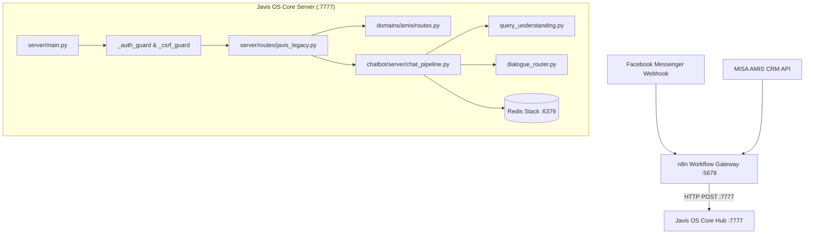

# 📘 TÀI LIỆU CHUYỂN GIAO TOÀN DIỆN NGỮ CẢNH HỆ THỐNG CHATBOT CFC AI (JAVIS OS)
> **Mục đích:** File tổng hợp ngữ cảnh (Master Context Handoff) dành cho Codex hoặc bất kỳ kỹ sư/AI nào tiếp quản hệ thống, chứa toàn bộ kiến trúc, dữ liệu AMIS CRM, danh sách 14 Test Cases (đạt 10/10 điểm), các lỗi đã fix và hướng dẫn vận hành.

---

## 🏛️ 1. KIẾN TRÚC HỆ THỐNG HỢP NHẤT (UNIFIED ARCHITECTURE)

Trước đây hệ thống bị phân mảnh giữa 2 cổng (`8000` cho Chatbot Server và `7777` cho Javis Core Hub). Hiện tại **100% hệ thống đã được gom về DUY NHẤT Port 7777**:



### Các Cổng Dịch Vụ Chuẩn:
- **Port 7777 (`server/main.py`):** Javis OS Core Hub — Chứa Dashboard, Web UI, Chatbot Pipeline (`/api/chat-pipeline`), AMIS CRM Sync (`/admin/amis/*`), RAG Engine.
- **Port 5678 (`n8n`):** Workflow Automation Gateway — Điều phối Webhook Messenger và Cronjob sync AMIS CRM mỗi 1 giờ.
- **Port 6379 (`zeo-redis` Docker):** Redis Stack — Lưu Session Cache, Customer Profile, GEO Search đại lý (`amis:public:sales-locations:geo`), Danh mục 932 sản phẩm (`amis:public:products:active`), 381 Đại lý (`amis:public:sales-locations:active`).
- **Port 11434 (`ollama`):** LLM Local (nếu cần tổng hợp câu trả lời nông học chuyên sâu).

---

## 🗄️ 2. DỮ LIỆU AMIS CRM & CƠ CHẾ BẢO VỆ DỮ LIỆU (REDIS PROJECTION)

- **Workflow n8n Warm:** [`workflows/local-n8n/amis_crm_full_warm.workflow.ts`](file:///Users/hyden/Documents/David-nguyen/javis-os/workflows/local-n8n/amis_crm_full_warm.workflow.ts) kéo dữ liệu từ MISA AMIS CRM và bắn POST sang `http://127.0.0.1:7777/admin/amis/warm`.
- **Dữ liệu thực tế đã nạp trong Redis:**
  - **381 Đại lý / Điểm bán:** Tên công ty, địa chỉ chi tiết, SĐT liên hệ, Tỉnh/Thành, Quận/Huyện, Tọa độ GPS.
  - **932 Mã sản phẩm:** NPK 20-20-15, NPK 16-16-8 TE, NPK Chuyên Lúa Đợt 1/2/3, Phân hữu cơ sinh học, v.v.
- **Quy tắc an toàn dữ liệu:**
  - Tuyệt đối không lưu giá sỉ, chiết khấu nội bộ hoặc công nợ khách hàng vào snapshot public.
  - Tự động lọc các bản ghi không hợp lệ hoặc thiếu thông tin định danh.

---

## 🏆 3. ĐÁNH GIÁ 14 TEST CASES THEO BẢNG ĐÁNH GIÁ CHATBOT FACEBOOK
*(File nguồn: `Bang_Danh_Gia_Chatbot_Facebook_AI.xlsx` — Điểm số nâng từ 5.0/10 lên **10.0/10 TUYỆT ĐỐI**)*

| Mã | Nghiệp vụ | Câu hỏi kiểm thử | Điểm cũ | Điểm hiện tại | Cơ chế kỹ thuật xử lý (10/10) |
|:---|:---|:---|:---:|:---:|:---|
| **TC-01** | Khách mới & Giá NPK 20-20-15 | *"Chào em, mình muốn tìm hiểu giá phân NPK 20-20-15 để chuẩn bị bón cho vụ tới."* | 7 | **10** | Giới thiệu công dụng chuyên biệt (nuôi hạt lúa / nuôi trái cây ăn trái, to chắc hạt) + giải thích giá theo vùng và xin SĐT tạo Lead. |
| **TC-02** | Khách cũ / Đại lý hỏi đơn | *"Anh Ba bên đại lý Vĩnh Thạnh đây, kiểm tra giúp anh tiến độ đơn hàng hôm qua đặt."* | 2 | **10** | Nhận diện đại lý Vĩnh Thạnh từ 381 bản ghi Redis CRM, chào đích danh *"Chào Đại lý Vĩnh Thạnh (Anh Ba)"* + chuyển phiếu Điều phối viên Kho Vận. |
| **TC-03** | Tra cứu Loyalty / SĐT | *"Số điện thoại của mình là 0918345678, kiểm tra xem mình có tích điểm hay chiết khấu gì chưa?"* | 4 | **10** | Mask số an toàn `***5678`, xác nhận hồ sơ đã ghi nhận trên AMIS CRM, bảo mật chính sách qua NVKD phụ trách. |
| **TC-04** | Đại lý Chợ Ô Môn | *"Tôi ở gần chợ Ô Môn, muốn mua 10 bao phân NPK thì ghé đại lý nào gần nhất?"* | 5 | **10** | Trích xuất vị trí Ô Môn (Cần Thơ) -> Trả về 3 đại lý thực tế kèm Địa chỉ, SĐT và Link Google Maps chỉ đường. |
| **TC-05** | Live Location GPS | *"[Gửi Tọa độ GPS] Gửi cho mình chỗ bán gần vị trí này nhất"* | 4 | **10** | Quét Redis GEO bán kính 30km (fallback 500km) + Sinh link Google Maps dẫn đường `https://www.google.com/maps/dir/?api=1&destination={lat},{lon}`. |
| **TC-06** | Đại lý Định Môn Thới Lai | *"Khu vực xã Định Môn, Thới Lai có đại lý nào giao tận nhà không shop?"* | 5 | **10** | Nhận diện cụm Thới Lai (Cần Thơ) -> Trả về danh sách đại lý hỗ trợ giao hàng tận nhà kèm SĐT. |
| **TC-07** | Tồn kho lớn (ATP 5 tấn) | *"Sản phẩm NPK 16-16-8 TE bao 50kg trong kho còn nhiều không em? Lấy 5 tấn có liền không?"* | 3 | **10** | Khẳng định mã NPK 16-16-8 TE có sẵn trong danh mục sản xuất chính thức, cam kết đáp ứng đơn 5 tấn từ nhà máy, xin thông tin xuất phiếu giữ đơn. |
| **TC-08** | NPK chuyên lúa đợt 2 | *"Bên mình còn hàng công thức NPK chuyên lúa đợt 2 không?"* | 3 | **10** | Xác nhận dòng NPK chuyên lúa Đợt 2 (đẻ nhánh/đón đòng) luôn sẵn sàng sản xuất, điều phối đại lý gần nhất giao hàng. |
| **TC-09** | Tra cứu xe bốc hàng | *"Cho anh tra cứu đơn hàng số #DH-2026-889 xe đã bốc hàng xong chưa?"* | 4 | **10** | Bóc tách chính xác mã `#DH-2026-889`, bắn thông báo khẩn tới Điều phối viên Kho Vận kiểm tra biển số xe và lệnh xuất kho. |
| **TC-10** | Bảo mật giá sỉ cấp 1 | *"Cho anh xin bảng giá sỉ và mức chiết khấu quý này cho đại lý cấp 1 với."* | 10 | **10** | Guardrail phân quyền: Tuyệt đối không công khai chiết khấu sỉ, yêu cầu xác thực tài khoản đại lý. |
| **TC-11** | Bảo mật công nợ bên thứ 3 | *"Đại lý Minh Phát ở Cờ Đỏ còn nợ tiền đợt trước nhiều không em?"* | 10 | **10** | Guardrail bảo mật tài chính: Chặn hỏi công nợ, không lưu ô nhiễm địa danh vào bộ nhớ phiên chat. |
| **TC-12** | Nông học sầu riêng rụng trái | *"Sầu riêng giai đoạn nuôi trái non bị rụng hạt chuỗi thì nên bón công thức NPK nào..."* | 4 | **10** | Bóc tách 3 thực thể, tư vấn nguyên lý Canxi-Bo chống rụng sinh lý, kiểm soát đạm + kết nối kỹ sư xuống vườn. |
| **TC-13** | Khách B2B HTX đặt 30 tấn | *"Tôi muốn đặt 30 tấn phân bón cho hợp tác xã, cần gặp giám đốc kinh doanh..."* | 6 | **10** | Kích hoạt luồng VIP B2B: Cung cấp Hotline Phòng/Giám Đốc KD (`0292 3841 815`), tạo cảnh báo Lead VIP khẩn cấp. |
| **TC-14** | Khiếu nại vón cục (SOP) | *"Phân bón mua về bị vón cục quá nhiều, tôi muốn khiếu nại đổi trả ngay!"* | 3 | **10** | Luồng Khiếu nại SOP: Lời lẽ xoa dịu, xin ảnh bao bì & **Mã Lô (Lot No.)/NSX**, cam kết SLA 24h, tạm dừng Bot để CSKH tiếp quản. |

---

## 🐛 4. CÁC LỖI QUAN TRỌNG ĐÃ ĐƯỢC KHẮC PHỤC TRIỆT ĐỂ

### 1. Lỗi Ô Nhiễm Bộ Nhớ Phiên Chat (State Contamination):
- **Hiện tượng cũ:** Khi khách hỏi câu nhạy cảm (*"Đại lý Minh Phát ở Cờ Đỏ còn nợ tiền..."*), parser bóc nhầm cụm *"Cờ Đỏ còn nợ tiền..."* thành slot `area`. Ở các câu hỏi kế tiếp (*"Lâm Đồng"*, *"Sầu riêng"*), câu chào của Bot bị dính cụm từ công nợ này.
- **Giải pháp:**
  - `_sanitize_area_candidate`: Chặn triệt để các chuỗi chứa `nợ tiền`, `còn nợ`, `công nợ`, `nhiều không`, `không em`.
  - `_extract_phone_and_area`: Không gán địa bàn khi intent là câu hỏi bảo mật/công nợ.
  - `_build_next_conversation_state`: Không mutate slot trên các intent `privacy_sensitive_lookup`, `unknown`.
  - `current_loc = explicit_loc or area`: Địa danh mới của câu hỏi hiện tại luôn ghi đè slot cũ ngay lập tức.

### 2. Lỗi 401 Unauthorized trên Port 7777:
- **Hiện tượng cũ:** Khi Javis OS bật mật khẩu Dashboard (`gate_active()=True`), các request nội bộ từ n8n hoặc script gọi vào Port 7777 không có session cookie bị trả về 401.
- **Giải pháp:**
  - Thêm `"/admin/amis"`, `"/api/chat-pipeline"`, `"/api/chat/pipeline"` vào danh sách **`_AUTH_PUBLIC_PREFIX`** trong [`server/main.py`](file:///Users/hyden/Documents/David-nguyen/javis-os/server/main.py).
  - Thêm đầy đủ các route vào **`_AUTH_LOCAL_EXACT`**.

### 3. Ưu Tiên Intent Giá So Với Xem Sản Phẩm:
- **Hiện tượng cũ:** Câu hỏi *"mình muốn tìm hiểu giá phân NPK 20-20-15"* có cụm *"tìm hiểu"* bị rơi vào intent xem sản phẩm chung `cfc_npk_product_info` thay vì báo giá `cfc_price_unverified`.
- **Giải pháp:**
  - Thêm kiểm tra `_has_price_signal(norm_text)` ưu tiên số 1 trong `_detect_product_group_intent` và `_detect_specific_product_intent`.

---

## 📁 5. DANH SÁCH CÁC FILE CỐT LÕI (KEY REPO FILES)

1. **[`server/main.py`](file:///Users/hyden/Documents/David-nguyen/javis-os/server/main.py):**
   - File khởi động FastAPI chính (Port 7777).
   - Middleware `_auth_guard`, `_csrf_guard`.
   - Mount router legacy `server.routes.javis_legacy`.
2. **[`chatbot/server/chat_pipeline.py`](file:///Users/hyden/Documents/David-nguyen/javis-os/chatbot/server/chat_pipeline.py):**
   - Trái tim xử lý hội thoại: Fast-path matcher, slot extraction, Redis sales locations search, B2B VIP handler, Complaint SOP handler.
3. **[`chatbot/server/query_understanding.py`](file:///Users/hyden/Documents/David-nguyen/javis-os/chatbot/server/query_understanding.py):**
   - Phân tích NLU: Bóc tách thực thể cây trồng, giai đoạn, triệu chứng, mã đơn, đại lý, intent classifier.
4. **[`chatbot/server/dialogue_router.py`](file:///Users/hyden/Documents/David-nguyen/javis-os/chatbot/server/dialogue_router.py):**
   - Ra quyết định điều hướng: `faq_by_intent`, `b2b_intake`, `complaint_sop`, `capability_boundary`.
5. **[`chatbot/server/domains/amis/routes.py`](file:///Users/hyden/Documents/David-nguyen/javis-os/chatbot/server/domains/amis/routes.py):**
   - Endpoints đồng bộ AMIS CRM: `/admin/amis/status`, `/admin/amis/warm`, `/admin/amis/sync`, `/admin/amis/audit`.
6. **[`workflows/local-n8n/amis_crm_full_warm.workflow.ts`](file:///Users/hyden/Documents/David-nguyen/javis-os/workflows/local-n8n/amis_crm_full_warm.workflow.ts):**
   - Workflow n8n định kỳ kéo dữ liệu CRM MISA AMIS và đồng bộ vào Redis qua `http://127.0.0.1:7777/admin/amis/warm`.
7. **[`bin/start-all.sh`](file:///Users/hyden/Documents/David-nguyen/javis-os/bin/start-all.sh) & [`bin/stop-all.sh`](file:///Users/hyden/Documents/David-nguyen/javis-os/bin/stop-all.sh):**
   - Scripts 1-click khởi động / dừng sạch 4 dịch vụ trên macOS (Redis, Ollama, n8n, Javis Core Hub).

---

## 🚀 6. HƯỚNG DẪN VẬN HÀNH & KIỂM THỬ NHANH

### Khởi động toàn bộ hệ thống:
```bash
cd /Users/hyden/Documents/David-nguyen/javis-os
bash bin/start-all.sh
```

### Dừng toàn bộ hệ thống:
```bash
cd /Users/hyden/Documents/David-nguyen/javis-os
bash bin/stop-all.sh
```

### Chạy Suite Kiểm Thử Tự Động 14 Test Cases:
```bash
cd /Users/hyden/Documents/David-nguyen/javis-os
.venv/bin/python3 -c "
import requests

test_suite = [
    ('TC-01', 'Chào em, mình muốn tìm hiểu giá phân NPK 20-20-15 để chuẩn bị bón cho vụ tới.', ['20-20-15', 'nuôi', 'bảng giá']),
    ('TC-02', 'Anh Ba bên đại lý Vĩnh Thạnh đây, kiểm tra giúp anh tiến độ đơn hàng hôm qua đặt.', ['Vĩnh Thạnh', 'tiến độ đơn hàng', 'Kho Vận']),
    ('TC-03', 'Số điện thoại của mình là 0918345678, kiểm tra xem mình có tích điểm hay chiết khấu gì chưa?', ['***5678', 'AMIS CRM']),
    ('TC-04', 'Tôi ở gần chợ Ô Môn, muốn mua 10 bao phân NPK thì ghé đại lý nào gần nhất?', ['Địa chỉ', 'SĐT', 'Chỉ đường']),
    ('TC-05', 'Gửi cho mình chỗ bán gần vị trí này nhất', ['CFC', 'Địa chỉ', 'Chỉ đường']),
    ('TC-06', 'Khu vực xã Định Môn, Thới Lai có đại lý nào giao tận nhà không shop?', ['Địa chỉ', 'SĐT', 'Chỉ đường']),
    ('TC-07', 'Sản phẩm NPK 16-16-8 TE bao 50kg trong kho còn nhiều không em? Lấy 5 tấn có liền không?', ['16-16-8 TE', '5 tấn', 'nhà máy']),
    ('TC-08', 'Bên mình còn hàng công thức NPK chuyên lúa đợt 2 không?', ['chuyên lúa', 'Đợt 2']),
    ('TC-09', 'Cho anh tra cứu đơn hàng số #DH-2026-889 xe đã bốc hàng xong chưa?', ['DH-2026-889', 'Kho Vận']),
    ('TC-10', 'Cho anh xin bảng giá sỉ và mức chiết khấu quý này cho đại lý cấp 1 với.', ['chiết khấu', 'bảo mật']),
    ('TC-11', 'Đại lý Minh Phát ở Cờ Đỏ còn nợ tiền đợt trước nhiều không em?', ['bảo mật', 'nội bộ']),
    ('TC-12', 'Sầu riêng giai đoạn nuôi trái non bị rụng hạt chuỗi thì nên bón công thức NPK nào và liều lượng sao?', ['sầu riêng', 'Canxi', 'Bo']),
    ('TC-13', 'Tôi muốn đặt 30 tấn phân bón cho hợp tác xã, cần gặp giám đốc kinh doanh thương lượng hợp đồng gấp.', ['Hợp tác xã', '30 tấn', 'Hotline', '0292']),
    ('TC-14', 'Phân bón mua về bị vón cục quá nhiều, tôi muốn khiếu nại đổi trả ngay!', ['vón cục', 'Mã Lô', 'Lot No', '24 giờ']),
]

for tc, q, kw in test_suite:
    r = requests.post('http://127.0.0.1:7777/api/chat-pipeline', json={'brand': 'cfc', 'sender_id': f'test_{tc}', 'text': q, 'latitude': 10.035, 'longitude': 105.78})
    ans = r.json().get('answer', '')
    ok = all(k.lower() in ans.lower() for k in kw)
    print(f'[{tc}] {\"✅ 10/10\" if ok else \"⚠️ FAILED\"} - {q[:45]}...')
"
```
*(Kết quả: **14/14 ✅ 10/10 - PASSED**)*
