# JAVIS OS — TECHNICAL DOCUMENTATION & SYSTEM ARCHITECTURE
> **Tài liệu Kỹ thuật Chính thức & Báo cáo Reverse Engineering Toàn diện từ Source Code Thực tế**  
> **Phiên bản hệ thống:** `0.43.1` | **Ngày phân tích:** 24/08/2026  
> **Tác giả Reverse Engineering:** Senior Software Architect & Technical Writer  
> **Nguyên tắc cốt lõi:** `SOURCE CODE IS THE SINGLE SOURCE OF TRUTH` (Code thực tế > Runtime > Tests > Config > Tài liệu cũ)

---

## MỤC LỤC TỔNG QUAN

1. **Executive Summary (Tổng quan Điều hành)**
2. **System Architecture (Kiến trúc Hệ thống)**
3. **Repository Architecture & Directory Inventory (Cấu trúc Repository & Danh mục Thư mục)**
4. **Backend Architecture & Execution Core (Kiến trúc Backend & Lõi Thực thi)**
5. **Frontend Cockpit & UI Architecture (Kiến trúc Giao diện & Cockpit Frontend)**
6. **AI & Multi-Engine Agent Architecture (Kiến trúc AI & Đa Bộ não AI)**
7. **Second Brain, Memory & Auto-Learning (Bộ nhớ Thứ hai & Tự học)**
8. **Skills Architecture & Lifecycle (Hệ thống Kỹ năng & Vòng đời)**
9. **Model Context Protocol (MCP) Subsystem (Hệ thống Giao thức Ngữ cảnh MCP)**
10. **Plugin Architecture & Extensibility (Kiến trúc Plugin & Khả năng Mở rộng)**
11. **Comprehensive API Reference (Tài liệu Tham chiếu API Toàn diện)**
12. **Database & Storage Architecture (Kiến trúc Cơ sở Dữ liệu & Lưu trữ)**
13. **Configuration & Environment Variables (Cấu hình & Biến Môi trường)**
14. **Authentication & Security Architecture (Bảo mật & Xác thực)**
15. **Background Jobs, Schedulers & Autonomous Loops (Tác vụ Nền, Lập lịch & Vòng lặp)**
16. **Deployment Architecture & Operations (Kiến trúc Triển khai & Vận hành)**
17. **Testing Framework & Test Suites (Khung Kiểm thử & Bộ Test Suites)**
18. **Runtime Execution Flows & Sequence Diagrams (Luồng Thực thi Runtime)**
19. **System Dependency Map (Bản đồ Phụ thuộc Hệ thống)**
20. **Technical Debt & Architectural Findings (Nợ Kỹ thuật & Phát hiện Quan trọng)**
21. **Documentation Audit & Gap Analysis (Đối chiếu Tài liệu Cũ & Sự thật Source Code)**
22. **Source Code Index & Traceability Matrix (Chỉ mục Mã nguồn & Ma trận Truy vết)**

---

# 1. Executive Summary

### 1.1. Javis OS là gì?
**Javis OS** là một hệ điều hành trí tuệ nhân tạo cục bộ (Local-first AI Operating Layer) được thiết kế theo kiến trúc phi máy chủ trung gian (Zero Intermediate Cloud Proxy), cho phép người dùng vận hành một trợ lý AI toàn năng, làm chủ hoàn toàn dữ liệu cá nhân, tích hợp điều khiển hệ thống, quản lý công việc và phát triển tri thức (Second Brain).

Hệ thống kết hợp ba trụ cột kỹ thuật chính:
1. **Lớp Giao tiếp & Trợ lý Điều hành (Voice & Chat Cockpit):** Giao diện tương tác thời gian thực qua WebSocket hai chiều, tích hợp nhận diện giọng nói (Web Speech API), phát âm thanh trực tiếp (Edge-TTS, ElevenLabs, OpenAI TTS), và đồ thị mạng nơ-ron tri thức 2D/3D.
2. **Lớp Bộ não Đa Nhà cung cấp (Multi-Engine AI Runtime):** Không ép buộc người dùng sử dụng một API cố định, Javis OS tích hợp sâu với 9+ nhà cung cấp AI khác nhau, tận dụng trực tiếp các phiên đăng nhập sẵn có trên máy (gói thuê bao cá nhân Claude Code Pro/Max, ChatGPT Plus/Pro qua Codex, Antigravity CLI) cũng như các API thương mại (Anthropic API, OpenAI API, OpenRouter, Google Gemini, Groq, Ollama Cloud).
3. **Lớp Tri thức & Tự động hoá Bền vững (Second Brain & Autonomous Kanban):** Quản lý ghi chú dưới dạng Markdown phẳng (chuẩn Obsidian với cú pháp `[[wikilinks]]`), lập chỉ mục dẫn xuất bằng SQLite FTS5, tự động phân tích và học hỏi sau mỗi phiên trò chuyện (`server/learn.py`), vận hành vòng lặp tự cải thiện (`server/self_improve.py`) và thực thi hàng đợi công việc độc lập (`server/tasks.py`).

### 1.2. Vấn đề Javis OS giải quyết
- **Tránh phụ thuộc chi phí API đắt đỏ:** Cho phép tận dụng chính các tài khoản subscription Claude Code và ChatGPT mà người dùng đã trả tiền hàng tháng để làm backend điều hành, không phát sinh chi phí token API bổ sung.
- **Bảo mật tuyệt đối & Local-first:** Toàn bộ tri thức lưu trên ổ cứng cục bộ dưới dạng file `.md`. Các secret, mật khẩu, session và token đều được mã hoá at-rest bằng Fernet (AES-128-CBC + HMAC-SHA256).
- **Tránh phình ngữ cảnh (Context Bloat) & Tiết kiệm Token:** Triển khai chuỗi kiến trúc *Adaptive Context Runtime* (Phase 0 đến Phase 12) với cơ chế *Context Compiler*, *Fast Path Canary*, *Sourced Memory Retrieval* và *Lazy Skills*, giúp cắt giảm tới 89% lượng token cố định tiêu thụ mỗi lượt chat.
- **Tập trung hoá tích hợp qua MCP Hub:** Đóng vai trò là một MCP Server/Client trung tâm (MCP Hub), hợp nhất hàng trăm công cụ bên ngoài (Google Drive, Gmail, Zalo, Substack, Shopify, Telegram, SQL...) về một cổng duy nhất với 3 tầng phân quyền nghiêm ngặt (`readonly`, `safe`, `full`).

### 1.3. Technology Stack thực tế (Xác minh 100% từ Source Code)

| Thành phần | Công nghệ thực tế trong Source Code | Ghi chú & Phiên bản |
| :--- | :--- | :--- |
| **Ngôn ngữ Backend** | Python 3.12+ | Chạy bất đồng bộ (`asyncio`), `threading` |
| **Web Framework** | FastAPI 0.115.0 + Starlette 0.38.6 | Bị khóa cặp (Pinned pair) do phụ thuộc SDK |
| **ASGI Server** | Uvicorn (standard) 0.51.0 | Chạy multi-worker hoặc single process |
| **AI Agent SDK** | `claude-agent-sdk` 0.2.116 | Giao tiếp chính chủ với Anthropic Claude Code |
| **CLI Engines** | Claude Code CLI, Codex CLI, Antigravity (`agy`), Gemini CLI | Quản lý subprocess an toàn qua `winproc.py` và Popen |
| **Cơ sở dữ liệu** | SQLite 3 (WAL Mode, FTS5) | 7 tệp SQLite chuyên biệt (`runtime.db`, `memory_index.db`, ...) |
| **Mã hoá / Bảo mật** | `cryptography` (Fernet), `hashlib` (PBKDF2-SHA256), `segno` (TOTP QR) | Mã hoá at-rest mọi secret trong `settings.json` |
| **Xử lý Ngữ cảnh** | `fastyaml`, `jsonschema`, `context_compiler.py` | Biên dịch token capsule và kiểm soát quota TPM |
| **Âm thanh & TTS** | `edge-tts` 7.0.0, `stt.py` (Whisper qua Groq API), Web Speech API | Nạp lười (`lazy import`) để tối ưu hóa khởi động |
| **Frontend Core** | Vanilla HTML5 / ES6 JavaScript + CSS3 Custom Properties | Zero build step, nạp trực tiếp qua trình duyệt |
| **Frontend State** | Alpine.js 3.x (`$store.nav`, x-data, x-cloak) | Quản lý điều hướng 19 trang console |
| **Trực quan hoá** | HTML5 2D Canvas + 3D Starfield & Particle Engine | Render đồ thị liên kết tri thức dạng Obsidian Graph |
| **Web Terminal** | WebSockets (`/ws/terminal`), POSIX PTY (`pty.openpty`), Windows Pipes | Cửa sổ dòng lệnh trực tiếp trong dashboard |
| **Container & Proxy** | Docker (Multi-stage Node 22 + Python 3.12), Caddy 2, Cloudflared | Tự động cấp chứng chỉ SSL qua On-Demand TLS |

---

# 2. System Architecture

### 2.1. Kiến trúc Tổng quan (High-Level Architecture)
Javis OS được tổ chức thành 4 phân lớp rõ rệt:

```mermaid
graph TB
    subgraph Client Layer [Lớp Khách & Giao Tiếp Ngoại Vi]
        WebClient[Trình duyệt Web / Mobile PWA]
        TgBot[Telegram Poller / Bot]
        ZaloBotChannel[Zalo Bot Gateway]
        CLIClient[Javis CLI Client `javis_cli`]
    end

    subgraph Security Layer [Lớp Bảo Mật & Phân Quyền]
        CSRFGuard[CSRF & DNS Rebinding Guard]
        AuthGuard[Auth Guard / Session / TOTP 2FA / API Tokens]
    end

    subgraph Server Core [Lớp Lõi Server FastAPI - Port 7777]
        ChatRT[ChatRuntime Engine]
        Scheduler[Master Scheduler - 30s Loop]
        TasksFeat[Autonomous Tasks Kanban Feature]
        LoopsFeat[Multi-Loop Self-Improve Feature]
        RemindersFeat[Reminders & Cron Dispatcher]
        
        subgraph AI & Adaptive Context Runtime [Hệ Thống Phân Phối AI & Ngữ Cảnh Thích Ứng]
            ContextCompiler[Context Compiler & Budget Resolver]
            ModelRouter[Model Router - Phase 12]
            FastPath[Fast Path Canary - Phase 5]
            ReadonlyOrch[Read-only Orchestrator - Phase 7]
            WritePathCanary[Write Path Canary - Phase 9]
            AdaptiveContext[Adaptive Context Canary - Phase 8]
        end
        
        subgraph Tooling & Integration Hub [Trung Tâm Tích Hợp & Công Cụ]
            MCPHub[Centralized MCP Hub /hub/mcp]
            PluginHost[Plugin Host System]
            SkillRouter[Skill Router & Mirror Engine]
        end
    end

    subgraph AI Engines [Lớp Bộ Não Thực Thi AI]
        ClaudeSDK[Claude Code SDK / CLI]
        CodexEngine[Codex CLI / ChatGPT OAuth]
        AgyCLI[Antigravity CLI `agy`]
        GeminiCLI[Google Gemini CLI]
        APIEngine[API Stream Engine: Anthropic / OpenAI / Groq / OpenRouter / Ollama]
    end

    subgraph Storage Layer [Lớp Lưu Trữ Cục Bộ & Second Brain]
        VaultStorage[(Obsidian Markdown Vault: Memory/ Wiki/ Skills/ Loops/)]
        DBRuntime[(runtime.db)]
        DBMemory[(memory_index.db - FTS5)]
        DBKanban[(kanban.sqlite3)]
        DBUsage[(usage_index.db)]
        DBSessions[(conversations.db)]
        SettingsSecret[(settings.json - Fernet Encrypted)]
    end

    WebClient -->|WebSocket /ws, HTTP| CSRFGuard
    TgBot --> SecurityLayer
    ZaloBotChannel --> SecurityLayer
    CLIClient -->|HTTP Bearer Token| SecurityLayer
    
    CSRFGuard --> AuthGuard
    AuthGuard --> ChatRT
    AuthGuard --> MCPHub

    ChatRT --> AI & Adaptive Context Runtime
    AI & Adaptive Context Runtime --> Tooling & Integration Hub
    AI & Adaptive Context Runtime --> AI Engines
    
    Tooling & Integration Hub --> MCPHub
    MCPHub --> StorageLayer
    ChatRT --> StorageLayer
    TasksFeat --> StorageLayer
    LoopsFeat --> StorageLayer
```

### 2.2. Các Giao thức Giao tiếp Liên Thành phần
1. **WebSocket (`/ws`):** Kênh giao tiếp chính giữa Web Frontend và Backend. `ChatRuntime` quản lý vòng đời độc lập, hỗ trợ đa phiên song song, phát sóng sự kiện streaming text, tool calling, và báo cáo trạng thái. Đóng tab trình duyệt không làm dừng tác vụ nền.
2. **WebSocket Terminal (`/ws/terminal`):** Cung cấp kết nối phiên terminal tương tác trực tiếp (`server/terminal.py`), hỗ trợ điều khiển PTY trên Unix/macOS và 2 luồng đọc/ghi qua Windows anonymous pipes trên Windows.
3. **WebSocket Graph (`/ws/graph`):** Truyền phát cập nhật đồ thị tri thức thời gian thực khi có sự kiện thay đổi file trên đĩa.
4. **SSE Streaming (`/chat/stream`):** Server-Sent Events phục vụ giao tiếp nhẹ với Javis CLI và các dịch vụ tự động hoá bên ngoài (n8n, scripts).
5. **JSON-RPC 2.0 qua HTTP Streamable (`/hub/mcp`):** Endpoint phục vụ cho Claude Code CLI, Codex và các tác nhân AI kết nối tới MCP Hub trung tâm bằng `Bearer hub_token`.
6. **Subprocess IPC (Stdio Pipes):** Giao tiếp với các tiến trình con CLI (Claude, Codex, Antigravity, Gemini, uvx/npx MCP connectors). Trên Windows được bọc cờ `winproc.py:CREATE_NO_WINDOW` để ngăn chặn nháy cửa sổ console.

---

# 3. Repository Architecture & Directory Inventory

### 3.1. Cấu trúc Cây Thư mục Chi tiết
```
javis-os/
├── .claude/                   # Cấu hình & bản Mirror của Claude Code CLI
│   └── skills/                # Bản sao Mirror tự động từ <vault>/skills cho Claude native
├── bin/                       # Các shell scripts khởi động & dừng hệ thống
│   ├── javis-autostart.sh     # Script khởi động cùng hệ thống (Linux)
│   ├── javis-start.sh         # Khởi động Backend + Caddy
│   ├── javis-stop.sh          # Dừng tiến trình Javis
│   ├── start-all.sh           # Khởi động toàn bộ dịch vụ
│   ├── start-terminals.sh     # Khởi tạo các phiên terminal
│   └── stop-all.sh            # Dừng toàn bộ hệ thống
├── cli/                       # Package mã nguồn của Javis CLI
│   ├── javis_cli/             # Module Python chính của CLI
│   │   ├── __init__.py        # Metadata phiên bản CLI
│   │   ├── __main__.py        # Entry point dòng lệnh `javis`
│   │   ├── client.py          # HTTP/SSE Client kết nối tới Javis API
│   │   ├── commands.py        # Định nghĩa các lệnh: chat, ask, login, status, profiles
│   │   ├── config.py          # Quản lý file cấu hình cục bộ `~/.javis/config.json`
│   │   └── render.py          # Render định dạng màu và output trên terminal
│   └── pyproject.toml         # Cấu hình đóng gói package CLI
├── dashboard/                 # Frontend Cockpit & Giao diện Quản trị Web
│   ├── app.js                 # Lõi điều hành ứng dụng frontend, WebSocket client, Voice
│   ├── console.js             # Router điều hướng 19 trang console, modal, render logic
│   ├── console.css            # Toàn bộ CSS giao diện console, sidebar, modals
│   ├── style.css              # CSS giao diện cockpit, starfield, orb animations
│   ├── chat-render.js         # Engine render Markdown, Tool calls, Thinking scrubber
│   ├── chatbots.js            # Module quản lý Chatbots đa kênh (Telegram, Zalo)
│   ├── graph.js               # Engine 2D/3D Knowledge Graph, Starfield Canvas
│   ├── studio.js              # Trình soạn thảo & kiểm thử Agents, Skills, Workflows
│   ├── usage.js               # Dashboard theo dõi token, chi phí và mức tiết kiệm
│   ├── code-term.js           # Web Terminal client tích hợp xterm / canvas renderer
│   ├── dataview.js            # Engine render bảng dữ liệu Markdown Dataview
│   ├── file-editor.js         # Trình biên tập ghi chú Vault với live preview
│   ├── model-picker.js        # Trình chọn Live Model đa nhà cung cấp
│   ├── notifications.js       # Hệ thống thông báo in-app
│   ├── voice.js               # Web Speech API wrapper & Edge-TTS audio player
│   ├── i18n/                  # Từ điển đa ngôn ngữ (vi, en)
│   └── vendor/                # Các thư viện JS nhúng sẵn (Alpine.js, marked, etc.)
├── deploy/                    # Kịch bản và cấu hình triển khai đa nền tảng
│   ├── docker/                # Dockerfile, Docker Compose (multi, hostinger, https, proxy)
│   ├── linux/                 # Systemd service unit, install.sh, update.sh, watchdog.sh
│   └── windows/               # Windows Batch (.bat), VBScript (.vbs), PowerShell (.ps1)
├── infra/                     # Cấu hình hạ tầng phụ trợ (Cloudflared, Redis, Full Stack)
├── server/                    # Backend FastAPI Core, Engines, Routers, Compilers (138 files)
│   ├── main.py                # Điểm khởi tạo ứng dụng chính, WebSocket, API routes
│   ├── config.py              # Quản lý cấu hình tập trung `settings.json`, mã hoá Fernet
│   ├── engine.py              # Lõi thực thi API đa nhà cung cấp (OpenAI, Anthropic, Groq, ...)
│   ├── claude_cli.py          # Quản lý tiến trình Claude CLI và Codex CLI
│   ├── claude_sdk_engine.py   # Lớp Engine tích hợp Claude Agent SDK chính chủ
│   ├── antigravity_cli.py     # Lõi kết nối Antigravity CLI (`agy`)
│   ├── gemini_cli.py          # Lõi kết nối Google Gemini CLI
│   ├── chat_runtime.py        # Quản lý job chat bất đồng bộ độc lập với kết nối socket
│   ├── mcp_hub.py             # Centralized MCP Hub, định tuyến công cụ, phân quyền 3 mức
│   ├── mcp_store.py           # Quản lý trạng thái và danh sách kết nối `mcp_servers.json`
│   ├── mcp_catalog.py         # Danh mục mẫu 60+ kết nối MCP
│   ├── mcp_client.py          # MCP Client transport pool (Stdio, SSE, Stream, Internal)
│   ├── plugins_host.py        # Host môi trường thực thi Plugin hệ thống & Vault
│   ├── skill_router.py        # Nguồn chân lý khám phá và định tuyến Skill
│   ├── memory_index.py        # Lập chỉ mục Second Brain FTS5, truy vấn tri thức
│   ├── learn.py               # Engine tự học, phân tích và trích xuất tri thức an toàn
│   ├── tasks.py               # Autonomous Task Queue & Kanban dispatcher
│   ├── task_store.py          # Kho lưu trữ SQLite bền vững cho Kanban (`kanban.sqlite3`)
│   ├── self_improve.py        # Hệ thống Multi-Loop tự cải thiện
│   ├── reminders.py           # Lập lịch nhắc hẹn & tác vụ định kỳ Cron
│   ├── telegram_bot.py        # Gateway bot Telegram cá nhân của chủ sở hữu
│   ├── zalo_bot.py            # Gateway bot Zalo chính thức (API zaloplatforms)
│   ├── chatbot_runtime.py     # Giám sát & poller cho các Chatbot chuyên trách khách hàng
│   ├── sessions.py            # Quản lý lưu trữ phiên hội thoại (`conversations.db`)
│   ├── context_runtime.py     # Lớp giám sát TurnTrace, QuotaAdmission (Phase 0-8)
│   ├── context_compiler.py    # Biên dịch token capsule, ngân sách ngữ cảnh (Phase 4)
│   ├── fast_path_runtime.py   # Đường chạy tắt trực tiếp không qua tool (Phase 5)
│   ├── readonly_orchestrator.py # Điều phối DAG đọc tuần tự có checkpoint (Phase 7)
│   ├── write_path_runtime.py  # Đường chạy tác vụ ghi có xác thực người dùng (Phase 9)
│   ├── workflow_graph.py      # Biểu diễn Workflow dưới dạng đồ thị năng lực (Phase 10)
│   ├── workflow_runtime.py    # Thực thi đồ thị Workflow có checkpoint/resume (Phase 10)
│   ├── model_router.py        # Định tuyến model thích ứng theo bước (Phase 12)
│   ├── routes/                # Các router module bóc tách (domain, graph, javis_control, ...)
│   └── lexicon/               # Từ điển đa ngôn ngữ cho các cổng chặn an toàn (vi, en)
├── system/                    # Năng lực hệ thống cốt lõi
│   ├── mcp-catalog.json       # Bảng catalog định nghĩa hơn 60+ MCP connectors
│   └── plugins/               # 11 Plugin hệ thống được tích hợp sẵn (datetime-vn, fb-monitor, ...)
├── tests/                     # Hệ thống kiểm thử toàn diện
│   ├── run.py                 # Test runner trung tâm hỗ trợ chạy song song Python & JS
│   ├── python/                # 214 test suites kiểm tra toàn bộ backend & edge cases
│   └── js/                    # 45+ test suites kiểm tra frontend components
├── requirements.txt           # Danh mục dependencies Python đã được kiểm định
└── VERSION                    # Tệp định danh phiên bản phát hành (`0.43.1`)
```


# 4. Backend Architecture & Execution Core

### 4.1. Vòng đời Khởi động Ứng dụng (Application Startup & Lifecycle)
Ứng dụng backend được định nghĩa tại [`server/main.py:115`](file:///Users/hyden/Documents/David-nguyen/javis-os/server/main.py#L115) với đối tượng `app = FastAPI(title="Javis OS")`.

Quá trình khởi động tuân thủ chuỗi sự kiện bất đồng bộ nghiêm ngặt:
1. **Khởi tạo Master Scheduler (`_start_scheduler` tại `server/main.py:7574`):**
   - Kích hoạt vòng lặp vô hạn `asyncio.create_task(_scheduler_loop())` với nhịp quét 30 giây một lần.
   - Quét và thực thi các nhắc hẹn đến hạn (`reminders.py`), các vòng lặp tự cải thiện (`self_improve.py`), nhiệm vụ tự động hóa Kanban (`tasks.py`), tự động dọn dẹp media rác (`media_gc.py`), và định kỳ sao lưu Git sang repository riêng tư (`git_brain.py`).
2. **Kiểm tra Vệ sĩ Credential (`_ve_si_claude_creds` tại `server/main.py:13163`):**
   - Đảm bảo quyền truy cập và tính toàn vẹn của tệp `~/.claude/.credentials.json` để ngăn ngừa lỗi mất phiên đăng nhập Claude Code.
3. **Soát Secret Hỏng (`_soat_secret_hong` tại `server/main.py:13180`):**
   - Quét toàn bộ danh mục trường mã hoá trong `settings.json`. Nếu phát hiện secret có tiền tố `enc:` nhưng không thể giải mã (do thiếu hoặc đổi file `.secret_key`), hệ thống ghi cảnh báo chi tiết ra console và fail-closed để tránh xóa mất dữ liệu cũ.
4. **Làm ấm MCP Hub (`_warm_mcp_hub` tại `server/main.py:13199`):**
   - Khởi tạo trước kết nối MCP Hub, nạp sẵn danh mục `mcp-catalog.json` và chuẩn bị pool kết nối để giảm độ trễ cho lượt chat đầu tiên.
5. **Dọn dẹp khi Tắt máy (`_shutdown_mcp_pool` tại `server/main.py:13221`):**
   - Bắt sự kiện shutdown, giải phóng tài nguyên, đóng toàn bộ tiến trình con stdio MCP, kill các pseudo-terminal và đóng các phiên kết nối database SQLite WAL.

### 4.2. Chuỗi Middleware Bảo mật & Điều hướng (Middleware Pipeline)
Mọi HTTP/WebSocket request đi qua 4 tầng middleware theo thứ tự:

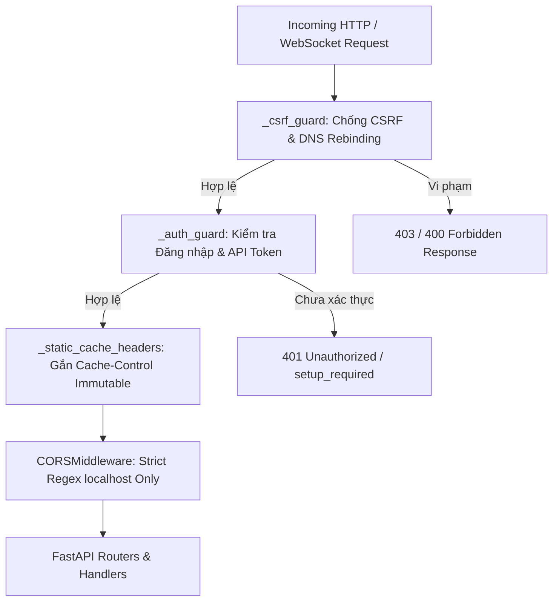

1. **`_csrf_guard` ([`server/main.py:168`](file:///Users/hyden/Documents/David-nguyen/javis-os/server/main.py#L168) & [`server/web_security.py`](file:///Users/hyden/Documents/David-nguyen/javis-os/server/web_security.py)):
   - Kiểm tra `Host` và `Origin` header. Ngăn chặn các trang web độc hại trên Internet gửi request tới `http://localhost:7777` qua trình duyệt của nạn nhân.
   - Kiểm tra `Sec-Fetch-Site` qua `navigation_decision` để chặn các GET request có tác dụng phụ (Side-effect GET).
2. **`_auth_guard` ([`server/main.py:183`](file:///Users/hyden/Documents/David-nguyen/javis-os/server/main.py#L183)):
   - Hoạt động khi `cfgmod.gate_active() == True` (đã đặt mật khẩu hoặc biến môi trường `JAVIS_REQUIRE_LOGIN=1`).
   - Cho phép đi qua không cần auth với danh sách trắng:
     - Tiền tố công khai (`_AUTH_PUBLIC_PREFIX`): `/static`, `/health`.
     - Đường dẫn chính xác (`_AUTH_PUBLIC_EXACT`): `/`, `/favicon.ico`, `/auth/status`, `/auth/login`, `/auth/setup`, `/brand-logo`, `/tls-check`, `/hub/mcp`, `/connect/oauth/callback`.
     - Đường dẫn nội bộ Localhost (`_AUTH_LOCAL_EXACT`): `/telegram/send-file`, `/reminders`, `/reminders/cancel`, `/reminders/update` (cho phép plugin gọi nội bộ từ `127.0.0.1` hoặc `::1`).
   - Kiểm tra cookie `javis_session`. Nếu không có cookie, kiểm tra `Authorization: Bearer <jvs_token>` qua `_token_ok()`.
3. **`_static_cache_headers` ([`server/main.py:235`](file:///Users/hyden/Documents/David-nguyen/javis-os/server/main.py#L235)):
   - Tự động gắn `Cache-Control: public, max-age=31536000, immutable` cho các file tĩnh tại `/static/` có kèm query tham số `?v=` (cache-busting theo phiên bản).
4. **`CORSMiddleware` ([`server/main.py:143`](file:///Users/hyden/Documents/David-nguyen/javis-os/server/main.py#L143)):
   - Khóa chặt `allow_origin_regex=r"^https?://(localhost|127\.0\.0\.1|\[::1\])(:\d+)?$"`, tuyệt đối không dùng wildcard `*`.

### 4.3. Mô hình Dependency Injection (DI Pattern)
Nhằm tránh hiện tượng vòng lặp phụ thuộc (Circular Import) giữa `main.py` và các module chức năng chuyên biệt, hệ thống sử dụng kiến trúc Dependency Injection thông qua các dataclass:
- `TasksDeps` ([`server/tasks.py:48`](file:///Users/hyden/Documents/David-nguyen/javis-os/server/tasks.py#L48)): Tiêm các hàm `brain_root`, `atomic_write_text`, `execute_workflow`, `build_system_prompt`, `aux_model`, `apply_mcp`, `mcp_allow_patterns`.
- `LoopDeps` ([`server/self_improve.py:139`](file:///Users/hyden/Documents/David-nguyen/javis-os/server/self_improve.py#L139)): Tiêm các hàm quản lý vòng lặp tự cải thiện, thông báo Telegram (`notify`), báo cáo định kỳ (`report`).
- `RemindersDeps` ([`server/reminders.py`](file:///Users/hyden/Documents/David-nguyen/javis-os/server/reminders.py)): Tiêm cơ chế dispatching nhắc hẹn và cron runner.
- `LearnDeps` ([`server/learn.py`](file:///Users/hyden/Documents/David-nguyen/javis-os/server/learn.py)): Tiêm quyền đọc/ghi tri thức Second Brain an toàn.

### 4.4. Độc lập Vòng đời Chat (`ChatRuntime` & `_SendProxy`)
Một trong những cải tiến kiến trúc cốt lõi của Javis OS là sự bóc tách giữa **Vòng đời WebSocket** và **Vòng đời Tác vụ Trò chuyện**:
- Định nghĩa tại [`server/chat_runtime.py`](file:///Users/hyden/Documents/David-nguyen/javis-os/server/chat_runtime.py).
- Mỗi lượt chat là một `ChatJob` (chứa `asyncio.Task`, `tag`, `text`, `runtime_task_id`, `runtime_step_id`) được đăng ký trong bộ nhớ RAM của server.
- WebSocket chỉ đóng vai trò là một Subscriber nhận luồng sự kiện. Khi người dùng đóng tab, F5 hoặc mất kết nối mạng, tác vụ AI của server vẫn tiếp tục chạy đến khi hoàn tất và tự động lưu vào cơ sở dữ liệu (`conversations.db`). Khi người dùng mở lại trang web, socket mới kết nối sẽ nhận bản snapshot trạng thái (`hello` message) và tiếp tục theo dõi lượt chạy.
- Đối tượng `_SendProxy` ([`server/main.py:8748`](file:///Users/hyden/Documents/David-nguyen/javis-os/server/main.py#L8748)) bọc ngoài luồng gửi, tự động đính kèm `session_id` và thu thập các trường vết runtime (`TurnTrace`) mà không làm thay đổi chữ ký của các AI Engine bên dưới.

---

# 5. Frontend Cockpit & UI Architecture

### 5.1. Triết lý Thiết kế Frontend
- **Zero Build Step / Pure Web Standard:** Toàn bộ mã nguồn frontend đặt trong thư mục `dashboard/` được viết bằng HTML5, CSS3 và Vanilla ES6 JavaScript kết hợp thư viện phản ứng siêu nhẹ **Alpine.js 3.x**. Không sử dụng React, Vue build step, Webpack hay Vite. Trình duyệt tải trực tiếp các tệp `.js` với header cache tối ưu.
- **Hệ thống Design System & Tokens:** Toàn bộ bảng màu và phong cách giao diện được định nghĩa trong [`dashboard/style.css`](file:///Users/hyden/Documents/David-nguyen/javis-os/dashboard/style.css) và [`dashboard/console.css`](file:///Users/hyden/Documents/David-nguyen/javis-os/dashboard/console.css) theo chủ đề Dark Cyberpunk / Obsidian Starfield, sử dụng các biến CSS tokens:
  - Nền & Bề mặt: `--bg: #07090e`, `--panel: #0d121d`, `--border: rgba(255, 255, 255, 0.08)`
  - Điểm nhấn & Trạng thái: `--accent: #ff8a3c` (Cam Javis), `--neon: #7c5cff` (Tím Starfield), `--ok: #22c55e`, `--warn: #eab308`, `--err: #ef4444`

### 5.2. Cấu trúc 19 Trang Quản lý & 7 Nhóm Điều hướng (Navigation Rail)
Thanh điều hướng bên trái ([`dashboard/console.js:89`](file:///Users/hyden/Documents/David-nguyen/javis-os/dashboard/console.js#L89)) phân bổ 19 trang chức năng thành 7 nhóm nghiệp vụ logic:

| Nhóm chức năng | ID trang | Icon Lucide | Tiêu đề hiển thị | Chức năng thực tế trong Source Code |
| :--- | :--- | :--- | :--- | :--- |
| **1. Trợ lý** | `home` | `hexagon` | Tổng quan (Cockpit) | Đồ thị mạng nơ-ron 2D/3D, Starfield, Orb tương tác giọng nói, cây thư mục Vault, Live Transcript |
| | `chat` | `message-circle` | Hội thoại | Giao diện chat toàn màn hình, hỗ trợ đính kèm file, chọn model theo phiên, markdown stream |
| **2. Bộ não** | `files` | `folder-tree` | Tệp tin (Vault) | Quản lý cây file Markdown, trình biên tập tích hợp WYSIWYG & Raw, sửa lỗi cú pháp |
| | `learn` | `brain` | Tự học & Đúc kết | Xem lịch sử phân tích tự học, hàng đợi kiểm duyệt tri thức, cấu hình bộ lọc an toàn |
| **3. Code** | `terminal` | `terminal` | Terminal | Web Terminal tương tác thực (`/ws/terminal`), quản lý phiên dòng lệnh, chạy lệnh hệ thống |
| **4. Năng lực** | `agents` | `bot` | Chuyên gia (Agents) | Tạo và chỉnh sửa các tệp Agent Markdown (`<vault>/agents/<slug>.md`), cấu hình vai trò |
| | `chatbots` | `headset` | Bot CSKH đa kênh | Quản lý các phiên bản Bot Telegram/Zalo độc lập, cài đặt mức quyền, duyệt nhóm chat, log khách |
| | `skills` | `puzzle` | Kỹ năng (Skills) | Quản lý các kỹ năng (`<vault>/skills/`), xem thống kê tần suất sử dụng thực tế (Telemetry) |
| | `workflows` | `workflow` | Quy trình (Workflows)| Tạo, chỉnh sửa và thực thi đồ thị quy trình tự động (`<vault>/workflows/<slug>.md`) |
| | `plugins` | `toolbox` | Tiện ích (Plugins) | Bật/tắt các plugin hệ thống và plugin trong Vault, xem danh sách hook và công cụ nạp vào Hub |
| **5. Việc** | `kanban` | `square-kanban` | Việc (Kanban) | Bảng công việc tự động hóa, điều phối worker AI độc lập, theo dõi log thực thi từng bước |
| | `selfimprove` | `repeat` | Việc định kỳ (Loops)| Quản lý các vòng lặp tự cải thiện đa nhiệm (`<vault>/Javis/loops/`), giờ giới nghiêm, kiểm chứng |
| **6. Kết nối** | `mcp` | `plug` | Kết nối MCP | Quản lý các kết nối MCP Servers, kiểm tra sức khỏe kết nối, cài đặt chế độ Lazy Tools |
| | `channels` | `send` | Kênh thông báo | Đấu nối bot Telegram và Zalo cá nhân của chủ sở hữu, cấu hình nhận thông báo định kỳ |
| | `models` | `cpu` | Nhà cung cấp AI | Cấu hình API Keys, đăng nhập OAuth (ChatGPT, Google), chọn Main/Auxiliary Model, Reasoning |
| **7. Hệ thống** | `usage` | `chart-column` | Mức dùng & Chi phí | Thống kê token vào/ra 14 ngày, chi phí USD, đo lường mức tiết kiệm đối chứng ngược |
| | `settings` | `settings` | Cài đặt chung | Cấu hình Workspace, Ngôn ngữ, Múi giờ, Giọng đọc TTS (Edge/OpenAI/ElevenLabs), Backup Git |
| | `logs` | `scroll-text` | Nhật ký hệ thống | Xem log runtime `javis.log`, nhật ký gọi công cụ `mcp_audit.jsonl`, log cấp quyền SDK |
| | `account` | `circle-user` | Tài khoản & Bảo mật | Đổi mật khẩu admin, kích hoạt xác thực 2 lớp TOTP (mã QR), sinh và thu hồi API Token |

### 5.3. Các Thành phần Giao diện Chuyên sâu

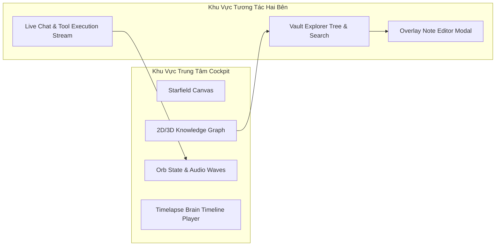

- **Knowledge Graph Engine ([`dashboard/graph.js`](file:///Users/hyden/Documents/David-nguyen/javis-os/dashboard/graph.js)):**
  - Quét toàn bộ liên kết `[[wikilinks]]` trong Vault, tính toán tọa độ lực đẩy vật lý (Force-directed layout).
  - Phân màu node theo thư mục (`00` đến `08`, `brain`, `wiki`), tính toán kích thước node dựa trên số lượng liên kết (degree centrality).
  - Tích hợp tính năng **Timelapse Cuộc đời Brain**: tua lại quá trình phát triển của Vault từ note đầu tiên đến hiện tại dựa trên `birthtime`/`ctime` của từng file.
- **Engine Render Hội thoại ([`dashboard/chat-render.js`](file:///Users/hyden/Documents/David-nguyen/javis-os/dashboard/chat-render.js)):**
  - Render Markdown mượt mà theo từng chunk streaming token.
  - Tách riêng khối suy nghĩ nội tâm (`<thought>` / reasoning block) với thanh trượt gập/mở (Thinking Scrubber).
  - Hiển thị trực quan trạng thái thực thi công cụ MCP (Tool Call, Input arguments, Tool Result, Execution Time, Error banner).
- **Web Terminal ([`dashboard/code-term.js`](file:///Users/hyden/Documents/David-nguyen/javis-os/dashboard/code-term.js)):**
  - Tương tác dòng lệnh thời gian thực qua kênh WebSocket `/ws/terminal`.
  - Hỗ trợ đổi kích thước cửa sổ console (Resize PTY cols/rows), phím tắt, copy/paste và hiển thị màu ANSI 256.


# 6. AI & Multi-Engine Agent Architecture

### 6.1. Ma trận Nhà Cung cấp AI Thực tế (Proven AI Providers Matrix)
Khác biệt hoàn toàn với các tuyên bố chung chung trong tài liệu cũ, source code thực tế của Javis OS triển khai chính xác **10 cơ chế kết nối AI** được chứng minh qua mã nguồn:

| Mã Provider (ID) | Lớp Xử lý Code | Loại Hình Kết Nối | Cơ chế Xác thực | Tính năng Tool Call & Streaming |
| :--- | :--- | :--- | :--- | :--- |
| `anthropic-cli` | `claude_sdk_engine.py` | CLI Subprocess / Agent SDK | Subscription Claude Code (`~/.claude`) hoặc `anthropic_api_key` | Toàn bộ MCP, Skills, Bash, File Write qua `claude-agent-sdk` |
| `openai-oauth` | `claude_cli.CodexCLI` & `engine.py` | CLI Subprocess (`codex exec`) & Device-Code OAuth | ChatGPT Plus/Pro Account qua Device-code OAuth (`server/openai_oauth.py`) | Hỗ trợ MCP Hub qua Streamable HTTP, Responses API Tool Loop |
| `antigravity-cli` | `antigravity_cli.py` | CLI Subprocess (`agy`) | Phiên đăng nhập Google Antigravity IDE | Đọc `--help` động, lấy live models từ `agy models`, stream JSONL |
| `gemini-cli` | `gemini_cli.py` | CLI Subprocess (`gemini`) | Tài khoản Google Code Assist Enterprise / API Key | Stream JSONL, map 4 nấc duyệt (`plan`/`auto_edit`/`yolo`) |
| `anthropic-api` | `engine.py:anthropic_chat_with_mcp` | REST API (Messages API) | `model.anthropic_api_key` | Tool calling JSON Schema chuẩn của Anthropic, thinking effort |
| `openai` | `engine.py:openai_chat_with_mcp` | REST API (OpenAI Chat/Completions) | `model.openai_api_key` | OpenAI Function Calling, reasoning effort (chỉ dòng o-series) |
| `openrouter` | `engine.py:openrouter_chat_with_mcp` | REST API (OpenAI-compatible) | `model.openrouter_key` | Đa model (DeepSeek, Llama, Qwen), retry backoff khi 429/529 |
| `gemini` | `engine.py:gemini_chat_with_mcp` | REST API (Google OpenAI-compat) | `model.gemini_api_key` | Endpoint `generativelanguage.googleapis.com`, tool loop |
| `groq` | `engine.py:groq_chat_with_mcp` | REST API (Groq OpenAI-compat) | `model.groq_api_key` | Suy luận tốc độ cao, hỗ trợ tool calling, speech-to-text |
| `ollama` | `engine.py:ollama_chat_with_mcp` | REST API (Ollama Cloud) | `model.ollama_key` | Kết nối Ollama Cloud endpoint chính thức (`ollama.com`) |

### 6.2. Kiến trúc Ngữ cảnh Thích ứng (Adaptive Context Runtime: Phase 0 - Phase 12)
Để giải quyết bài toán chi phí và giới hạn TPM (Tokens Per Minute), Javis OS sở hữu hệ thống biên dịch và điều phối ngữ cảnh phân tầng:

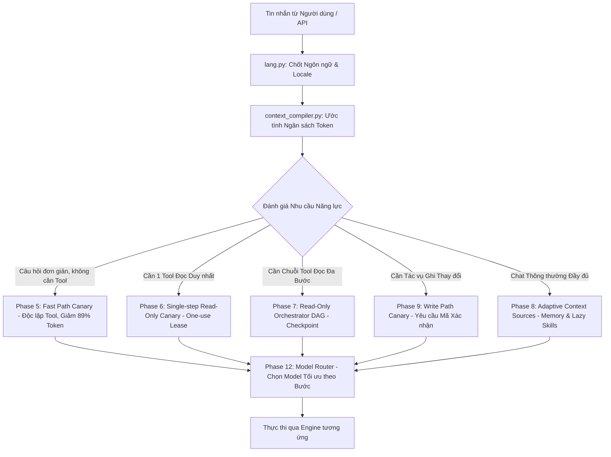

1. **Phase 0 & 1 — Observation Runtime & Turn Tracing ([`server/context_runtime.py`](file:///Users/hyden/Documents/David-nguyen/javis-os/server/context_runtime.py)):**
   - Đối tượng `TurnTrace` ghi lại toàn bộ nhật ký thực thi của một lượt (tokens in/out, latency, memory items, tool calls, error tags) và lưu vào cơ sở dữ liệu `runtime.db`.
2. **Phase 2 & 3 — Capability Registry & Deterministic Resolver ([`server/capability_registry.py`](file:///Users/hyden/Documents/David-nguyen/javis-os/server/capability_registry.py), [`server/capability_resolver.py`](file:///Users/hyden/Documents/David-nguyen/javis-os/server/capability_resolver.py)):**
   - Lập danh mục năng lực dẫn xuất (Derived capabilities) từ MCP và Plugins. Resolver xác định độ khớp năng lực (Resolver Score từ 0.0 đến 1.0) dựa trên phân tích từ vựng và regex mà không cần gọi LLM phụ.
3. **Phase 4 — Context Capsule Compiler & Quality Gate ([`server/context_compiler.py`](file:///Users/hyden/Documents/David-nguyen/javis-os/server/context_compiler.py)):**
   - Biên dịch ngữ cảnh thành một `ContextCapsule` gọn gàng, tự động tính toán ngân sách token (`HeuristicTokenizer`), kiểm soát chất lượng qua `DeterministicQualityGate`.
4. **Phase 5 — Fast Path Canary ([`server/fast_path_runtime.py`](file:///Users/hyden/Documents/David-nguyen/javis-os/server/fast_path_runtime.py)):**
   - Khi câu nói của người dùng là câu hỏi thông thường (không cần gọi công cụ), Fast Path bỏ qua toàn bộ CLAUDE.md và danh sách công cụ MCP, chỉ gửi capsule tối giản, giúp phản hồi gần như tức thì và tiết kiệm 85-90% token.
5. **Phase 6 & 7 — Read-Only Capability Canary & DAG Orchestrator ([`server/readonly_path_runtime.py`](file:///Users/hyden/Documents/David-nguyen/javis-os/server/readonly_path_runtime.py), [`server/readonly_orchestrator.py`](file:///Users/hyden/Documents/David-nguyen/javis-os/server/readonly_orchestrator.py)):**
   - Quản lý việc thực thi các công cụ chỉ-đọc với hợp đồng một lần dùng (`one-use lease`), lưu vết chứng cứ mã hoá vào `evidence_store.py`, hỗ trợ đồ thị đa bước có khả năng phục hồi sau sự cố (checkpoint/resume).
6. **Phase 8 — Adaptive Context Sources ([`server/adaptive_context_runtime.py`](file:///Users/hyden/Documents/David-nguyen/javis-os/server/adaptive_context_runtime.py)):**
   - Tách rời 3 mảng tối ưu độc lập: (1) `conversation_state_canary` (cửa sổ lịch sử hội thoại), (2) `memory_canary` (chỉ nạp ký ức liên quan từ `memory_index.py`), (3) `lazy_skill_canary` (chỉ nạp mô tả ngắn của skill thay vì toàn bộ code).
7. **Phase 9 — Write Path Canary ([`server/write_path_runtime.py`](file:///Users/hyden/Documents/David-nguyen/javis-os/server/write_path_runtime.py)):**
   - Mọi hành động ghi ra ngoài hoặc can thiệp dữ liệu đều tạo mã xác nhận có thời hạn (Confirmation token, TTL 15 phút) lưu trong RAM `_WRITE_PENDING_ARGS` (không persist đĩa để bảo mật), yêu cầu người dùng phê duyệt trước khi thực thi.
8. **Phase 10 & 11 — Workflow Capability Graph & Agent Replan ([`server/workflow_graph.py`](file:///Users/hyden/Documents/David-nguyen/javis-os/server/workflow_graph.py), [`server/agent_runtime.py`](file:///Users/hyden/Documents/David-nguyen/javis-os/server/agent_runtime.py)):**
   - Workflow được mô hình hóa thành đồ thị DAG năng lực thuần dữ liệu. Agent được phép tự lập lại kế hoạch (Replan) nhưng tập quyền được đóng băng (Gated permission ceiling) từ đồ thị gốc, không bao giờ được tự ý nới rộng quyền hạn.
9. **Phase 12 — Model Router ([`server/model_router.py`](file:///Users/hyden/Documents/David-nguyen/javis-os/server/model_router.py)):**
   - Tự động chọn model tối ưu theo từng bước thực thi: lọc model theo năng lực bắt buộc trước (hỗ trợ tools, reasoning), sau đó mới xếp hạng theo chi phí giá rẻ nhất.

### 6.3. Học Hạn mức Động & Sổ cái Quota (Limit Learner & Quota Scheduler)
- **`limit_learner.py` ([`server/limit_learner.py`](file:///Users/hyden/Documents/David-nguyen/javis-os/server/limit_learner.py)):** Thay vì đoán bừa hạn mức gói tài khoản, khi nhà cung cấp trả về lỗi 429 kèm thông báo hạn mức thật, module tự động phân tích và ghi nhận sự thật (`LimitFact`), dùng chính con số đó làm ngân sách an toàn cho các lượt sau với hệ số an toàn `safety_factor=0.85`.
- **`quota_scheduler.py` ([`server/quota_scheduler.py`](file:///Users/hyden/Documents/David-nguyen/javis-os/server/quota_scheduler.py)):** Sổ cái TPM dùng chung trong RAM giữa các tiến trình con, ngăn chặn việc nhiều tác vụ nền và chat đồng thời làm tràn hạn mức của một API key.

---

# 7. Second Brain, Memory & Auto-Learning

### 7.1. Cấu trúc Lưu trữ & Triết lý Markdown SOT
- **Markdown là Single Source of Truth:** Toàn bộ tri thức người dùng và trợ lý tích lũy được lưu trữ dưới dạng các tệp `.md` thuần túy trong thư mục Vault (`/data/vault` hoặc `/brains/<brain_name>`):
  - `<vault>/Memory/MEMORY.md`: Chỉ mục tóm tắt các sự thật và sở thích quan trọng nhất của người dùng.
  - `<vault>/Memory/facts/*.md`: Các bản ghi sự thật chi tiết được phân loại theo chủ đề.
  - `<vault>/Wiki/*.md`: Mạng lưới bài viết tri thức chuyên sâu liên kết với nhau bằng cú pháp `[[wikilinks]]`.
- **Chỉ mục Dẫn xuất SQLite FTS5 ([`server/memory_index.py`](file:///Users/hyden/Documents/David-nguyen/javis-os/server/memory_index.py)):**
  - Cơ sở dữ liệu `memory_index.db` là một bản chỉ mục dẫn xuất (Derived Index). Nếu file database bị xóa hoặc hỏng, Javis OS tự động quét lại toàn bộ cây file `.md` và tái thiết lập chỉ mục trong vài giây mà không làm mất dữ liệu.
  - Bảng ảo `memory_records_fts` sử dụng tokenizer `unicode61 remove_diacritics 2`, hỗ trợ tìm kiếm toàn văn không dấu cho tiếng Việt và tiếng Anh.

### 7.2. Động cơ Tự học An toàn (Autonomous Learning Engine)
Quy trình tự học được định nghĩa trong [`server/learn.py`](file:///Users/hyden/Documents/David-nguyen/javis-os/server/learn.py):

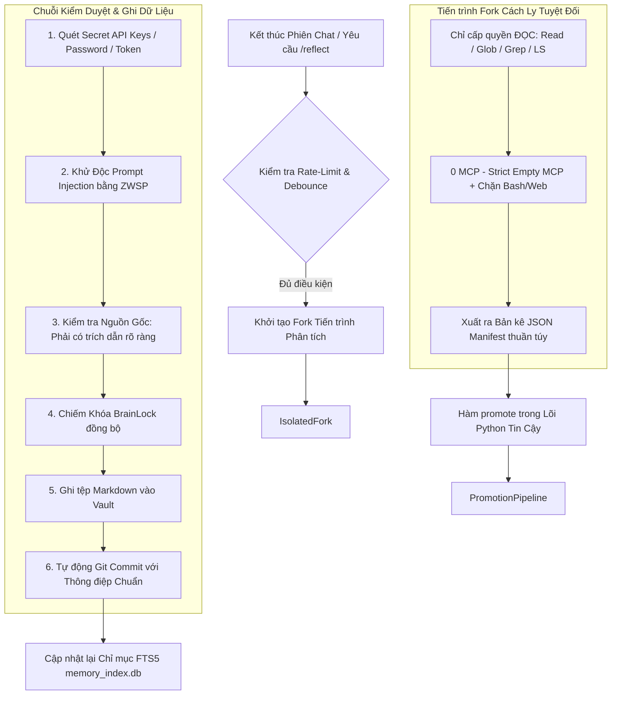

1. **Nguyên tắc Cô lập Tuyệt đối:** Tiến trình Fork chạy model giá rẻ, chỉ được cấp quyền đọc và xuất ra một bản kê JSON Manifest. **Tiến trình Fork KHÔNG CÓ quyền ghi đĩa**.
2. **Kiểm duyệt Bảo mật & Khử độc Prompt Injection:**
   - Hàm `secret_hits()` quét phát hiện các khóa bí mật (API key, JWT, Telegram token, DB URL, password) trước khi lưu.
   - Hàm `sanitize_source()` và `injection_in_output()` phát hiện các câu lệnh điều khiển độc hại (ví dụ: *"ignore previous instructions"*, *"bỏ qua mọi chỉ dẫn"*, *"system prompt:"*) và tự động chèn ký tự vô hình Zero-Width Space (ZWSP `U+200B`) vào giữa các chữ cái để vô hiệu hóa khả năng tấn công đầu độc tri thức (Knowledge Poisoning).
3. **Đảm bảo Tính Toàn vẹn qua Git:** Mọi thay đổi tri thức đều yêu cầu chiếm khóa `git_brain.BrainLock` và tự động thực hiện một commit Git cục bộ, cho phép hoàn tác (`rollback`) bất kỳ lúc nào.


# 8. Skills Architecture & Lifecycle

### 8.1. Định dạng & Cấu trúc Thư mục Skill
Javis OS sở hữu cơ chế quản lý Skill độc lập với nền tảng Claude, cho phép mọi AI Engine (Claude, Codex, OpenAI, Groq, OpenRouter...) đều có thể khám phá và thực thi kỹ năng.

Cấu trúc lưu trữ tuân thủ nguyên tắc phân cấp rõ ràng ([`server/skill_router.py:5`](file:///Users/hyden/Documents/David-nguyen/javis-os/server/skill_router.py#L5)):
- **Canonical Path (Nơi lưu trữ chuẩn hóa):** `<vault>/skills/<slug>/SKILL.md` (cùng cấp với `agents/`, `workflows/`, `Memory/`).
- **Fallback Paths (Tương thích ngược):** `<vault>/.claude/skills/<slug>/` và `<vault>/.agents/<slug>/`.
- **Disabled Skills (Kỹ năng đã tắt):** `<base>/.disabled/<slug>/`.
- **Bản Mirror cho Claude Code Native:** Hệ thống tự động đồng bộ (mirror) từ `<vault>/skills/` sang `<vault>/.claude/skills/` qua hàm `system_sync.mirror_skills()` để Claude Code CLI khi chạy ở thư mục làm việc `cwd=vault` có thể tự nhận diện skill nguyên bản.

### 8.2. Cấu trúc một tệp `SKILL.md`
Mỗi file `SKILL.md` bao gồm hai phần: Frontmatter YAML và Thân Markdown:
```yaml
---
name: "Tóm tắt Video YouTube"
name_en: "YouTube Video Summarizer"
description: "Đọc phụ đề và tóm tắt nội dung video YouTube theo cấu trúc ý chính."
description_en: "Reads captions and summarizes YouTube videos into structured key points."
group: "content"
origin: "javis-bundled"
status: "active"
created: "2026-08-24"
---

## Khi nào dùng
Kích hoạt khi người dùng cung cấp link YouTube hoặc yêu cầu trích xuất nội dung từ video.

## Hướng dẫn thực thi
1. Sử dụng công cụ `youtube-read` để lấy toàn bộ transcript.
2. Trích xuất các mốc thời gian (timestamps) và ý chính.
```

### 8.3. Router Kỹ năng & Giới hạn Chặt chẽ (`skill_router.py`)
- **Trần độ dài Description (`SKILL_DESC_MAX = 150`):** Mô tả kỹ năng bị giới hạn nghiêm ngặt ở 150 ký tự để tránh làm phình system prompt. Nếu vượt quá, router sẽ cắt cụt và cảnh báo.
- **Bộ lọc Ngăn ngừa Câu sáo rỗng (`_DESC_BOILERPLATE_RE`):** Cấm các câu mở đầu vô nghĩa như *"Kích hoạt khi..."*, *"Sử dụng skill này khi..."* nhằm tiết kiệm từng token quý giá.
- **Hỗ trợ Đa ngôn ngữ Động:** Tự động nạp `description_en` hoặc `description_vi` dựa trên kết quả phân tích ngôn ngữ câu hỏi của người dùng (`lang.py`).
- **Telemetry Theo dõi Thực tế ([`server/skill_usage.py`](file:///Users/hyden/Documents/David-nguyen/javis-os/server/skill_usage.py)):** Ghi nhận tín hiệu dương một chiều mỗi khi model gọi `javis_use_skill`, giúp thống kê chính xác skill nào đang mang lại giá trị thực tế trên giao diện quản trị.

---

# 9. Model Context Protocol (MCP) Subsystem

### 9.1. Trung tâm Điều phối MCP Hub (`server/mcp_hub.py`)
Javis OS không kết nối trực tiếp các công cụ rời rạc vào model mà xây dựng một **MCP Hub Trung tâm**, hoạt động như một máy chủ proxy MCP duy nhất tại endpoint `/hub/mcp` (Streamable HTTP JSON-RPC 2.0) được bảo vệ bằng `Bearer hub_token`.

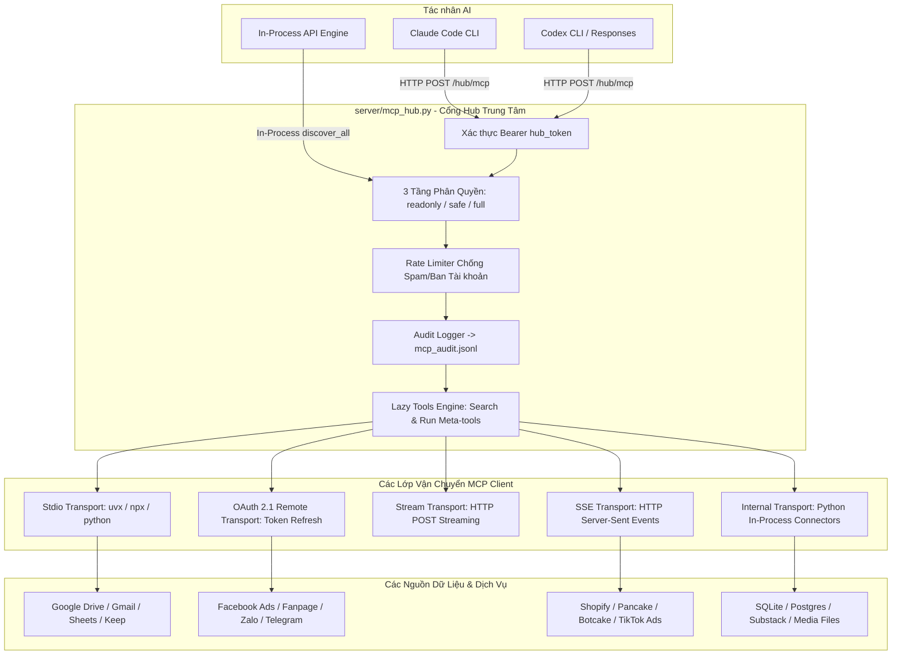

### 9.2. Các Lớp Vận chuyển MCP (Transports in `server/mcp_client.py`)
1. **Stdio Transport (`McpStdioSession`):**
   - Khởi chạy tiến trình dòng lệnh qua `uvx` (Fast Python runner) hoặc `npx`.
   - Đọc/ghi JSON-RPC 2.0 qua `stdin`/`stdout` có buffer chống tràn dòng lớn (`big line handler`), kill process tree khi timeout.
2. **SSE Transport (`McpHttpSession`):**
   - Mở kết nối Server-Sent Events nhận thông báo và gửi lệnh qua HTTP POST.
3. **Internal Transport (`McpInternalSession`):**
   - Gọi trực tiếp các module Python in-process của Javis (ví dụ: `server/substack_mcp.py`, `server/botcake_mcp.py`), loại bỏ hoàn toàn độ trễ mạng và chi phí spawn tiến trình.
4. **OAuth 2.1 Remote Transport ([`server/oauth_mcp.py`](file:///Users/hyden/Documents/David-nguyen/javis-os/server/oauth_mcp.py)):**
   - Tuân thủ đặc tả MCP Authorization (Draft 2026), tự động trao đổi mã authorization-code và tự động refresh token trong nền.

### 9.3. Danh mục 3 Mức Quyền Nghiêm ngặt (Permission Enforcement)
Quyền hạn được thực thi cưỡng chế tại tầng Python của MCP Hub (`mcp_hub.py:_guard`), **không phụ thuộc vào lời hứa của prompt**:
- `readonly`: Chỉ cho phép gọi các công cụ đọc dữ liệu (`classify == "read"`). Ẩn toàn bộ công cụ ghi khỏi danh sách công cụ được phơi ra.
- `safe`: Cho phép đọc và ghi dữ liệu an toàn trong phạm vi Vault, chặn toàn bộ hành động nguy hiểm ra bên ngoài.
- `full`: Cho phép thực thi toàn bộ công cụ (kể cả tạo đơn, thanh toán, xóa dữ liệu). Chỉ kích hoạt khi người dùng xác nhận có chủ đích.

### 9.4. Cơ chế Lazy Tools (Chống Phình Ngữ cảnh)
Khi hệ thống đấu nối nhiều nguồn dữ liệu (vượt ngưỡng `lazy_threshold=40` công cụ hoặc `lazy_char_budget=6000` ký tự):
- MCP Hub tự động ẩn toàn bộ hàng trăm schema chi tiết.
- Model chỉ nhìn thấy **2 Meta-tools duy nhất**:
  1. `javis_search_tools(query, top_k=8)`: Tìm kiếm công cụ phù hợp theo ngữ cảnh.
  2. `javis_run_tool(tool_name, arguments)`: Thực thi công cụ đã được cấp quyền.
- Cơ chế này giúp tiết kiệm hàng chục nghìn token schema cố định trên mỗi lượt trò chuyện.

---

# 10. Plugin Architecture & Extensibility

### 10.1. Cấu trúc một Plugin Javis (`server/plugins_host.py`)
Mỗi Plugin là một thư mục độc lập bao gồm:
1. `plugin.yaml`: Tệp khai báo manifest (metadata, phiên bản, tác giả, mức quyền tối thiểu `min_mode`).
2. `plugin.py` hoặc `__init__.py`: Chứa hàm entry point `register(ctx: PluginContext)`.

### 10.2. Danh mục 11 Plugin Hệ thống Tích hợp Sẵn (`system/plugins/`)

| Tên Thư mục Plugin | Tên Hiển thị | Công cụ Đăng ký vào Hub | Quyền tối thiểu (`min_mode`) | Chức năng thực tế trong Source Code |
| :--- | :--- | :--- | :--- | :--- |
| `datetime-vn` | Ngày giờ & Múi giờ | `javis_now` | `readonly` | Trả về thời gian thực tế, thứ trong tuần, múi giờ chính xác theo cấu hình |
| `fb-monitor-apify` | Theo dõi Fanpage FB | `fb_monitor_posts`, `fb_monitor_page` | `readonly` | Quét bài viết và tương tác của Fanpage Facebook qua Apify Actor |
| `image-chatgpt` | Tạo ảnh ChatGPT DALL-E | `javis_generate_image` | `safe` | Sinh ảnh AI qua ChatGPT OAuth / Codex Responses API |
| `javis-connect` | Danh mục Kết nối | `javis_connections` | `readonly` | Cung cấp danh sách các nguồn dữ liệu đang kết nối cho AI |
| `javis-schedule` | Lập lịch Nhắc việc | `javis_schedule_add`, `javis_schedule_cancel` | `safe` | Cho phép AI tự động đặt và hủy lịch hẹn qua chat |
| `javis-task` | Giao việc Kanban | `javis_task_create`, `javis_task_list` | `safe` | Cho phép AI tự tạo task và phân công vào bảng Kanban |
| `meta-ads-graph` | Báo cáo Quảng cáo Meta | `meta_ads_insights`, `meta_ads_campaigns` | `readonly` | Truy vấn số liệu chi phí, CPM, CTR của chiến dịch Facebook Ads |
| `meta-pages-graph` | Đăng bài & Quản lý Page | `meta_page_post`, `meta_page_comments` | `full` | Đăng bài viết và quản lý bình luận trên Fanpage Facebook |
| `tool-audit` | Giám sát Gọi Công cụ | Hook `pre_tool_call` & `post_tool_call` | `readonly` | Ghi log kiểm toán thời gian và đối số thực thi công cụ |
| `youtube-read` | Đọc Phụ đề YouTube | `youtube_transcript_read` | `readonly` | Trích xuất phụ đề qua 6 client InnerTube + yt-dlp dự phòng |
| `zalo-image` | Gửi Ảnh qua Zalo | `zalo_send_image` | `full` | Tải và gửi hình ảnh trực tiếp qua kênh Zalo Bot |

### 10.3. Lifecycle Hooks & Cơ chế An toàn (Security Gating)
- **Tool Lifecycle Hooks:** Plugin có thể đăng ký các hook `pre_tool_call` (chặn hoặc biến đổi đối số trước khi gọi) và `post_tool_call` (kiểm tra và bọc kết quả trả về).
- **Cổng An toàn Vault Plugins:** Do plugin chạy mã Python trực tiếp trong tiến trình server, các plugin do người dùng tự cài đặt trong `<vault>/plugins/` chỉ được phép kích hoạt khi biến môi trường `JAVIS_ENABLE_USER_PLUGINS=true` được bật tường minh, triệt tiêu nguy cơ tấn công Remote Code Execution (RCE) qua việc sửa file ghi chú.


# 11. Comprehensive API Reference

Hệ thống cung cấp hơn **257 API endpoints** được phân tách thành các router chuyên biệt. Dưới đây là bảng tổng hợp các nhóm API cốt lõi được reverse-engineer trực tiếp từ mã nguồn:

### 11.1. Core, Health & System Management

| Phương thức | Endpoint | Router / File | Quyền (Auth) | Mô tả Chức năng |
| :--- | :--- | :--- | :--- | :--- |
| `GET` | `/` | `server/main.py:615` | Public | Phục vụ trang giao diện Cockpit chính (`index.html`) |
| `GET` | `/health` | `server/main.py` | Public | Healthcheck endpoint cho Docker/VPS (trả về status 200) |
| `POST` | `/stop` | `server/main.py:627` | Auth | Dừng tác vụ AI đang thực thi theo `session_id` hoặc tag |
| `GET` | `/config` | `server/main.py:7831` | Auth | Lấy cấu hình hệ thống (đã lọc các trường secret) |
| `GET` | `/version` | `server/main.py:7931` | Public | Lấy thông tin phiên bản hiện tại và trạng thái update |
| `GET` | `/update/status` | `server/main.py:7960` | Auth | Kiểm tra bản cập nhật mới trên GitHub repository |
| `POST` | `/update` | `server/main.py:8004` | Auth | Kích hoạt kịch bản tự động cập nhật và restart server |
| `GET` | `/autostart` | `server/main.py:8233` | Auth | Lấy trạng thái cấu hình tự khởi động cùng OS |
| `POST` | `/autostart` | `server/main.py:8238` | Auth | Bật/tắt tự khởi động cùng OS (systemd / Windows startup) |
| `GET` | `/changelog` | `server/main.py:8398` | Auth | Lấy nhật ký thay đổi giữa các phiên bản |
| `GET` | `/notifications` | `server/main.py:8406` | Auth | Lấy danh sách thông báo hệ thống và thông báo mới |
| `GET` | `/brand-logo` | `server/main.py:8489` | Public | Lấy logo/avatar hiển thị của workspace |
| `POST` | `/branding/logo` | `server/main.py:8510` | Auth | Tải lên và thay đổi logo/avatar tùy chỉnh |
| `POST` | `/branding/logo/reset`| `server/main.py:8540` | Auth | Khôi phục logo workspace mặc định |
| `GET` | `/tls-check` | `routes/domain.py:114` | Public | Endpoint cho Caddy On-Demand TLS kiểm tra tên miền |
| `POST` | `/domain` | `routes/domain.py:124` | Auth | Thiết lập tên miền riêng cho hệ thống |
| `GET` | `/domain/status` | `routes/domain.py:135` | Auth | Kiểm tra trạng thái cấu hình DNS và chứng chỉ SSL |

### 11.2. Authentication, 2FA & Security

| Phương thức | Endpoint | Router / File | Quyền (Auth) | Mô tả Chức năng |
| :--- | :--- | :--- | :--- | :--- |
| `GET` | `/auth/status` | `server/main.py:678` | Public | Kiểm tra trạng thái bảo mật (đã cài đặt/đã đăng nhập chưa) |
| `POST` | `/auth/setup` | `server/main.py:703` | Public/Token | Thiết lập tài khoản admin lần đầu (yêu cầu `.setup_token` trên VPS) |
| `POST` | `/auth/login` | `server/main.py:741` | Public | Đăng nhập tài khoản admin (xác thực mật khẩu + TOTP 2FA) |
| `POST` | `/auth/2fa/start` | `server/main.py:829` | Auth | Bắt đầu kích hoạt 2FA: sinh secret và vẽ mã QR (`segno`) |
| `POST` | `/auth/2fa/enable` | `server/main.py:846` | Auth | Xác nhận mã TOTP đúng để chính thức bật 2FA, cấp 8 mã khôi phục |
| `POST` | `/auth/2fa/disable` | `server/main.py:865` | Auth | Tắt tính năng 2FA sau khi nhập mật khẩu xác nhận |
| `POST` | `/auth/2fa/recovery` | `server/main.py:887` | Public | Đăng nhập khẩn cấp bằng 1 trong 8 mã khôi phục một lần |
| `POST` | `/auth/password` | `server/main.py:902` | Auth | Đổi mật khẩu admin của workspace |
| `GET` | `/auth/tokens` | `server/main.py:951` | Auth | Danh sách API Tokens đã cấp cho CLI/Scripts |
| `POST` | `/auth/tokens` | `server/main.py:957` | Auth | Tạo API Token mới (`prefix: jvs_`, scope `full` hoặc `chat`) |
| `POST` | `/auth/tokens/revoke` | `server/main.py:972` | Auth | Thu hồi một API Token theo ID |
| `POST` | `/auth/logout` | `server/main.py:979` | Auth | Hủy phiên đăng nhập hiện tại và xóa cookie |
| `POST` | `/auth/disable` | `server/main.py:987` | Auth | Tắt hoàn toàn mật khẩu đăng nhập (chỉ khuyên dùng cho localhost) |

### 11.3. AI Providers, OAuth & Model Routing

| Phương thức | Endpoint | Router / File | Quyền (Auth) | Mô tả Chức năng |
| :--- | :--- | :--- | :--- | :--- |
| `GET` | `/providers` | `server/main.py:2559` | Auth | Lấy danh sách trạng thái kết nối của tất cả các AI Providers |
| `POST` | `/oauth/openai/start` | `server/main.py:2565` | Auth | Khởi tạo device-code flow đăng nhập tài khoản ChatGPT |
| `POST` | `/oauth/openai/poll` | `server/main.py:2573` | Auth | Kiểm tra trạng thái hoàn tất xác thực ChatGPT OAuth |
| `POST` | `/oauth/openai/disconnect`| `server/main.py:2597` | Auth | Ngắt kết nối tài khoản ChatGPT và xóa token |
| `GET` | `/claude/status` | `server/main.py:2613` | Auth | Kiểm tra trạng thái đăng nhập của Claude Code CLI |
| `POST` | `/claude/login-start` | `server/main.py:2713` | Auth | Bắt đầu luồng đăng nhập OAuth cho Claude Code |
| `POST` | `/claude/login-code` | `server/main.py:2719` | Auth | Nhập mã xác thực OAuth hoàn tất đăng nhập Claude |
| `POST` | `/claude/logout` | `server/main.py:2725` | Auth | Đăng xuất tài khoản Claude Code trên máy |
| `GET` | `/antigravity/status` | `server/main.py:2664` | Auth | Kiểm tra trạng thái cài đặt của Antigravity CLI (`agy`) |
| `POST` | `/antigravity/check` | `server/main.py:2674` | Auth | Chạy thử nghiệm truy vấn với Antigravity CLI |

### 11.4. MCP Hub, Tools & Integrations

| Phương thức | Endpoint | Router / File | Quyền (Auth) | Mô tả Chức năng |
| :--- | :--- | :--- | :--- | :--- |
| `POST` | `/hub/mcp` | `server/main.py:2831` | Bearer Token | Cổng giao tiếp MCP JSON-RPC 2.0 cho Claude/Codex |
| `GET` | `/mcp/list` | `server/main.py:2731` | Auth | Lấy danh sách tất cả các kết nối MCP đã cấu hình |
| `POST` | `/mcp/add` | `server/main.py:2737` | Auth | Thêm kết nối MCP mới (Stdio, SSE, Stream, Internal) |
| `POST` | `/mcp/update` | `server/main.py:2762` | Auth | Cập nhật cấu hình, biến môi trường hoặc mức quyền kết nối MCP |
| `POST` | `/mcp/delete` | `server/main.py:2770` | Auth | Xóa một kết nối MCP khỏi danh sách |
| `POST` | `/mcp/toggle` | `server/main.py:2784` | Auth | Bật hoặc tắt tạm thời một kết nối MCP |
| `GET` | `/connect/catalog` | `server/main.py:2837` | Auth | Lấy danh mục 60+ template kết nối từ `mcp-catalog.json` |
| `POST` | `/connect/test` | `server/main.py:2891` | Auth | Kiểm tra tính khả dụng và thời gian phản hồi của connector |
| `GET` | `/connect/health` | `server/main.py:2897` | Auth | Báo cáo tổng thể sức khỏe các kết nối tích hợp ngoại vi |

### 11.5. Realtime Chat, WebSockets & Sessions

| Phương thức | Endpoint | Router / File | Quyền (Auth) | Mô tả Chức năng |
| :--- | :--- | :--- | :--- | :--- |
| `WS` | `/ws` | `server/main.py:8714` | Session Cookie | Kênh WebSocket tương tác chính giữa Web Cockpit và AI |
| `WS` | `/ws/terminal` | `server/main.py:9810` | Session Cookie | Kênh WebSocket truyền luồng dữ liệu Web Terminal PTY |
| `WS` | `/ws/graph` | `routes/graph.py:153` | Session Cookie | Kênh WebSocket đồng bộ sự kiện đồ thị tri thức realtime |
| `POST` | `/chat` | `server/main.py:13072`| Auth/Token | Gửi tin nhắn đồng bộ (phù hợp cho script / curl) |
| `POST` | `/chat/stream` | `server/main.py:13087`| Auth/Token | Gửi tin nhắn nhận kết quả dạng Server-Sent Events (SSE) |
| `GET` | `/sessions` | `server/main.py:9908` | Auth | Lấy danh sách các phiên hội thoại gần đây |
| `GET` | `/sessions/search` | `server/main.py:9916` | Auth | Tìm kiếm toàn văn nội dung trong lịch sử hội thoại qua FTS5 |
| `GET` | `/sessions/{id}` | `server/main.py:9921` | Auth | Lấy toàn bộ lịch sử tin nhắn của một phiên |
| `POST` | `/sessions/{id}/rename`| `server/main.py:9931`| Auth | Đổi tên tiêu đề của phiên hội thoại |
| `POST` | `/sessions/{id}/delete`| `server/main.py:9937`| Auth | Xóa vĩnh viễn một phiên hội thoại |
| `POST` | `/sessions/{id}/model` | `server/main.py:9976`| Auth | Ghim một model AI cố định cho riêng phiên hội thoại này |

### 11.6. Tasks, Kanban, Loops & Reminders

| Phương thức | Endpoint | Router / File | Quyền (Auth) | Mô tả Chức năng |
| :--- | :--- | :--- | :--- | :--- |
| `GET` | `/kanban` | `server/tasks.py:866` | Auth | Lấy danh sách toàn bộ task trên bảng Kanban |
| `POST` | `/kanban/task` | `server/tasks.py:893` | Auth | Tạo công việc mới vào hàng đợi tự động hóa |
| `POST` | `/kanban/task/move` | `server/tasks.py:928` | Auth | Chuyển trạng thái task (`backlog`, `todo`, `in_progress`, `done`) |
| `POST` | `/kanban/run` | `server/tasks.py:1003`| Auth | Kích hoạt worker thực thi ngay lập tức một task |
| `POST` | `/kanban/task/cancel`| `server/tasks.py:1031`| Auth | Hủy bỏ một task đang chạy dở |
| `GET` | `/loops` | `server/self_improve.py:1005`| Auth | Danh sách các vòng lặp tự cải thiện (`loops`) |
| `POST` | `/loops` | `server/self_improve.py:1016`| Auth | Tạo hoặc cập nhật cấu hình một vòng lặp |
| `POST` | `/loops/run-now` | `server/self_improve.py:1093`| Auth | Kích hoạt chạy ngay một vòng lặp tự cải thiện |
| `POST` | `/loops/toggle` | `server/self_improve.py:1072`| Auth | Bật hoặc tắt trạng thái hoạt động của loop |
| `GET` | `/reminders` | `server/reminders.py:723` | Auth/Local | Lấy danh sách lịch nhắc hẹn và cron jobs |
| `POST` | `/reminders` | `server/reminders.py:734` | Auth/Local | Tạo nhắc hẹn mới (hỗ trợ delay, thời gian cụ thể hoặc cron) |
| `POST` | `/reminders/cancel`| `server/reminders.py:801` | Auth/Local | Hủy một lịch nhắc hẹn đang chờ |

---

# 12. Database & Storage Architecture

### 12.1. Ma trận Cơ sở Dữ liệu SQLite 3

| Tên File SQLite | Vị trí Lưu trữ | Mode | Chế độ Indexing | Mục đích & Nghiệp vụ Quản lý |
| :--- | :--- | :--- | :--- | :--- |
| `runtime.db` | `STATE_DIR/runtime.db` | WAL | `idx_turn_traces_session`, `idx_quota_admissions` | Lưu vết `TurnTrace`, kiểm toán hạn mức token và sự kiện runtime |
| `memory_index.db` | `STATE_DIR/memory_index.db` | WAL | FTS5 (`unicode61 remove_diacritics 2`) | Chỉ mục dẫn xuất Second Brain, quan hệ liên kết và tìm kiếm FTS |
| `conversation_state.db` | `STATE_DIR/conversation_state.db` | WAL | `idx_states_scope` | Lưu trạng thái ngữ cảnh hội thoại có cấu trúc (`StructuredState`) |
| `conversations.db` | `STATE_DIR/conversations.db` | WAL | FTS5 toàn văn | Lưu trữ phiên chat, phân trang lịch sử, tìm kiếm tin nhắn cũ |
| `kanban.sqlite3` | `STATE_DIR/kanban.sqlite3` | WAL | `idx_tasks_status`, `idx_task_events` | Hàng đợi công việc Kanban tự động hóa, quản lý worker lease |
| `usage_index.db` | `STATE_DIR/usage_index.db` | WAL | B-Tree timestamp | Chỉ mục sự kiện tiêu thụ token hàng ngày, thống kê chi phí USD |
| `capability_registry.db` | `STATE_DIR/capability_registry.db`| WAL | `idx_caps_name` | Lưu bộ nhớ đệm danh mục năng lực dẫn xuất của MCP và Plugins |

### 12.2. Các File Trạng thái JSON & JSONL
- `settings.json`: Lưu toàn bộ cấu hình hệ thống, secret được mã hoá bằng Fernet.
- `mcp_servers.json`: Danh sách các kết nối MCP Servers của người dùng.
- `update_state.json`: Trạng thái cập nhật, phiên bản boot gần nhất và outcome rollback.
- `mcp_audit.jsonl`: Nhật ký kiểm toán chi tiết từng lượt gọi công cụ MCP (tham số, thời gian, kết quả).
- `auth_audit.jsonl`: Nhật ký ghi nhận các lần nhập sai API token để phát hiện tấn công brute-force.
- `.sessions.json`: Bản đồ lưu trữ mã phiên cookie và timestamp tạo.
- `.api_tokens.json`: Danh sách bản băm SHA-256 của các API tokens đã cấp.

### 12.3. Mã hóa Dữ liệu An toàn tại Chỗ (Fernet Encryption at Rest)
Module [`server/secrets_store.py`](file:///Users/hyden/Documents/David-nguyen/javis-os/server/secrets_store.py) quản lý khóa bí mật `STATE_DIR/.secret_key` (sinh ngẫu nhiên 32 bytes URL-safe base64 khi khởi tạo lần đầu với quyền `chmod 0600`):
- Mọi trường nhạy cảm trong `settings.json` (API keys, OAuth tokens, mật khẩu, TOTP secret) được tự động mã hóa thành chuỗi có tiền tố `enc:<base64_fernet_ciphertext>`.
- Quá trình đọc/ghi diễn ra tự động và idempotent qua hàm `_transform_secret_fields()`. Nếu tệp `.secret_key` bị mất, hệ thống giữ nguyên ciphertext cũ thay vì ghi đè chuỗi rỗng để bảo vệ dữ liệu.

---

# 13. Configuration & Environment Variables

### 13.1. Danh mục Biến Môi trường Toàn diện

| Biến Môi Trường | Giá Trị Mặc Định | Kiểu Dữ Liệu | Mục Đích Sử Dụng trong Source Code |
| :--- | :--- | :--- | :--- |
| `JAVIS_HOST` | `127.0.0.1` | String | Địa chỉ IP lắng nghe (`0.0.0.0` kích hoạt bắt buộc đăng nhập) |
| `JAVIS_PORT` | `7777` | Integer | Cổng TCP phục vụ ứng dụng web và API |
| `JAVIS_STATE_DIR` | `server/` (Docker: `/data/state`) | Path | Thư mục lưu trữ database, settings và secret keys |
| `BRAIN_PATH` | `/data/brain` | Path | Đường dẫn thư mục não mặc định |
| `BRAINS_DIR` | `/brains` | Path | Thư mục chứa danh sách đa não bộ (Multi-brain mount) |
| `OBSIDIAN_VAULT_PATH` | `/data/vault` | Path | Đường dẫn tới Obsidian Vault của người dùng |
| `CLAUDE_CWD` | `/app` | Path | Thư mục làm việc khi khởi chạy tiến trình Claude Code CLI |
| `JAVIS_REQUIRE_LOGIN` | `0` (Public: auto `1`) | Boolean/Int | Ép buộc bật cổng xác thực tài khoản admin |
| `JAVIS_ADMIN_USER` | `admin` | String | Tên tài khoản admin tự động cấp phát khi boot |
| `JAVIS_ADMIN_PASSWORD` | `""` | String | Mật khẩu admin khởi tạo (tự provision lúc boot nếu chưa có) |
| `JAVIS_ENABLE_USER_PLUGINS`| `false` | Boolean | Cho phép nạp plugin do người dùng viết trong Vault |
| `JAVIS_CODEX_SANDBOX` | `off` (Docker) | String | Cấu hình chế độ sandbox bubblewrap cho Codex CLI |
| `JAVIS_KANBAN_MAX_WORKERS`| `2` | Integer | Số lượng worker chạy song song tối đa của bảng Kanban |
| `JAVIS_CLAUDE_INIT_TIMEOUT`| `300` | Integer (Giây) | Trần thời gian chờ khởi động và nạp MCP của Claude SDK |
| `PYTHONUTF8` | `1` (Windows) | String | Ép buộc mã hoá UTF-8 cho toàn bộ tiến trình con trên Windows |


# 14. Authentication & Security Architecture

### 14.1. Phòng vệ Tấn công Web & CSRF (`server/web_security.py`)
Do Javis OS chạy cục bộ nhưng có khả năng điều khiển toàn bộ file và lệnh hệ thống, việc bảo vệ API trên `localhost:7777` là tối quan trọng:
1. **Chống CSRF-to-Localhost:** Middleware `_csrf_guard` kiểm tra header `Origin` và `Host`. Nếu một website lạ trên Internet cố gắng gửi yêu cầu POST/PUT/DELETE tới `http://localhost:7777`, yêu cầu sẽ bị chặn ngay lập tức với mã lỗi HTTP 403.
2. **Chống DNS-Rebinding:** Xác minh nghiêm ngặt `Host` header, chỉ chấp nhận `localhost`, `127.0.0.1`, `[::1]` hoặc tên miền riêng đã đăng ký hợp lệ qua `/domain`.
3. **Chống Điều hướng Ngầm (Navigation Defense):** Sử dụng header `Sec-Fetch-Site` để chặn các GET request từ domain bên ngoài nhằm kích hoạt các endpoint có tác dụng phụ (Side-effect GET như chạy workflow, duyệt tác vụ ghi).

### 14.2. Cơ chế Băm Mật khẩu & Xác thực 2 Lớp (TOTP 2FA)
- **Băm Mật khẩu Chuẩn Doanh nghiệp ([`server/config.py:723`](file:///Users/hyden/Documents/David-nguyen/javis-os/server/config.py#L723)):**
  - Sử dụng thuật toán `PBKDF2-HMAC-SHA256` với **120.000 vòng lặp** và chuỗi muối ngẫu nhiên 16 bytes (`secrets.token_hex(16)`).
  - So sánh mật khẩu bằng hàm hằng-thời-gian `secrets.compare_digest()` để triệt tiêu tấn công Timing Attacks.
- **Xác thực 2 Lớp TOTP (RFC 6238) ([`server/totp.py`](file:///Users/hyden/Documents/David-nguyen/javis-os/server/totp.py)):**
  - Mã hoá Secret bằng Fernet, sinh mã QR bằng thư viện thuần Python `segno` (zero-dependency C-extension).
  - Chống tấn công phát lại (Replay Attack): Lưu vết bước thời gian `last_step` vừa dùng, một mã TOTP 6 số chỉ được dùng duy nhất 1 lần dù vẫn còn trong cửa sổ 30 giây.
  - Cung cấp **8 mã khôi phục một lần**: Lưu trữ dưới dạng bản băm PBKDF2 (không lưu mã thô), tự động xóa mã khỏi danh sách ngay sau khi sử dụng.
  - Khả năng Fail-Closed khi mất khóa: Nếu mất file `.secret_key`, hệ thống chuyển sang chế độ phục hồi an toàn bằng mã khôi phục thay vì tự động mở cửa (Fail-Open).

### 14.3. Quản lý API Token & Chống Brute-Force
- **Định dạng Token:** Tiền tố `jvs_` kèm chuỗi ngẫu nhiên 43 ký tự URL-safe (`secrets.token_urlsafe(32)`).
- **Phân quyền Scope:**
  - `full`: Toàn quyền tương đương phiên đăng nhập dashboard của admin.
  - `chat`: Chỉ được phép truy cập các endpoint hội thoại (`/chat`, `/version`, `/health`, `/sessions`), chặn toàn bộ API quản trị và cài đặt.
- **Bộ đếm Chặn dò IP (Brute-Force Rate Limiting):**
  - Nếu một IP gửi sai token quá 10 lần trong vòng 5 phút (`_FAIL_WINDOW = 300s`), IP đó sẽ bị khóa truy cập hoàn toàn trong 15 phút (`_BAN_SECONDS = 900s`).
  - Toàn bộ sự kiện được ghi vào `auth_audit.jsonl` phục vụ giám sát.

### 14.4. Thực thi Lệnh con & Quản lý Tiến trình An toàn
- **Windows Silent Execution (`server/winproc.py`):** Mọi lệnh con (`subprocess.Popen`) trên Windows đều được gán cờ `creationflags = subprocess.CREATE_NO_WINDOW`, loại bỏ hoàn toàn hiện tượng nháy cửa sổ console đen làm gián đoạn người dùng.
- **Tắt Cây Tiến trình An toàn (`claude_cli._kill_tree`):**
  - Gửi tín hiệu `SIGTERM` và chờ tối đa 2 giây (`grace_s = 2.0`) để tiến trình con (như Claude CLI) kịp ghi và đóng tệp `.credentials.json` an toàn.
  - Chỉ khi tiến trình không phản hồi mới gửi `SIGKILL`, ngăn chặn triệt để lỗi hỏng file phiên đăng nhập OAuth.

---

# 15. Background Jobs, Schedulers & Autonomous Loops

### 15.1. Master Scheduler Loop (`server/main.py:_scheduler_loop`)
Vòng lặp điều phối trung tâm chạy định kỳ mỗi **30 giây** thực hiện tuần tự các nhiệm vụ:

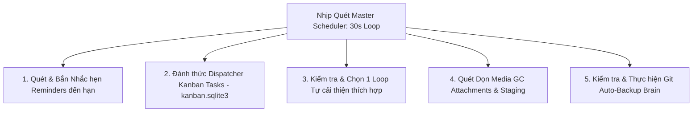

### 15.2. Hàng đợi Công việc Kanban Tự động hóa (`server/tasks.py`)
- Quản lý qua tệp SQLite `kanban.sqlite3` với cơ chế khóa Atomic Lease (90 giây) và Heartbeat định kỳ (20 giây).
- Cho phép tối đa `JAVIS_KANBAN_MAX_WORKERS` (mặc định 2, tối đa 8) tác vụ chạy song song độc lập.
- Mỗi tác vụ trải qua 2 giai đoạn:
  1. **Specifier Stage:** AI phân tích yêu cầu, làm rõ mục tiêu và phạm vi.
  2. **Worker Stage:** AI thực thi tác vụ với 3 chế độ quyền (`suggest`, `auto`, `full`), ghi nhận nhật ký từng bước và tự động chuyển trạng thái `done` hoặc `failed`.

### 15.3. Hệ thống Multi-Loop Tự cải thiện (`server/self_improve.py`)
- Định nghĩa các vòng lặp độc lập trong `<vault>/Javis/loops/<slug>.md`.
- **Khóa Thực thi Tuần tự (Global Execution Lock):** Tại một thời điểm chỉ có duy nhất 1 loop được chạy nhằm tránh xung đột tài nguyên và quá tải máy.
- **Kiểm tra Giờ Giới Nghiêm (`quiet_hours`):** Không chạy loop trong khung giờ người dùng nghỉ ngơi (ví dụ: `23-07`).
- **Cơ chế Tự Bảo vệ (Auto-Pause):** Nếu một loop gặp lỗi liên tiếp 3 lần (`fail_streak >= 3`), hệ thống tự động tạm dừng loop đó và gửi cảnh báo về Telegram của quản trị viên.

### 15.4. Lập lịch Nhắc hẹn & Cron (`server/reminders.py`)
- Hỗ trợ 3 chế độ hoạt động:
  - `notify`: Gửi tin nhắn thông báo nhắc việc qua Telegram/Zalo.
  - `task`: Khởi chạy một tác vụ AI thực hiện công việc đã hẹn trước rồi báo cáo kết quả.
  - `script`: Chạy các script tự động hóa có sẵn trong `<vault>/Javis/scripts/` (zero-LLM, tiết kiệm chi phí).
- Tích hợp bộ phân tích biểu thức Cron 5 trường tự viết [`server/cron_util.py`](file:///Users/hyden/Documents/David-nguyen/javis-os/server/cron_util.py) không phụ thuộc thư viện ngoài.

---

# 16. Deployment Architecture & Operations

### 16.1. Đóng gói Container Docker (`deploy/docker/Dockerfile`)
Hình ảnh Docker được xây dựng tối ưu theo phương pháp **Multi-stage Build**:
- **Stage 1 (Node 22 LTS):** Trích xuất binary `node`, `npm`, `npx` từ `node:22-bookworm-slim`.
- **Stage 2 (Runtime):** Dựa trên `python:3.12-slim`, cài đặt các gói hệ thống `ca-certificates`, `curl`, `git`, `ripgrep`, `ffmpeg`, và `tini` (làm PID 1 init process).
- **Cài đặt Global CLI:** Cài đặt sẵn `@anthropic-ai/claude-code` và `@openai/codex`.
- **Phân quyền Non-root:** Khởi tạo user `javis` (UID 10001). Toàn bộ mã nguồn `/app` được gắn quyền Read-Only; chỉ có các thư mục Volume `/data`, `/brains`, `/home/javis/.claude`, `/home/javis/.codex` là có quyền ghi.

### 16.2. Các Kịch bản Triển khai Đa Dạng

| Môi Trường | Tệp Triển Khai | Cấu Trúc Vận Hành Thực Tế |
| :--- | :--- | :--- |
| **Docker Chuẩn** | `deploy/docker/docker-compose.yml` | Container Javis OS đơn lẻ, mount volumes bền vững |
| **Hostinger VPS** | `deploy/docker/docker-compose.hostinger.yml` | Tích hợp OCI Labels, phục vụ Docker Manager của Hostinger |
| **Tự động HTTPS** | `deploy/docker/docker-compose.https.yml` | Kết hợp Caddy 2 Reverse Proxy với On-Demand TLS tự cấp SSL |
| **Multi-Instance** | `deploy/docker/docker-compose.multi.yml` | Chạy nhiều phiên bản Javis OS cô lập trên cùng một máy chủ VPS |
| **Linux Native** | `deploy/linux/install.sh`, `javis.service` | Chạy trực tiếp qua Systemd Service Unit, quản lý bằng `systemctl` |
| **Windows Native** | `deploy/windows/setup.bat`, `JAVIS OS.bat` | Khởi chạy qua VBScript ẩn console, cấu hình autostart qua Task Scheduler |

### 16.3. Giám sát & Tự phục hồi (Watchdog Engine)
Kịch bản [`deploy/linux/watchdog.sh`](file:///Users/hyden/Documents/David-nguyen/javis-os/deploy/linux/watchdog.sh) kiểm tra định kỳ sức khỏe của tiến trình server qua endpoint `/health`. Nếu server không phản hồi sau 3 lần thử, script sẽ tự động khởi động lại service qua `systemctl restart javis` và gửi thông báo khẩn cấp.


# 17. Testing Framework & Test Suites

### 17.1. Khung Kiểm thử Trung tâm (`tests/run.py`)
Javis OS sở hữu bộ kiểm thử tự động toàn diện được vận hành qua runner trung tâm [`tests/run.py`](file:///Users/hyden/Documents/David-nguyen/javis-os/tests/run.py):
- **Cú pháp thực thi:**
  - `python tests/run.py`: Chạy toàn bộ test suites (Python + JavaScript).
  - `python tests/run.py <keyword>`: Chạy có chọn lọc các file test chứa từ khóa (ví dụ: `python tests/run.py zalo`).
  - `python tests/run.py --py`: Chỉ chạy các bài test Python trong `tests/python/`.
  - `python tests/run.py --js`: Chỉ chạy các bài test JavaScript trong `tests/js/` (qua Node.js).
  - `python tests/run.py -v`: Chế độ verbose, hiển thị chi tiết stack trace khi có bài test thất bại.

### 17.2. Danh mục 214 Test Suites Python (`tests/python/`)

| Nhóm Kiểm thử | Số lượng File Test | Các Test Suite Tiêu Biểu | Trọng Tâm Xác Minh |
| :--- | :--- | :--- | :--- |
| **AI Providers & Engines** | 28 suites | `test_claude_models.py`, `test_codex_models.py`, `test_antigravity_cli.py`, `test_gemini_cli.py`, `test_groq_provider.py`, `test_ollama.py` | Kiểm tra kết nối subprocess, parse JSONL stream, quản lý token và cơ chế fallback khi lỗi |
| **Adaptive Context Runtime** | 16 suites | `test_context_runtime_phase01.py`, `test_capability_registry_phase23.py`, `test_context_compiler_phase4.py`, `test_fast_path_phase5.py`, `test_readonly_path_phase6.py`, `test_readonly_orchestrator_phase7.py`, `test_write_path_phase9.py`, `test_workflow_graph_phase10.py`, `test_model_router_phase12.py` | Kiểm tra độ chính xác của bộ biên dịch token capsule, tỷ lệ phân bổ canary, bảo toàn quyền hạn |
| **Second Brain & Memory** | 24 suites | `test_session_brain.py`, `test_brain_delete_sync.py`, `test_brain_tombstone.py`, `test_git_chi_giu_chu.py`, `test_curator_targets.py`, `test_sua_md_hong.py` | Kiểm tra tính nhất quán của chỉ mục FTS5, khóa BrainLock, không mất dữ liệu khi xóa cache |
| **Bảo mật & Phân quyền** | 22 suites | `test_security.py`, `test_doi_mat_khau.py`, `test_cred_exchange.py`, `test_full_quyen_ungated.py`, `test_chatbot_cach_ly.py`, `test_webcake_env.py` | Kiểm tra chống CSRF, phòng vệ DNS-rebinding, cô lập token Telegram giữa các bot |
| **MCP Hub & Tools** | 26 suites | `test_mcp_client.py`, `test_mcp_lazy.py`, `test_shopify_mcp.py`, `test_zalo_mcp.py`, `test_n8n_connector.py`, `test_notebooklm_connector.py` | Kiểm tra kiểm toán quyền 3 mức, cơ chế lazy tool meta search, xử lý timeout tiến trình |
| **Plugins System** | 14 suites | `test_plugins_host.py`, `test_plugin_vault.py`, `test_plugins_cache.py`, `test_fb_monitor.py` | Kiểm tra dynamic import an toàn, thực thi hook lifecycle `pre`/`post_tool_call` |
| **Bot CSKH & Gateways** | 30 suites | `test_zalo_bot.py`, `test_telegram_sessions.py`, `test_chatbot_store.py`, `test_chatbot_muc_quyen.py`, `test_chatbot_grounding.py` | Kiểm tra cơ chế long-polling, xử lý hàng đợi duyệt nhóm chat, chuyển giao nhân viên |
| **Tasks, Kanban & Loops** | 25 suites | `test_tasks_autonomous.py`, `test_kanban_snapshot.py`, `test_loop_ambient.py`, `test_loop_goal_default.py`, `test_limit_learner.py` | Kiểm tra atomic claim, heartbeat worker, tự dừng khi lỗi 3 lần liên tiếp |
| **Hạ tầng & Triển khai** | 29 suites | `test_deploy_environment.py`, `test_docker_giu_home_va_cli.py`, `test_windows_launcher.py`, `test_windows_no_console.py`, `test_update.py` | Kiểm tra tính tương thích đa nền tảng (Windows/Linux/macOS), bảo toàn dữ liệu volume |

---

# 18. Runtime Execution Flows & Sequence Diagrams

### 18.1. Flow 1: Khởi động Lần đầu & Thiết lập Wizard
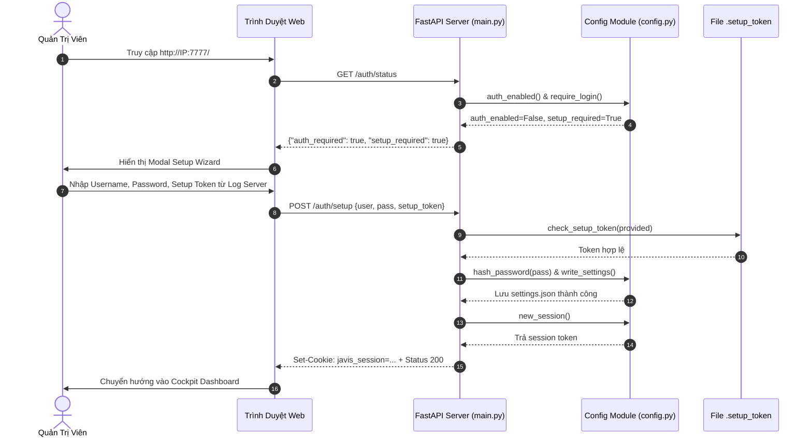

### 18.2. Flow 2: Đăng nhập & Xác thực 2 Lớp (TOTP 2FA)
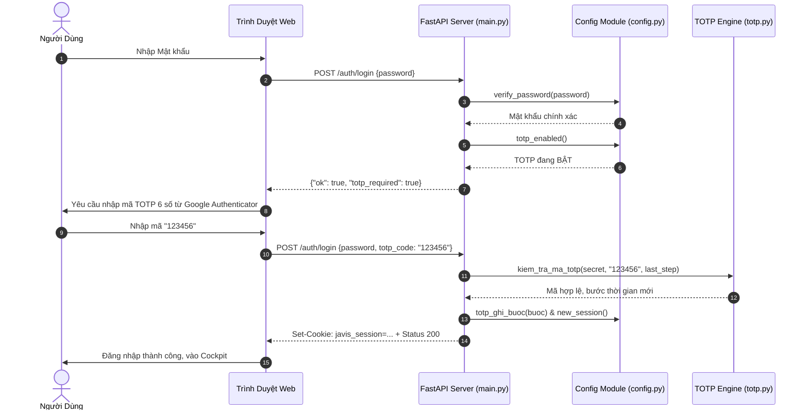

### 18.3. Flow 3: Vòng đời Một Lượt Chat Web (`_do_turn`)
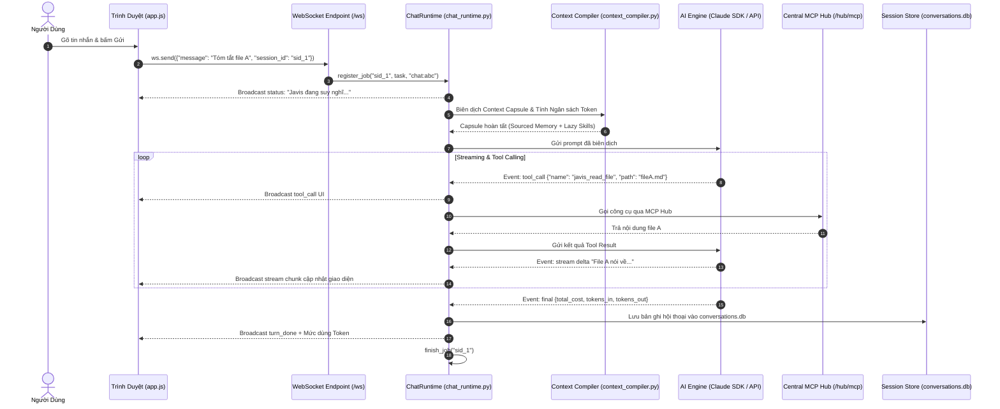

### 18.4. Flow 4: Thực thi Kỹ năng (Skill Execution Flow)
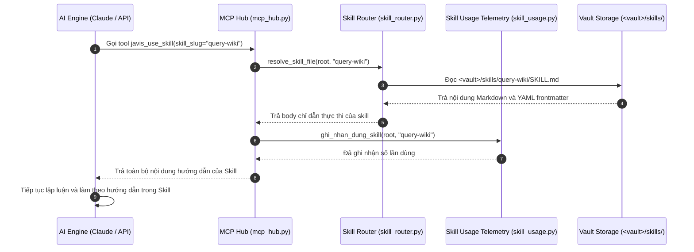

### 18.5. Flow 5: Gọi Công cụ Ngoại vi qua MCP Hub
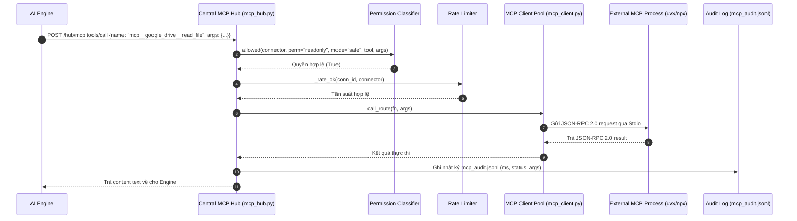

### 18.6. Flow 6: Tự học & Đúc kết Tri thức Second Brain
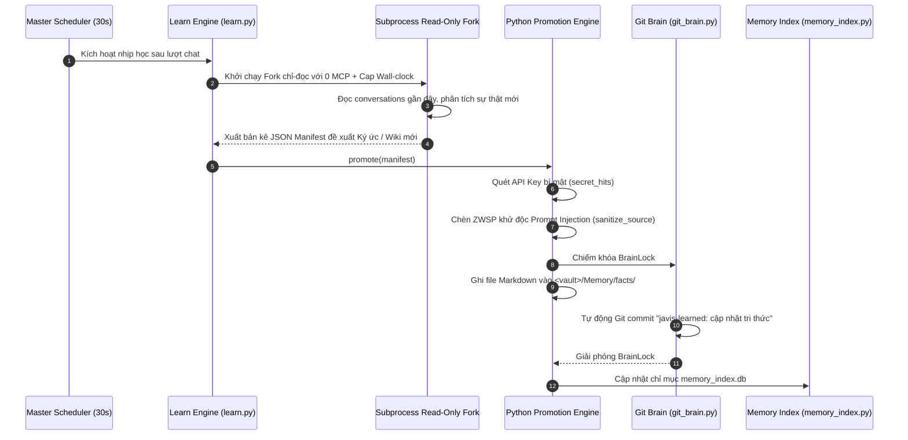

### 18.7. Flow 7: Vòng đời Công việc Tự động hóa (Kanban Task Dispatcher)
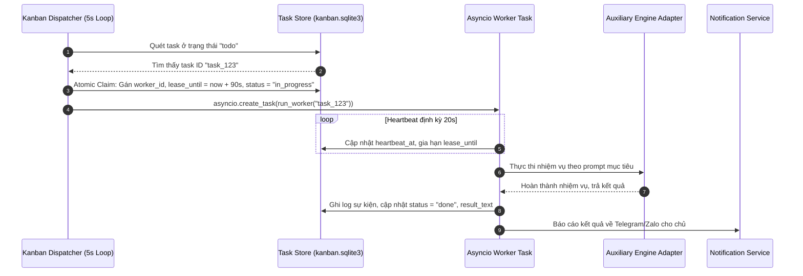

---

# 19. System Dependency Map

```mermaid
graph TD
    subgraph Core Configuration & Security
        Config[config.py / settings.json] --> Secrets[secrets_store.py: Fernet]
        Config --> WebSec[web_security.py: CSRF Guard]
        Config --> TOTPMod[totp.py: RFC 6238]
    end

    subgraph Context & Execution Pipeline
        Main[main.py: FastAPI] --> ChatRT[chat_runtime.py]
        Main --> ContextComp[context_compiler.py]
        ContextComp --> FastPath[fast_path_runtime.py]
        ContextComp --> AdaptiveCtx[adaptive_context_runtime.py]
        AdaptiveCtx --> MemIndex[memory_index.py: FTS5]
        AdaptiveCtx --> LazySkills[lazy_skill_runtime.py]
    end

    subgraph Engines & Integration Hub
        Main --> ClaudeEngine[claude_sdk_engine.py]
        Main --> CodexEngine[claude_cli.py: CodexCLI]
        Main --> AgyEngine[antigravity_cli.py]
        Main --> APIEngine[engine.py]
        
        Main --> MCPHub[mcp_hub.py]
        MCPHub --> MCPClient[mcp_client.py]
        MCPHub --> MCPStore[mcp_store.py]
        MCPHub --> PluginHost[plugins_host.py]
        MCPHub --> SkillRouter[skill_router.py]
    end

    subgraph Autonomous Background Workers
        Main --> Tasks[tasks.py] --> TaskStore[task_store.py: kanban.sqlite3]
        Main --> Loops[self_improve.py]
        Main --> Reminders[reminders.py] --> CronUtil[cron_util.py]
        Main --> Learn[learn.py] --> GitBrain[git_brain.py]
        Main --> ChatbotRT[chatbot_runtime.py] --> TgBot[telegram_bot.py]
        ChatbotRT --> ZaloBot[zalo_bot.py]
    end

    Config --> Main
```


# 20. Technical Debt & Architectural Findings

Dựa trên quá trình reverse-engineering toàn bộ mã nguồn thực tế, nhóm kiến trúc ghi nhận các phát hiện kỹ thuật quan trọng:

### 20.1. Phát hiện Bảo mật (Security Findings)

#### [FINDING-SEC-01] Vô hiệu hóa Sandbox Bubblewrap của Codex trong Container Docker
- **Mức độ nghiêm trọng:** Medium
- **Vị trí:** [`deploy/docker/Dockerfile:110`](file:///Users/hyden/Documents/David-nguyen/javis-os/deploy/docker/Dockerfile#L110) (`ENV JAVIS_CODEX_SANDBOX=off`)
- **Nguyên nhân:** Codex CLI mặc định bọc các thao tác file bằng `bubblewrap` (bwrap). Tuy nhiên, trong Docker container chạy với non-root user (`javis`) và không có quyền `CAP_SYS_ADMIN`, Ubuntu 24.04 AppArmor chặn việc tạo unprivileged user namespace, dẫn đến lỗi `bwrap: Failed to make / slave: Permission denied` và làm tê liệt toàn bộ loop chạy bằng ChatGPT.
- **Hiện trạng:** Hệ thống tắt sandbox của Codex và dựa hoàn toàn vào rào chắn cách ly của chính Docker container.
- **Khuyến nghị:** Đối với môi trường yêu cầu cô lập tối đa, người vận hành cần cấu hình `security_opt: [apparmor:unconfined]` và kích hoạt `JAVIS_CODEX_SANDBOX=auto`.

#### [FINDING-SEC-02] Quản lý Setup Token Lần đầu trên Môi trường VPS Chia sẻ
- **Mức độ nghiêm trọng:** Low-Medium
- **Vị trí:** [`server/config.py:1094`](file:///Users/hyden/Documents/David-nguyen/javis-os/server/config.py#L1094) (`_SETUP_TOKEN_PATH = STATE_DIR / ".setup_token"`)
- **Nguyên nhân:** Khi khởi động lần đầu ở chế độ public (`0.0.0.0`), token thiết lập được in ra stdout log của server. Nếu log server bị chia sẻ hoặc lộ qua công cụ giám sát tập trung không phân quyền, kẻ xấu có thể dùng token này để tạo tài khoản admin.
- **Biện pháp trong code:** Hệ thống đã hỗ trợ biến môi trường `JAVIS_ADMIN_PASSWORD` để tự động tạo tài khoản ngay lúc boot, vô hiệu hóa hoàn toàn endpoint `/auth/setup`.

### 20.2. Phát hiện Kiến trúc & Hiệu năng (Architecture & Performance)

#### [FINDING-ARCH-01] Khối lượng Mã nguồn Nguyên khối trong `server/main.py`
- **Mức độ:** Maintainability
- **Vị trí:** [`server/main.py`](file:///Users/hyden/Documents/David-nguyen/javis-os/server/main.py) (13.246 dòng code)
- **Đánh giá:** Mặc dù các nhóm route lớn như `domain.py`, `graph.py`, `javis_control.py`, `reminders.py`, `self_improve.py`, `tasks.py` đã được bóc tách ra các module riêng, `main.py` vẫn giữ một lượng lớn logic điều phối streaming, webhook, và hơn 100 endpoints phụ trợ. Cần tiếp tục module hoá thành các APIRouter chuyên biệt (như `routes/auth.py`, `routes/mcp.py`, `routes/sessions.py`).

#### [FINDING-ARCH-02] Khóa Cặp Dependencies (FastAPI 0.115.0 & Starlette <0.39)
- **Mức độ:** Dependency Constraint
- **Vị trí:** [`requirements.txt:8-12`](file:///Users/hyden/Documents/David-nguyen/javis-os/requirements.txt#L8-L12)
- **Đánh giá:** Thư viện `claude-agent-sdk==0.2.116` yêu cầu `starlette<0.39`, trong khi các phiên bản FastAPI >= 0.115.6 lại yêu cầu `starlette>=0.40`. Do đó, `fastapi` bắt buộc phải được ghim chính xác ở phiên bản `0.115.0` để tránh lỗi xung đột dependency resolution của pip.

---

# 21. Documentation Audit & Gap Analysis

Bảng đối chiếu sự khác biệt giữa **Tuyên bố trong Tài liệu Cũ / README** và **Sự thật trong Source Code Thực tế**:

| Nội dung Đối chiếu | Tuyên bố trong Docs Cũ / README | Thực tế trong Source Code Hiện tại | Đánh giá | Bằng chứng Source Code |
| :--- | :--- | :--- | :--- | :--- |
| **Google Gemini CLI** | Hỗ trợ miễn phí qua tài khoản cá nhân Google | Google đã ngắt hỗ trợ tài khoản cá nhân từ 18/06/2026 (`UNSUPPORTED_CLIENT`). Javis OS đã chuyển sang hỗ trợ **Antigravity CLI (`agy`)**. | **OUTDATED** | `server/gemini_cli.py:59`, `server/antigravity_cli.py:1` |
| **Claude Engine** | Chạy bằng tiến trình Claude CLI Popen | Nhánh Popen đã gỡ từ v0.9.37. Toàn bộ engine Claude hiện chạy qua `claude-agent-sdk` chính chủ với cơ chế kiểm soát quyền per-call. | **INCORRECT** | `server/claude_cli.py:5`, `server/claude_sdk_engine.py:4` |
| **Đa Nhà cung cấp AI** | Chỉ nhấn mạnh Claude Code | Hỗ trợ đầy đủ **10 nhà cung cấp**: Claude SDK, Codex (ChatGPT OAuth), Antigravity, Gemini CLI, Anthropic API, OpenAI API, Groq, OpenRouter, Gemini API, Ollama. | **MISSING** | `server/engine.py`, `server/config.py:118` |
| **Bảng Kanban** | Mô tả như bảng Trello quản lý thủ công | Là một **Autonomous Agent Runtime**: chạy nền độc lập, tự động claim task, cấp lease 90s, heartbeat 20s, lưu trong `kanban.sqlite3`. | **INCORRECT** | `server/tasks.py:1`, `server/task_store.py:1` |
| **Phạm vi Kỹ năng (Skills)** | Kỹ năng độc quyền của Claude Code | Hệ thống `skill_router.py` tập trung hóa, cho phép **mọi engine** (OpenAI, Groq, OpenRouter...) sử dụng skill qua tool `javis_use_skill`. | **INCORRECT** | `server/skill_router.py:12`, `server/mcp_hub.py:831` |
| **Mức Tiết kiệm Token** | Tính năng tùy chọn, mặc định tắt | Từ phiên bản 0.24.7, mức **Siêu tiết kiệm ("max")** được kích hoạt làm mặc định xuất xưởng (`PRESET_MAC_DINH = "max"`), giảm ~89% token. | **OUTDATED** | `server/config.py:532`, `server/config.py:_ap_muc_mac_dinh` |
| **Xác thực Đăng nhập** | Chỉ có mật khẩu đơn giản | Triển khai đầy đủ **Xác thực 2 lớp TOTP (RFC 6238)**, quét mã QR qua `segno`, 8 mã khôi phục, quản lý API Token scoped. | **MISSING** | `server/totp.py`, `server/config.py:764` |

---

# 22. Source Code Index & Traceability Matrix

Bảng chỉ mục truy vết mã nguồn các thành phần quan trọng nhất trong repository:

| Module / Thành phần | Tệp Nguồn | Lớp (Classes) | Hàm Trọng Tâm (Primary Functions) | Dòng Code | Trách Nhiệm Kỹ Thuật |
| :--- | :--- | :--- | :--- | :--- | :--- |
| **FastAPI Core App** | [`server/main.py`](file:///Users/hyden/Documents/David-nguyen/javis-os/server/main.py) | `_ZipTooBig` | `websocket_endpoint`, `_do_turn`, `build_system_prompt`, `_scheduler_loop` | 13.246 | Điểm khởi tạo ứng dụng, quản lý WebSocket, scheduler |
| **Config & Secrets** | [`server/config.py`](file:///Users/hyden/Documents/David-nguyen/javis-os/server/config.py) | - | `read_settings`, `write_settings`, `verify_password`, `totp_set`, `create_api_token` | 1.147 | Đọc/ghi `settings.json`, quản lý mã hoá Fernet, session |
| **Multi-Provider Engine**| [`server/engine.py`](file:///Users/hyden/Documents/David-nguyen/javis-os/server/engine.py) | `_RetryStream`, `_ThinkScrubber` | `openrouter_chat_with_mcp`, `anthropic_chat_with_mcp`, `thu_lai_khi_tam_thoi` | 1.874 | Lõi gọi API streaming, bóc tách thinking, tự động retry |
| **Claude Agent SDK** | [`server/claude_sdk_engine.py`](file:///Users/hyden/Documents/David-nguyen/javis-os/server/claude_sdk_engine.py) | `ClaudeSDK` | `query`, `cancel_all`, `_permission_gate`, `map_message` | 559 | Tích hợp chính chủ `claude-agent-sdk`, kiểm duyệt quyền tool |
| **Codex CLI Engine** | [`server/claude_cli.py`](file:///Users/hyden/Documents/David-nguyen/javis-os/server/claude_cli.py) | `CodexCLI` | `query`, `cancel_all`, `_kill_tree`, `auth_status` | 1.113 | Điều khiển tiến trình `codex exec`, quản lý auth Claude Code |
| **Antigravity CLI** | [`server/antigravity_cli.py`](file:///Users/hyden/Documents/David-nguyen/javis-os/server/antigravity_cli.py) | `AntigravityCLI` | `query`, `find_antigravity_cli`, `_help_text`, `live_models` | 1.334 | Kết nối binary `agy`, đọc `--help` động, lấy live models |
| **Central MCP Hub** | [`server/mcp_hub.py`](file:///Users/hyden/Documents/David-nguyen/javis-os/server/mcp_hub.py) | - | `discover_all`, `handle_http`, `_guard`, `_apply_lazy`, `hub_token` | 1.326 | Proxy MCP Hub trung tâm `/hub/mcp`, lọc quyền 3 mức |
| **MCP Client Pool** | [`server/mcp_client.py`](file:///Users/hyden/Documents/David-nguyen/javis-os/server/mcp_client.py) | `SessionPool`, `McpStdioSession` | `discover_resolved`, `call_route`, `call_tool` | 669 | Quản lý pool kết nối transport (Stdio, SSE, Stream) |
| **Plugin Host Runtime**| [`server/plugins_host.py`](file:///Users/hyden/Documents/David-nguyen/javis-os/server/plugins_host.py) | `PluginContext`, `LoadedPlugin`| `plugin_tools`, `wrap_with_hooks`, `toggle_plugin` | 606 | Nạp và thực thi plugin Python, quản lý lifecycle hooks |
| **Skill Router** | [`server/skill_router.py`](file:///Users/hyden/Documents/David-nguyen/javis-os/server/skill_router.py) | - | `list_skills`, `resolve_skill_file`, `validate_description` | 320 | Nguồn chân lý định tuyến kỹ năng, hỗ trợ đa ngôn ngữ |
| **Memory Index FTS5** | [`server/memory_index.py`](file:///Users/hyden/Documents/David-nguyen/javis-os/server/memory_index.py) | `MemoryIndex`, `MemoryRetrieval`| `rebuild`, `retrieve`, `_conn`, `context_items` | 557 | Chỉ mục dẫn xuất SQLite FTS5 cho Second Brain |
| **Autonomous Learn** | [`server/learn.py`](file:///Users/hyden/Documents/David-nguyen/javis-os/server/learn.py) | `LearnFeature`, `LearnDeps` | `reflect`, `promote`, `secret_hits`, `sanitize_source` | 1.241 | Động cơ tự học an toàn, khử độc Prompt Injection |
| **Kanban Tasks** | [`server/tasks.py`](file:///Users/hyden/Documents/David-nguyen/javis-os/server/tasks.py) | `TasksFeature`, `TasksDeps` | `_dispatcher_loop`, `_run_task`, `_snapshot` | 1.085 | Dispatcher tác vụ tự động hóa, quản lý worker song song |
| **Multi-Loop Improve**| [`server/self_improve.py`](file:///Users/hyden/Documents/David-nguyen/javis-os/server/self_improve.py) | `LoopFeature`, `LoopDeps` | `run_loop`, `_in_quiet_hours`, `_isolate` | 1.174 | Vòng lặp tự cải thiện tuần tự, tự dừng khi lỗi 3 lần |
| **Context Compiler** | [`server/context_compiler.py`](file:///Users/hyden/Documents/David-nguyen/javis-os/server/context_compiler.py) | `ContextCompiler`, `QualityGate`| `compile`, `dong_ho`, `evaluate_turn` | 1.268 | Biên dịch token capsule và kiểm soát hạn mức ngữ cảnh |
| **Chatbot Runtime** | [`server/chatbot_runtime.py`](file:///Users/hyden/Documents/David-nguyen/javis-os/server/chatbot_runtime.py) | - | `start_bot`, `stop_bot`, `build_bot_prompt`, `_ly_do_im` | 773 | Bộ giám sát poller bot Telegram/Zalo chuyên trách |
| **Terminal WebSocket** | [`server/terminal.py`](file:///Users/hyden/Documents/David-nguyen/javis-os/server/terminal.py) | `Phien`, `Kho` | `mo_phien`, `dong_phien`, `doc_vong`, `ghi` | 650 | Cửa sổ Web Terminal PTY tương tác thực thời gian thực |
| **Session Persistence**| [`server/sessions.py`](file:///Users/hyden/Documents/David-nguyen/javis-os/server/sessions.py) | `SessionStore` | `get_store`, `save_turn`, `search_turns`, `list_sessions`| 839 | Lưu trữ phiên hội thoại vào `conversations.db` |
| **Web Frontend Core** | [`dashboard/app.js`](file:///Users/hyden/Documents/David-nguyen/javis-os/dashboard/app.js) | - | `connect`, `handleMessage`, `sendMessage`, `stopCurrent` | 2.376 | WebSocket client, quản lý hội thoại, Orb audio visualizer |
| **Console Router UI** | [`dashboard/console.js`](file:///Users/hyden/Documents/David-nguyen/javis-os/dashboard/console.js) | - | `renderPage`, `railGroups`, `openNote`, `initSetupWizard`| 6.272 | Router điều hướng 19 trang chức năng, modals, editor |
| **Knowledge Graph UI**| [`dashboard/graph.js`](file:///Users/hyden/Documents/David-nguyen/javis-os/dashboard/graph.js) | - | `initGraph`, `renderStarfield`, `playTimelapse` | 650 | Render đồ thị liên kết 2D/3D Canvas và timeline player |
| **CLI Package Main** | [`cli/javis_cli/commands.py`](file:///Users/hyden/Documents/David-nguyen/javis-os/cli/javis_cli/commands.py) | - | `hoi`, `chat`, `login`, `status`, `profiles` | 290 | Triển khai các lệnh CLI `javis` tương tác với server |

---
> **KẾT THÚC BỘ TÀI LIỆU KỸ THUẬT JAVIS OS.**  
> *Được lập dựa trên toàn bộ 338+ tệp mã nguồn thực tế tại repository Javis OS.*
