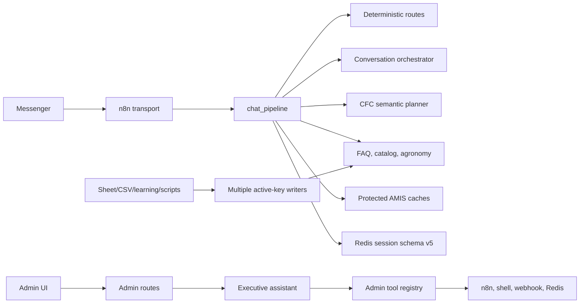

# Rà soát `chatbot/server` cho kế hoạch CFC AI Agent

Ngày rà soát: 09/09/2026.

Trạng thái bằng chứng: **static source audit**. Không gọi AMIS/n8n/Ollama, không chạy Page thật, không ghi Redis và không xác nhận revision đang deploy.

## 1. Phạm vi đã đọc

Đã kiểm kê toàn bộ cây `chatbot/server` trừ cache Python: 115 file Python, 11 file JavaScript, 3 file CSS, HTML admin, tài liệu/manual cases, JSONL evaluation và các file cấu hình/mẫu. Toàn bộ 115 file Python, tổng 31.662 dòng, đã được parse AST; không có lỗi cú pháp tại thời điểm rà soát.

Phần đọc sâu gồm:

- runtime: `main.py`, `admin_routes.py`, `chat_pipeline.py`, `conversation_store.py`, `conversation_orchestrator.py`, `dialogue_router.py`, `cfc_semantic_planner.py`, `query_understanding.py`, `ai_engine.py`, `ai_agent_tools.py`;
- dữ liệu/grounding: `rag_search.py`, `knowledge_sync.py`, `embedder.py`, `document_ingestor.py`, `shopee_matcher.py`, `grounding_policy.py`, `evidence_trace.py`;
- domain: assistant, customers, knowledge, learning, agronomy, AMIS, rag_test, n8n, reports và system;
- đánh giá: 33 file `test_*.py`, replay JSONL, manual scenarios, replay runner, evaluation ops, runtime manifest, NLU shadow;
- vận hành: toàn bộ script AMIS/Shopee/CSV/document và UI admin JavaScript.

Không đọc hoặc chép giá trị secret. Các nhận định về runtime được ghi là việc cần xác minh, không suy ra từ source.

## 2. Sơ đồ hệ thống thực tế

Điểm quan trọng là Page chatbot và Executive Assistant là hai Agent khác audience và quyền. Chúng chỉ nên chia sẻ adapter đọc an toàn ở tầng thấp, không chia sẻ nguyên tool registry.

## 3. Những gì đã có và nên tái sử dụng

### Bộ nhớ hội thoại

`chat_pipeline.py` đã migrate lazy sang schema v5, tạo `GoalFrame`, chuyển goal, tạm dừng/resume, giới hạn frame, lưu slot, tool result có expiry và answer reference. `_build_next_conversation_state` đang làm vai trò reducer. Vì vậy không cần tạo một state engine mới.

### Planner có policy

`conversation_orchestrator.py` có allowlist intent/tool/action, redaction, schema validation, confidence gate, context giới hạn và fallback. Đây là nền phù hợp để trở thành decision contract chung.

### Dữ liệu có ranh giới công khai/riêng tư

AMIS đã tách public product/location khỏi protected order và loyalty cache. Order lookup có exact code + phone ownership check và freshness. Loyalty projection chuẩn hóa phone, dùng HMAC và trả outcome ambiguous thay vì tự chọn một account.

### Đánh giá và rollout primitive

Đã có unit/regression cho state, planner, protected cache, AMIS route, grounding và knowledge sync; có replay multi-turn, dataset manifest và canary primitives. Cần sửa isolation và telemetry, không xây harness từ đầu.

## 4. Các khoảng trống ảnh hưởng trực tiếp đến Agent

### 4.1 Context chưa phản ánh đầy đủ state schema v5

`build_conversation_context` chỉ gửi `active_goal`, confirmed slots, recent results, một `pending_request` và topic stack. Nó không gửi `goal_frames`, `active_goal_id` hoặc `pending_requests`, dù pipeline đã lưu các field này. Model có thể không thấy mục tiêu đang tạm dừng để resume đúng.

Trong chế độ `assist`, `should_run_orchestrator` bỏ qua phần lớn first turn khi chưa có context. Do đó câu đầu mới lạ không tự động được planner chung xử lý.

### 4.2 Có nhiều planner trong cùng request

CFC semantic planner được `await` và trace `proposal_only`; kết quả không điều khiển route. Sau đó conversation planner và nhánh NLU khác vẫn có thể chạy. Điều này làm tăng độ trễ và khó biết planner nào chịu trách nhiệm.

Contract cũng lệch tên: router kiểm tra `dealer_lookup`, trong khi allowlist semantic dùng `sales_location_search`. Hợp đồng action phải được thống nhất trước khi thêm tool.

### 4.3 Khóa sender chưa được caller thực thi đúng

`sender_lease` yield boolean `acquired`, nhưng wrapper dùng `async with` mà không đọc giá trị. Nếu Redis không acquire được hoặc lease thất bại, request vẫn tiếp tục. TTL không có renewal, nên turn dài có thể vượt lease.

Persist session là best effort; lỗi được log rồi response vẫn trả thành công. Cách này chấp nhận được cho đọc/fallback nhưng không đủ làm nền cho CRM side effect.

Finalizer còn dựa vào so sánh `last_user_message` với raw text để quyết định build state. Hai message ID khác nhưng cùng nội dung cần test riêng vì text equality không phải idempotency key.

### 4.4 Admin update có thể làm state lệch

`domains/customers/service.py` ghi trực tiếp profile/session, không giữ TTL, revision, nested confirmed slots/GoalFrames hoặc invalidate local cache. Nó còn gửi Telegram khi thấy phone. Update phải đi qua cùng store/reducer và outbox trước khi Agent phụ thuộc vào identity state.

### 4.5 Evidence hiện mới là provenance thô

`evidence_trace.py` tạo một claim cho toàn answer và mặc định evidence audience là public. Finalizer luôn truyền status snapshot của knowledge/FAQ, kể cả response đến từ AMIS hoặc nguồn khác. Vì vậy trace hiện tại chưa đủ để khẳng định từng fact protected đã được chứng minh bằng đúng version nguồn.

`grounding_policy.py` chủ yếu dựa vào source ID/family và fallback marker. Nó không đối chiếu nội dung mệnh đề với payload tool.

### 4.6 Các writer knowledge/catalog chưa có một publish contract

Knowledge service và learning approval có thể ghi thẳng `*:kb:basic:active` trước khi vector sync hoàn tất. Các đường CSV/Sheet làm mất một số metadata như source/audience/answer mode hoặc ép `active=True`. Nhiều script Shopee cũng ghi thẳng `zeo:shopee:catalog:active`; đường reload hot cache được gọi dưới `try/except` trong khi matcher không có contract reload tương ứng.

`knowledge_sync.py` kiểm tra embedding trước khi upsert và tốt hơn các writer còn lại, nhưng vẫn cập nhật nhiều vector document rồi xóa stale theo chuỗi lệnh; chưa phải promote nguyên tử giữa active snapshot, vector index và RAM cache.

Document ingestion dùng index `*:vec:docs` riêng. Không thấy caller từ pipeline customer trong static call-site audit, nên upload tài liệu chưa đồng nghĩa Page Agent sẽ truy hồi nó.

### 4.7 Customer resolution mới dừng ở projection an toàn

Loyalty HMAC index đủ cho lookup outcome nhưng cố ý loại raw phone/account identifiers. Đây là thiết kế đúng cho public read, nhưng không thể dùng trực tiếp để gắn hoặc cập nhật customer AMIS. Cần privileged adapter và bước xác minh riêng.

`live_crm.create_cskh_ticket` ghi JSON local; nếu ghi file lỗi hàm vẫn trả ticket object. Nó không phải AMIS write. `lookup_inventory_atp` chứa số capacity/available cố định và `can_fulfill_instantly=True`; không được đưa vào public Agent registry như tồn kho realtime.

### 4.8 Agent quản trị không phải nền an toàn cho Page Agent

`/admin/assistant/chat` dùng `ai_agent_tools.py`. Registry có shell qua `create_subprocess_shell`, toggle workflow và webhook URL. Nhánh native Groq trong assistant được kích hoạt khi có API key và không dùng cùng enforcement `execution_mode` của `generate_ai_text`.

`main.py` mount admin router và CORS `*`; source standalone không thể hiện middleware xác thực chung. Deployment có thể còn gateway/lớp auth bên ngoài, nên cần kiểm tra ingress thật. Cho đến khi có bằng chứng, không nối registry này với public route.

## 5. Giới hạn của bộ đánh giá hiện tại

Replay runner dùng sender `eval-replay:{case_id}`; run nonce chỉ nằm trong message ID. Hai run đồng thời có thể cùng reset state. Runner gọi pipeline thật và chưa inject rõ dependency fake cho Telegram/CRM. Trường dataset manifest luôn dùng default path dù CLI có thể truyền `--cases` khác. `TurnResult` chưa có latency từng stage.

`run_test_md_scenarios.py --reload-data` có đường ghi active data và quét session thật; không phù hợp làm baseline cô lập. Admin rag-test mặc định có thể chạy thêm RAG ngoài pipeline, nên total latency ở UI không phải riêng pipeline.

Các test hiện hữu phần lớn dùng FakeRedis/AsyncMock. Kết quả unit, static và live phải báo riêng.

## 6. Điều chỉnh so với plan trước

- Bỏ ý tưởng tạo reducer/state framework mới; mở rộng reducer và migration hiện có.
- Chưa tạo `domains/agent/` lớn; tạo public tool registry nhỏ, tách tuyệt đối khỏi admin registry.
- Đưa correctness của lease/state/source publish/evidence/replay lên P0.
- Dùng conversation orchestrator làm hợp đồng decision chính; loại lượt planner synchronous không có tác dụng.
- Benchmark model sau khi context/tool/state nhất quán, vì trước đó kết quả đo không chỉ phản ánh năng lực model.
- CRM write lùi sau public read Agent, customer draft và replay side-effect isolation.

## 7. Những việc audit chưa chứng minh

Static review không chứng minh model nào đang resident, latency/RAM, settings đã reload, gateway có auth, Redis đang chứa snapshot nào, AMIS credential/field write nào được cấp, workflow n8n nào đang active hoặc Page đang gọi revision nào. Các mục này thuộc P0 live verification và phải có bằng chứng runtime riêng.
