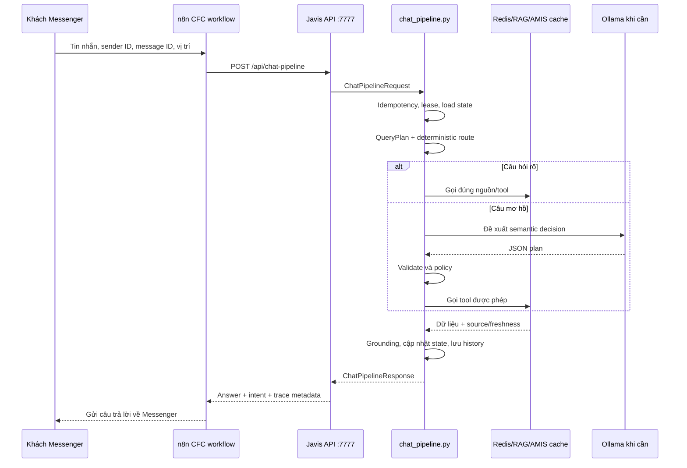
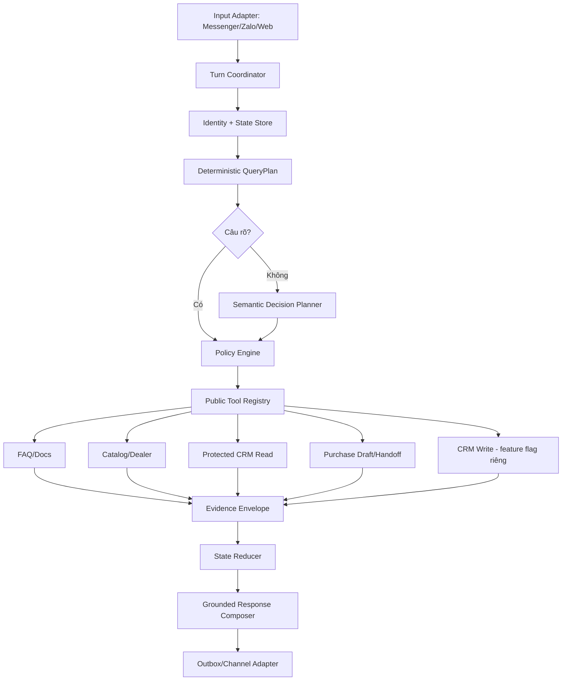

# Master plan CFC AI Agent: từ hệ thống hiện tại đến trợ lý bán hàng thông minh

Ngày lập: 09/09/2026. Phạm vi chính: CFC; ZeO dùng chung engine nhưng phải có regression riêng.

Trạng thái: **tài liệu giải thích và kế hoạch, chưa phải bằng chứng deployment.** Nội dung hiện trạng được đối chiếu với source local. Chưa gọi Ollama, Redis, AMIS, n8n hoặc Page thật trong lần lập tài liệu này.

Tài liệu được viết cho người bắt đầu từ số 0: không giả định người đọc biết AI, FastAPI, Redis, RAG hoặc n8n.

Kế hoạch thực thi theo từng phase, với điều kiện nghiệm thu và rollback, nằm tại [Phase roadmap nâng cấp không làm mất hệ thống cũ](PHASE_ROADMAP_CFC_AI_AGENT_NANG_CAP_KHONG_MAT_HE_THONG_CU_2026-09-09.md).

## 1. Trả lời ngắn những câu hỏi quan trọng nhất

### Chatbot hiện tại đã là AI Agent chưa?

**Nó là chatbot lai đã có nhiều bộ phận của Agent, nhưng chưa phải Agent nghiệp vụ hoàn chỉnh.** Nó đã biết:

- nhớ một phần hội thoại và mục tiêu;
- hiểu intent bằng luật, RAG và một số planner AI;
- chọn các tuyến tra cứu được code sẵn;
- đọc FAQ, sản phẩm, điểm bán và cache AMIS được bảo vệ;
- từ chối hoặc handoff khi không có nguồn an toàn.

Nó chưa có một vòng nghiệp vụ thống nhất kiểu: hiểu mục tiêu → tự chọn tool an toàn → thu thập đủ dữ kiện → tạo draft → xin xác nhận → ghi CRM → kiểm tra kết quả → tiếp tục hội thoại.

### Hiện đã có case tra cứu CRM chưa?

**Có.** Source và test đã có các case sau:

| Nhu cầu | Hiện trạng | Điều bot thực sự làm | Chưa có gì |
|---|---|---|---|
| Tra đơn hàng | Đã có code + unit/integration test | Yêu cầu mã đơn chính xác và SĐT khớp HMAC; đọc protected warm cache; kiểm tra freshness tối đa 12 giờ | Không gọi realtime AMIS cho mỗi câu hỏi |
| Tra điểm/hạng loyalty | Đã có code + test | Chuẩn hóa SĐT, tra HMAC index, phân biệt found/no-loyalty/ambiguous/not-found/unavailable | Không xác minh quyền sở hữu chỉ bằng việc biết SĐT; không sửa loyalty |
| Tìm sản phẩm phân bón | Đã có code + test | Đọc public catalog đã lọc, khớp công thức/danh mục, loại hàng không phù hợp | Không có giá/tồn kho realtime trong public projection |
| Tìm đại lý/điểm bán | Đã có code + test | Đọc public sales locations, dùng địa bàn hoặc vị trí được khách gửi | Không tự suy ra “gần nhất” khi thiếu vị trí/dữ liệu |
| Hỏi giá | Có route an toàn | Hiển thị sản phẩm/quy cách khớp rồi nhận nhu cầu/liên hệ | Chưa có current-price source đủ tin cậy để báo giá tự động |
| Hỏi tồn kho | Có capability boundary | Nói rõ chưa kết nối dữ liệu tồn kho realtime | Hàm legacy có số cố định không được dùng làm tồn kho thật |
| Muốn mua hàng | Có purchase intake và memory test | Giữ sản phẩm, số lượng, cây trồng, địa bàn; hỏi slot còn thiếu | Chưa có `PurchaseDraft` hoàn chỉnh và chưa tạo đơn AMIS |
| Tạo/cập nhật khách AMIS | Chưa có | Chỉ có profile chat trong Redis và projection khách dùng cho lookup | Chưa có API write adapter, identity verification hoặc operation ledger |
| Tạo đơn AMIS | Chưa có | Chỉ tiếp nhận/handoff | Chưa có mapping, consent, idempotency bền hoặc reconciliation |

`AmisClient` hiện chỉ đọc ba resource `Customers`, `Products`, `SaleOrders`. POST `/Account` chỉ dùng đăng nhập lấy token; source không có method tạo Contact/Lead/Sale Order.

### Qwen2.5 7B có làm bot thông minh được không?

**Có thể làm bộ hiểu ngôn ngữ cho Agent phạm vi hẹp.** Nó không phải toàn bộ trí thông minh của hệ thống. Bot “khôn” khi sáu phần cùng đúng:

1. Hiểu khách đang muốn gì.
2. Nhớ đúng khách đã nói gì và đang làm dở việc gì.
3. Biết chọn đúng công cụ.
4. Công cụ đọc được dữ liệu thật, mới và đúng quyền.
5. Luật nghiệp vụ ngăn bịa, lộ dữ liệu và ghi nhầm.
6. Có test/đo lường để phát hiện nó đang sai ở đâu.

Model lớn mà thiếu dữ liệu hoặc tool vẫn đoán. Model 7B với context rõ, action ít, tool tốt và policy chặt có thể đáng tin hơn cho nghiệp vụ hẹp.

## 2. Hình dung hệ thống bằng một cửa hàng

| Thành phần kỹ thuật | Hình dung đơn giản | Trách nhiệm |
|---|---|---|
| Messenger/Page | Khách bước vào cửa hàng | Gửi câu hỏi, SĐT, vị trí |
| n8n workflow | Nhân viên tiếp nhận thư | Nhận webhook, chuẩn hóa payload, gọi API, gửi câu trả lời về Page |
| FastAPI endpoint | Cửa tiếp nhận nội bộ | Nhận request ở `/api/chat-pipeline` |
| `chat_pipeline.py` | Quản lý quầy | Quyết định toàn bộ đường đi của một tin nhắn |
| `query_understanding.py` | Người đọc phiếu yêu cầu | Chuẩn hóa tiếng Việt, nhận intent/entity/constraint |
| `dialogue_router.py` | Người điều phối | Chọn action/tool dựa trên kế hoạch và state |
| Qwen/Ollama | Người hiểu câu nói mơ hồ | Đề xuất intent/action hoặc viết lại câu trả lời có nguồn |
| Redis | Sổ tay + tủ dữ liệu nhanh | Lưu session, lịch sử, FAQ/vector, catalog và protected CRM cache |
| RAG | Thủ thư | Tìm đoạn kiến thức phù hợp trong nguồn đã nạp |
| AMIS CRM | Sổ nghiệp vụ chính thức | Nguồn khách, sản phẩm và đơn hàng |
| Grounding/policy | Kiểm soát viên | Không cho câu trả lời nhạy cảm đi ra khi thiếu nguồn |
| Test/evaluation | Diễn tập trước khi mở cửa | Kiểm tra bot có hiểu, nhớ, tra và trả đúng không |

Não của Agent không phải một file hay một model. Nó là tổ hợp:

```text
Agent = Model hiểu ngôn ngữ
      + State nhớ hội thoại
      + Tools truy cập dữ liệu/hành động
      + Policy kiểm tra quyền và sự thật
      + Orchestrator quyết định bước tiếp theo
      + Evaluation đo chất lượng
```

## 3. Tin nhắn đi qua hệ thống như thế nào?

Đường kết nối hiện có trong source:



Source có hai cách expose pipeline:

- `chatbot/server/main.py`: FastAPI standalone, có `/api/chat-pipeline` và `/api/chat/pipeline`.
- Javis OS hiện đại dùng `server/routes/javis_legacy.py` → `server/legacy_javis_runtime.py` → import `chatbot/server/chat_pipeline.py`.

Workflow CFC local khai báo gọi `http://127.0.0.1:7777/api/chat-pipeline`. Điều này là source contract; cần kiểm tra runtime/deployment riêng trước khi khẳng định Page production đang chạy đúng revision.

## 4. `chat_pipeline.py` dùng làm gì?

`chat_pipeline.py` là file trung tâm của chatbot. Nó có 6.716 dòng vì đang gánh nhiều vai trò cùng lúc.

### Đầu vào và đầu ra

- `ChatPipelineRequest` ở khoảng dòng 2.686: brand, sender ID, text, Facebook name, message ID, loại attachment và tọa độ.
- `ChatPipelineResponse` ở khoảng dòng 2.698: answer, intent, confidence, score, brand, phone/area, latency, grounding/trace metadata và trạng thái chống trùng.

### Wrapper an toàn của một request

`process_chat_pipeline` ở khoảng dòng 6.558:

1. Chuẩn hóa brand/sender/message ID.
2. Chống webhook trùng bằng `message_idempotency.py`.
3. Lấy sender lease để tránh hai request cùng sửa một session.
4. Gọi `_process_chat_pipeline_once`.
5. Ép grounding trước khi gửi khách.
6. Finalize response, state và history.
7. Cache response cho message ID đã xử lý.

Khoảng trống hiện tại: caller chưa kiểm tra boolean `acquired` do sender lease trả về; turn dài chưa có lease renewal. Đây thuộc Phase 1 và phải hoàn tất trước CRM write.

### Phần xử lý chính

`_process_chat_pipeline_once` ở khoảng dòng 2.892:

1. Kiểm tra input rỗng/reset test.
2. Trích SĐT và địa bàn.
3. Nạp profile/session từ RAM cache hoặc Redis.
4. Nạp `ConversationState` schema v5.
5. Tạo `QueryPlan`: intent, entities, constraints, context need.
6. Tạo deterministic `RouteDecision`.
7. Bỏ qua AI planner cho các tuyến rõ và nhạy cảm như order, giá có catalog, agronomy rõ, website và operational CFC.
8. Với câu mơ hồ, có thể gọi CFC semantic planner và conversation orchestrator.
9. Chạy nhánh nghiệp vụ: product, dealer, order, loyalty, purchase, agronomy, complaint, B2B, FAQ/RAG, contact hoặc fallback.
10. Trả một `ChatPipelineResponse` có answer và trace.

### Bộ nhớ hội thoại

- `_migrate_goal_frames` khoảng dòng 596: đưa state cũ lên GoalFrame schema.
- `_update_goal_frames` khoảng dòng 631: active/pause/resume goal.
- `_load_conversation_state` khoảng dòng 1.474: đọc và làm sạch state cũ.
- `_build_next_conversation_state` khoảng dòng 1.985: cập nhật slot, result, reference, correction và recent turns.

Đây đã là một reducer thực tế. Tương lai nên tách nó ra module riêng sau khi có characterization tests, không viết một reducer cạnh tranh ngay lập tức.

### Các nhánh CRM trong pipeline

- `order_status_lookup`: gọi `lookup_cached_order_status`; chỉ trả trạng thái khi mã đơn + SĐT khớp và cache còn mới.
- `loyalty_lookup`: gọi `lookup_cached_loyalty_info`; xử lý rõ các outcome.
- `sales_location_search`: tìm public location/dealer theo địa bàn hoặc tọa độ.
- `purchase_intake`: gom product/quantity/crop/area/phone và hỏi slot thiếu; chưa ghi CRM.
- `inventory_lookup`: giữ capability boundary vì chưa có ATP realtime đáng tin cậy.

### Finalizer

`_finalize_pipeline_response` khoảng dòng 6.396:

- cập nhật answer trace;
- gắn answer ID vào active GoalFrame;
- tăng revision;
- ghi session và bounded history;
- log degraded nếu Redis persist lỗi.

Khoảng trống: evidence snapshot hiện thiên về knowledge/FAQ dù answer có thể đến từ AMIS. Repeated text với message ID khác cần test vì finalizer dùng so sánh text ở một nhánh. CRM side effect không được phép chạy nếu state/ledger không persist chắc chắn.

### Vì sao không nên viết lại cả file ngay?

File này có 60 caller theo CodeGraph và được nhiều test bám vào. Big-bang rewrite dễ làm hỏng các route an toàn đã có. Cách đúng là:

1. Viết characterization tests cho hành vi hiện tại.
2. Tách pure function/contract trước.
3. Giữ endpoint và response tương thích.
4. Chuyển từng nhánh qua module mới bằng feature flag.
5. So replay trước/sau trên cùng fixture.

## 5. Bản đồ các file chính

### Cửa vào và điều phối

| File | Vai trò hiện tại | Hướng tương lai |
|---|---|---|
| `main.py` | FastAPI standalone, health/search/rewrite/chat pipeline, mount admin | Giữ compatibility; xác minh auth/ingress; logic nghiệp vụ không nằm ở route |
| `admin_routes.py` | Ghép router domain vào prefix admin | Chỉ làm composition root; không chứa business logic |
| `chat_pipeline.py` | Monolith xử lý toàn bộ một turn | Tách dần contracts, handlers, state reducer và response composer |
| `query_understanding.py` | Tạo `QueryPlan`, chuẩn hóa tiếng Việt, intent/entity/constraint | Một nguồn hiểu deterministic duy nhất; version rules và đo coverage |
| `dialogue_router.py` | Chuyển QueryPlan + semantic plan thành action/tool | Dùng một action enum chung và policy table |
| `conversation_orchestrator.py` | Tạo/redact context, validate LLM plan, recover follow-up | Trở thành semantic Decision planner duy nhất |
| `cfc_semantic_planner.py` | Planner CFC thứ hai | Hợp nhất hoặc chuyển shadow bất đồng bộ; không chờ proposal vô tác dụng |

### AI, RAG và dữ liệu

| File | Vai trò hiện tại | Hướng tương lai |
|---|---|---|
| `ai_engine.py` | Gateway Gemini/OpenRouter/Groq/Ollama; rewrite/generate và admin assistant | Tách planner, grounded generator và admin agent; telemetry model/token/latency |
| `ai_agent_tools.py` | Tool registry quyền cao cho Executive Assistant | Giữ trong admin trust boundary; không dùng cho Page Agent |
| `rag_search.py` | Hybrid lexical/vector FAQ search, threshold và fallback | Metadata filter chặt, reranking, source/version envelope |
| `embedder.py` | Gọi embedding model và kiểm tra dimension | Pin model digest + embedding-space version; không fallback sang model sai không gian |
| `knowledge_sync.py` | Tạo/upsert FAQ vector index và refresh hot cache | Stage/version/promote nguyên tử với rollback |
| `document_ingestor.py` | Chunk Markdown vào `*:vec:docs` | Nối vào public retrieval có policy hoặc ghi rõ chỉ admin/offline |
| `shopee_matcher.py` | Match catalog ZeO/Shopee, cache RAM/Redis | Chuẩn hóa schema/link/variant và một refresh contract |
| `grounding_policy.py` | Chặn generator/source không an toàn | Kiểm tra theo loại claim và data class |
| `evidence_trace.py` | Answer ID, claim/evidence metadata | Gắn đúng source family/version/audience cho từng claim |
| `runtime_manifest.py` | Hash một số file runtime | Thêm router/store/AMIS/config/model/source generation |

### State, reliability và evaluation

| File | Vai trò hiện tại | Hướng tương lai |
|---|---|---|
| `conversation_store.py` | TTL cache, Redis session/history, sender lease | CAS/revision, lease failure contract và renewal |
| `message_idempotency.py` | Chống xử lý trùng message webhook | Giữ cho chat; CRM có operation ledger riêng |
| `nlu_shadow.py` | Chạy NLU shadow có bounded background tasks | Ghi disagreement/latency, không side effect |
| `conversation_replay_eval.py` | Replay 19 hội thoại nhiều lượt qua pipeline thật | Namespace theo run, inject fake side effects, latency từng stage |
| `evaluation_ops.py` | Dataset manifest và canary primitives | Nối vào rollout report/canary thật |
| `eval_test_suite.py` | Bộ đánh giá bổ sung | Hợp nhất output format với replay runner |
| `run_test_md_scenarios.py` | Chạy manual Markdown scenarios | Tách reload-data khỏi test; cấm ghi active data mặc định |
| `eval_conversation_replays.jsonl` | 19 case hội thoại nhiều lượt | Mở rộng thành development + holdout |
| `eval_sheet_grounding_cases.jsonl` | 40 case grounding theo Sheet | Pin source snapshot và expected evidence |

### AMIS CRM

| File | Vai trò hiện tại | Hướng tương lai |
|---|---|---|
| `domains/amis/config.py` | Cấu hình URL, TTL, key, safety gate, secret references | Tách read/write credentials và flags |
| `domains/amis/client.py` | Client chỉ đọc Customers/Products/SaleOrders | Thêm write client riêng sau khi xác minh tenant contract |
| `domains/amis/projection.py` | Lọc dữ liệu AMIS thành public product/location | Versioned projection và schema contract |
| `domains/amis/catalog.py` | Parse/tìm public fertilizer catalog | Chuẩn hóa product identity dùng chung với draft |
| `domains/amis/order_cache.py` | Protected order snapshot/index, code + phone HMAC | Giữ read-only; source freshness/evidence rõ |
| `domains/amis/loyalty_cache.py` | Protected phone-HMAC loyalty/customer outcome | Thêm privileged resolver riêng; không lộ account ID công khai |
| `domains/amis/service.py` | Build/publish public và protected bundle | Last-known-good, generation ID, atomic publish |
| `domains/amis/warm_staging.py` | Nhận chunk, kiểm đủ rồi commit Full Warm | Reconciliation/metrics/alert theo run |
| `domains/amis/routes.py` | Internal status/audit/sync/warm endpoints | Auth bắt buộc, audit log, rate/size limit |
| `domains/amis/live_crm.py` | Legacy local dataset/ticket helpers | Không dùng hardcoded ATP; retire sau caller audit |

### Các domain quản trị

| Thư mục | Vai trò |
|---|---|
| `domains/agronomy/` | Approved facts và dựng hướng dẫn nông học có nguồn |
| `domains/assistant/` | API/UI cho Executive Assistant quản trị |
| `domains/customers/` | Xem/sửa profile/session/handoff của khách trong Redis |
| `domains/knowledge/` | CRUD/sync FAQ, Sheet, CSV và catalog |
| `domains/learning/` | Learning queue, AI đề xuất và duyệt FAQ |
| `domains/rag_test/` | Endpoint debug pipeline/RAG |
| `domains/n8n/` | Danh sách, deploy, execution và file watch n8n |
| `domains/reports/` | Báo cáo và AI insights |
| `domains/system/` | Settings, status, Telegram test, analytics |
| `domains/common/` | Config/Redis helper dùng chung |

`domains/customers/service.py` hiện ghi trực tiếp profile/session và có thể gửi Telegram khi cập nhật phone. Tương lai phải đi qua cùng state store, revision, TTL và outbox để không lệch với RAM cache/GoalFrame.

### UI, script và test

- `static/admin.html`, `static/js/`, `static/css/`: dashboard quản trị; gọi các `/admin/*` endpoint.
- `telegram_notifier.py`: báo lead/fallback; phải suppress/inject fake trong replay.
- `ai_reporter.py`: tạo báo cáo AI; không phải customer answer engine.
- `scripts/amis_crm_sync.py`: CLI audit/sync read-only.
- các script `crawl_shopee_*`, `format_*`, `clean_*`, `build_*`: thu thập/chuẩn hóa catalog; vài script ghi thẳng active Redis nên không phải publisher production an toàn.
- `scripts/merge_nha_nong_faq.py`: ghép nội dung FAQ nông học vào CSV.
- `tests/`: 33 file, 229 test method theo AST tại thời điểm audit. Phần lớn là unit/static với FakeRedis/AsyncMock; không được gọi là live pass.

`query_understanding.py.bak`, file data local và script auth cần được audit caller/secret/retention rồi mới quyết định archive; không xóa chỉ vì tên “bak” hoặc “legacy”.

## 6. Bot hiện “thông minh” ở đâu và còn “ngốc” ở đâu?

### Điểm đang làm tốt

- Route rõ đi fast path, không bắt model suy nghĩ việc đã chắc chắn.
- Mã đơn + SĐT là protected lookup, không tìm mơ hồ rồi lộ đơn người khác.
- Có GoalFrame và test chuyển mục tiêu, hỏi chen, resume.
- Có public projection loại giá/financial/private fields.
- Có safe fallback cho stale/unavailable thay vì bịa.
- Có nhiều test cho paraphrase, order, loyalty, dealer, purchase, agronomy và grounding.

### Điểm làm bot chưa tự nhiên hoặc chưa ổn định

- State v5 có nhiều dữ liệu nhưng context gửi model thiếu suspended GoalFrames/pending requests.
- Có thể chờ hơn một planner trong một request; một planner CFC chỉ tạo `proposal_only`.
- Action name giữa planner/router chưa hoàn toàn đồng nhất.
- `chat_pipeline.py` quá lớn nên thêm case mới dễ tạo branch chồng chéo.
- RAG FAQ, document index, catalog và AMIS evidence chưa có một source envelope chung.
- Nhiều đường ghi active knowledge/catalog có thể làm Redis snapshot, vector và RAM khác phiên bản.
- Replay runner chưa cô lập hoàn toàn notification/Redis namespace.
- Grounding hiện chủ yếu biết “answer có source marker”, chưa kiểm từng fact quan trọng khớp tool payload.
- Admin Agent có tool shell/n8n/webhook quyền cao; phải tách tuyệt đối khỏi Page Agent.

## 7. Kiến trúc Agent tương lai



### Decision contract

Model chỉ được trả JSON có schema:

```json
{
  "action": "lookup_order_status",
  "arguments": {"order_code": "DH-2026-889"},
  "slot_changes": [],
  "reference": {},
  "missing_slots": ["phone"],
  "confidence": 0.92,
  "reason_code": "ORDER_CODE_PRESENT_PHONE_MISSING"
}
```

Backend tự gắn `brand`, `sender_id`, credential và quyền. Model không được chọn identity hoặc URL tool.

### Public tool registry đầu tiên

| Tool | Input tối thiểu | Output | Quyền |
|---|---|---|---|
| `search_faq` | query, brand | answer candidates + evidence | Public |
| `search_products` | product/formula/category | public product candidates | Public |
| `search_sales_locations` | area hoặc lat/lon | public locations | Public |
| `lookup_order_status` | exact order code + verified chat phone | protected minimal status | Protected |
| `lookup_loyalty` | phone + policy state | minimal loyalty outcome | Protected |
| `update_purchase_draft` | draft ID/version + slot changes | new draft preview | Session scoped |
| `request_handoff` | reason + safe summary | persisted handoff ID | Session scoped |

Không đưa `execute_system_command`, toggle n8n, arbitrary webhook hoặc raw Redis vào public registry.

### Vòng Agent bị giới hạn

Mỗi turn mặc định:

1. Một decision planner call nếu deterministic route chưa đủ.
2. Tối đa hai tool đọc độc lập.
3. Một response generation có facts khi cần; template cho protected result.
4. Không tự retry tool ghi.
5. Hết deadline thì fallback/handoff.

Agent bán hàng không cần vòng lặp vô hạn. Phần lớn cuộc trò chuyện chỉ cần một quyết định và một tool.

## 8. Kế hoạch nâng cấp theo giai đoạn

Lộ trình chi tiết, file tác động, test, rollout và rollback dùng một nguồn duy nhất: [Phase roadmap nâng cấp không làm mất hệ thống cũ](PHASE_ROADMAP_CFC_AI_AGENT_NANG_CAP_KHONG_MAT_HE_THONG_CU_2026-09-09.md).

| Phase | Mục tiêu |
|---|---|
| 0 | Đóng băng hành vi, compatibility và baseline |
| 1 | Reliability của state, lease, replay và evidence |
| 2 | Một Decision Brain cho hội thoại |
| 3 | Public Read Agent |
| 4 | PurchaseDraft và handoff bền |
| 5 | Customer resolver và xác minh khách cũ |
| 6 | CRM write contract và dry-run |
| 7 | CRM write canary |
| 8 | Knowledge/RAG publisher thế hệ mới |
| 9 | Model, hiệu năng và vận hành |
| 10 | Cleanup sau caller audit và rollback window |

Phase 0–2 có thể hoàn thiện local trước. Phase 3–5 thêm capability nhưng vẫn chưa cần AMIS write. Phase 6–7 phụ thuộc quyết định nghiệp vụ, tenant contract và phê duyệt live. Phase 8 có thể thiết kế song song sau khi Phase 1 có evidence/generation foundation.

## 9. Bộ case hiện có và cần bổ sung

Hiện có 33 file test với 229 test method, 19 replay conversation và 40 sheet-grounding cases theo static inventory. Các case CRM đáng chú ý đã code:

- exact order code + matching phone trả trạng thái;
- sai code hoặc sai phone không lộ order;
- order snapshot dùng được đến freshness limit và stale thì unavailable;
- loyalty 0 điểm vẫn là kết quả hợp lệ;
- phone chỉ có trên order có thể join đúng customer alias;
- một phone dùng cho nhiều account trả ambiguous;
- product formula exact không thay bằng công thức gần giống;
- product → dealer, agronomy → purchase, hỏi chen rồi resume;
- order → loyalty → quay lại order;
- price request dùng catalog intake, không bịa giá;
- inventory/dealer/location thiếu dữ liệu trả capability boundary.

Các case cần thêm trước Agent/write:

| Nhóm | Case bắt buộc |
|---|---|
| Concurrency | Hai message cùng sender, lease timeout, turn vượt TTL, hai worker |
| Idempotency | Cùng message ID; khác message ID cùng text; retry sau response timeout |
| State | Ba goal xen kẽ; sửa slot; reference hết hạn; admin update khi RAM cache nóng |
| Planner | JSON lỗi; action hợp schema nhưng sai nghĩa; prompt injection từ user/source |
| CRM identity | 0/1/nhiều match; stale; đổi phone; chưa xác minh; third-party lookup |
| Draft | Sửa sau preview; consent cũ; hủy; hai line item; unit mơ hồ |
| Write | POST thành công client timeout; contact thành công order lỗi; reconcile không chắc |
| Data publish | Embed lỗi giữa chừng; active/vector/RAM generation mismatch; rollback |
| Security | Public prompt gọi shell/n8n/webhook; raw account ID/phone leak; cross-brand/sender |
| Performance | 1/2/3 concurrent chats; cold model; embedding contention; source/tool timeout |

Gate đề xuất, chưa phải số đã đạt:

- 100% route protected rõ không bị LLM override.
- ≥99% decision hợp schema trước fallback.
- ≥95% action + arguments đúng trên turn có đáp án rõ.
- ≥95% goal/slot/reference đúng qua hội thoại nhiều lượt.
- 0 vi phạm quan sát được về PII, admin tool, protected fact, consent hoặc duplicate trong suite.
- 100% write `unknown` bị chặn retry đến khi reconcile.
- Mục tiêu p95 tuyến không model ≤1 giây; Agent warm ≤8 giây, chỉ chốt sau đo M4.

## 10. Cách thêm một khả năng mới sau này

Ví dụ muốn bot trả lời “đại lý nào còn NPK 20-20-15 hôm nay?”:

1. Xác định sự thật nằm ở đâu: AMIS/ERP/tồn kho đại lý nào.
2. Xác định quyền: dữ liệu nào public, dữ liệu nào cần xác minh.
3. Viết tool contract, không viết câu trả lời trước.
4. Adapter trả structured result + freshness + evidence.
5. Thêm action vào enum/policy.
6. Cho planner chọn action bằng schema.
7. Composer biến result thành câu tự nhiên mà không thêm fact.
8. Viết unit, replay, security và stale tests.
9. Shadow → assist cohort → canary.
10. Theo dõi rồi mới mở rộng.

Không thêm một regex cho mỗi cách nói. Regex chỉ dùng cho dữ kiện ổn định và rủi ro cao như SĐT, mã đơn, xác nhận/hủy. Paraphrase dài và follow-up để semantic planner xử lý.

## 11. Thứ tự làm thực tế từ ngày mai

Không bắt đầu bằng “đổi model”. Bắt đầu theo thứ tự:

1. Phase 0 đóng băng baseline và compatibility.
2. Phase 1 sửa reliability và replay isolation.
3. Phase 2 tạo một Decision planner với context đầy đủ.
4. Benchmark Qwen 7B trên corpus hiện có + holdout mới.
5. Phase 3 mở public read Agent cho product/dealer/order/loyalty.
6. Phase 4 thêm PurchaseDraft và handoff bền.
7. Phase 5 thêm customer resolver sau khi chốt cách xác minh.
8. Chốt nghiệp vụ AMIS rồi làm Phase 6 dry-run và Phase 7 canary.
9. Phase 8–9 hoàn thiện knowledge/RAG, model và vận hành.

Mỗi phase phải có: code, test, static report, live verification riêng nếu có kết nối thật, feature flag, rollback và cập nhật tài liệu.

## 12. Các quyết định chủ hệ thống cần chốt

Không cần chốt các mục CRM để làm Phase 0–4. Trước Phase 5 cần chốt cách xác minh khách cũ; trước Phase 6–7 cần trả lời:

- tạo Lead, Contact hay một intake nội bộ;
- có tạo Sale Order Draft hay nhân viên tạo sau handoff;
- trường bắt buộc, owner và cách lấy giá;
- cách xác minh khách cũ;
- câu preview/consent và thời hạn hiệu lực;
- kho operation ledger;
- cách reconcile record khi timeout;
- cohort/allowlist đầu tiên;
- có cho phép cloud với dữ liệu đã redacted hay bắt buộc local.

## 13. Những điều chưa được chứng minh live

Source audit không chứng minh process nào đang chạy, model digest nào resident, Page production đang gọi revision nào, gateway/admin có auth ngoài app hay không, Redis đang giữ generation nào, Full Warm gần nhất thành công hay thất bại, hoặc AMIS tenant cho phép field write nào. Phải xác minh các mục này bằng runtime evidence trước rollout.

## 14. Tài liệu liên quan

- [Phase roadmap nâng cấp không làm mất hệ thống cũ](PHASE_ROADMAP_CFC_AI_AGENT_NANG_CAP_KHONG_MAT_HE_THONG_CU_2026-09-09.md)
- [Audit source `chatbot/server`](AUDIT_SERVER_CHO_CFC_AGENT_2026-09-09.md)
- [Plan kỹ thuật Agent + CRM trên M4](PLAN_CFC_AGENT_VA_CRM_2026-09-08.md)
- [Backlog khách mới/cũ, CRM và cleanup](../PLAN_KHACH_HANG_MOI_CU_TAO_DON_CRM_VA_DON_DEP_2026-08-31.md)
- [Tài liệu hệ thống CFC AI](../TAI_LIEU_HE_THONG_CFC_AI.md)
- [Tổng hợp Conversation Intelligence và bộ test](TONG_HOP_HIEN_TRANG_VA_BO_TEST_CONVERSATION_INTELLIGENCE_CFC.md)
