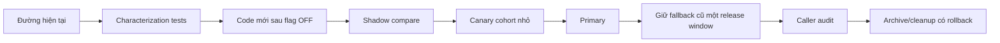
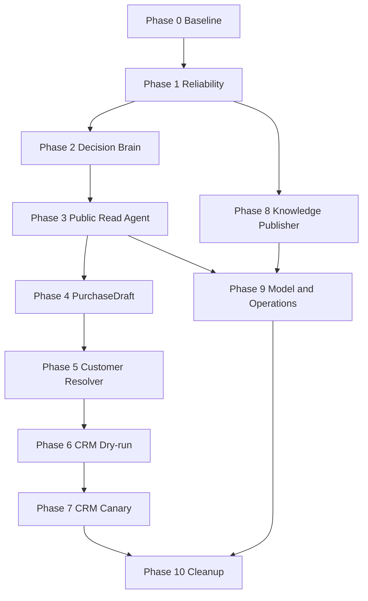

# Phase roadmap CFC AI Agent: nâng cấp mà không làm mất hệ thống hiện tại

Ngày lập: 09/09/2026. Tài liệu nguồn: [Master plan CFC AI Agent](MASTER_PLAN_CFC_AI_AGENT_HIEN_TAI_VA_TUONG_LAI_2026-09-09.md).

Trạng thái chung: `PHASE 0 LOCAL_COMPLETE — SẴN SÀNG TRIỂN KHAI PHASE 1 LOCAL`.

Mục tiêu: chia chương trình nâng cấp thành các phần nhỏ có thể hoàn thiện, kiểm tra và rollback độc lập. Hệ thống hiện tại tiếp tục hoạt động trong suốt quá trình; tính năng mới chỉ thay thế đường cũ sau khi chứng minh tốt hơn.

## 1. Câu trả lời: nên hoàn thiện cái gì trước?

Ước lượng dưới đây dành cho một luồng triển khai tập trung, chưa tính thời gian chờ phê duyệt, traffic canary hoặc phản hồi từ quản trị AMIS.

| Thứ tự | Phase | Có thể làm ngay? | Ước lượng | Giá trị | Rủi ro | Phụ thuộc bên ngoài |
|---:|---|---|---:|---|---|---|
| 1 | Phase 0 — Đóng băng hành vi và dựng hàng rào | Có | 1–2 ngày | Biết chính xác cái gì đang chạy; ngăn làm mất chức năng cũ | Thấp | Không |
| 2 | Phase 1 — Reliability của state/replay/evidence | Có | 3–5 ngày | Hết race phổ biến, test an toàn, trace đúng nguồn | Thấp–vừa | Local không cần; production verification cần môi trường |
| 3 | Phase 2 — Một Decision Brain | Có | 4–7 ngày | Bot hiểu ngữ cảnh tốt hơn, giảm planner thừa và độ trễ | Vừa | Ollama local để benchmark thật |
| 4 | Phase 3 — Public Read Agent | Có sau Phase 1–2 | 4–7 ngày | Bot tự chọn tool đọc an toàn, tự nhiên hơn | Vừa | Redis fixture; canary cần runtime |
| 5 | Phase 4 — PurchaseDraft + handoff bền | Có sau Phase 3 | 5–8 ngày | Thu thập nhu cầu mua có cấu trúc, chưa đụng AMIS write | Vừa | Cần chốt nội dung preview/handoff |
| 6 | Phase 5 — Customer resolver và xác minh | Một phần | 4–7 ngày | Phân biệt khách mới/cũ đúng hơn | Vừa–cao | Cần chốt cách xác minh khách cũ |
| 7 | Phase 6 — CRM write dry-run | Chưa nên làm trước | 5–10 ngày | Có payload/ledger/reconcile an toàn | Cao | Cần AMIS tenant contract và nghiệp vụ |
| 8 | Phase 7 — CRM canary thật | Chưa | 3–7 ngày lịch tối thiểu | Tạo record thật có kiểm soát | Rất cao | Phê duyệt live và nhân viên đối chiếu |
| 9 | Phase 8 — Knowledge/RAG publisher thế hệ mới | Có thể song song phần thiết kế | 5–10 ngày | Thêm kiến thức an toàn, rollback được | Vừa | Có thể cần người duyệt nội dung |
| 10 | Phase 9 — Model/performance/operations | Sau khi flow đúng | 3–5 ngày + quan sát | Tối ưu Qwen, RAM, latency, quan sát vận hành | Vừa | Cần đo trên M4 và traffic thật |
| 11 | Phase 10 — Cleanup | Cuối cùng | 2–5 ngày | Giảm nợ kỹ thuật | Cao nếu làm sớm | Cần caller audit và rollback |

Ba phase nên bắt đầu trước là **Phase 0 → Phase 1 → Phase 2**. Chúng cải thiện nền hiện tại mà chưa thay đổi nghiệp vụ khách hàng hoặc ghi CRM.

## 2. Luật bảo toàn hệ thống hiện tại

Mọi phase phải tuân thủ các bất biến sau:

1. Giữ nguyên endpoint `/api/chat-pipeline` và schema response cho n8n cho đến khi có migration riêng.
2. Giữ các deterministic/protected fast path hiện có cho order, loyalty, price boundary, agronomy và dealer.
3. Không reset/flush Redis để migrate state.
4. State mới chỉ thêm field và có lazy migration; session cũ phải đọc được.
5. Không ghi đè active snapshot/vector bằng dữ liệu chưa validate.
6. Feature flag mới mặc định `off` hoặc `shadow`.
7. Shadow không đổi answer, không gọi tool side effect và không ghi state nghiệp vụ.
8. Không dùng `ai_agent_tools.py` của Admin Agent cho Page Agent.
9. Không đổi model cùng lúc với thay router/state; nếu đổi cả hai sẽ không biết lỗi đến từ đâu.
10. Không xóa file, Redis key, workflow hoặc code legacy khi chưa có caller audit và ít nhất một release rollback window.
11. Không dùng unit/mock để tuyên bố live pass.
12. CRM write là flag/credential/adapter riêng; rollback Agent read không được làm mất operation đang `unknown`.

## 3. Chiến lược thay đổi không gián đoạn

Mỗi capability có vòng đời riêng. Ví dụ product/dealer Agent có thể lên canary trong khi CRM write vẫn tắt hoàn toàn.

### Quy tắc tương thích

| Thành phần | Cách bảo toàn |
|---|---|
| API | Giữ request/response cũ; field mới optional |
| Redis session | Lazy migration; đọc được schema cũ; không flush |
| Redis snapshot | Candidate/generation key mới; active key chỉ promote sau gate |
| Conversation route | Old route là control/fallback; route mới chạy shadow trước |
| Model | Qwen 7B là baseline cố định trong lúc thay state/router |
| n8n | Chưa sửa ở Phase 0–6 nếu API contract cũ đủ dùng |
| CRM | Read và write dùng credential/flag/adapter tách biệt |
| Notification | Outbox riêng; lỗi gửi không chạy lại nghiệp vụ |
| Cleanup | Chỉ archive sau call-site audit, canary và rollback rehearsal |

## 4. Trạng thái phase và ý nghĩa

- `PLANNED`: có scope nhưng chưa code.
- `IN_PROGRESS_LOCAL`: đang code/test local, không nói production.
- `LOCAL_COMPLETE`: code + test + replay local đạt, chưa có live evidence.
- `READY_FOR_SHADOW`: đủ an toàn để quan sát không ảnh hưởng khách.
- `READY_FOR_CANARY`: shadow đạt gate, có runbook và approval cần thiết.
- `DONE`: đạt exit gate và có bằng chứng đúng với phạm vi phase.
- `BLOCKED`: thiếu dependency hoặc quyết định bắt buộc.
- `ROLLED_BACK`: đã rút capability khỏi traffic và ghi rõ revision/snapshot/reason.

Một phase không được đánh dấu `DONE` chỉ vì viết xong code.

## 5. Phase 0 — Đóng băng hành vi và dựng hàng rào

Khả năng hoàn thiện trước: **cao nhất**. Phạm vi local, không cần thay live.

Trạng thái ngày 09/09/2026: `LOCAL_COMPLETE`. Contract, dataset/runtime manifest và replay isolation đã triển khai; 63/63 test mục tiêu và full suite 247/247 pass. Redis replay đạt 11/19 case, 24/36 turn với source coverage 100%; tám case chưa đạt được giữ nguyên làm baseline cho Phase 1–2, chưa đủ điều kiện shadow/canary. Xem [báo cáo baseline Phase 0](PHASE_0_BASELINE_REPORT_2026-09-09.md).

### Mục tiêu

Tạo đường chuẩn để mọi nâng cấp sau chứng minh rằng tính năng cũ không mất.

### Việc thực hiện

- Chốt danh sách capability hiện có: product, dealer, order, loyalty, price intake, purchase intake, agronomy, contact, complaint, B2B, handoff và fallback.
- Đóng băng 19 replay hiện có và 40 grounding cases bằng dataset manifest đúng file/hash.
- Chia test thành `unit_static`, `pipeline_fixture`, `ollama_local`, `redis_integration`, `live_canary`.
- Tạo compatibility matrix cho request/response, intent, source family, state field và Redis key.
- Ghi baseline toàn bộ 229 test hiện có; báo pass/fail thật, không sửa expectation để làm xanh giả.
- Bổ sung case bắt buộc cho các tuyến đã có nhưng chưa khóa đủ: repeated text khác message ID, lease contention, admin update khi cache nóng, cross-brand/sender, stale data.
- Ghi runtime manifest đầy đủ hơn: `chat_pipeline`, router, orchestrator, store, AMIS adapters, prompt/schema/config fingerprints.
- Thêm checklist cấm external side effect cho runner.

### File tác động dự kiến

- `runtime_manifest.py`
- `evaluation_ops.py`
- `conversation_replay_eval.py`
- `eval_conversation_replays.jsonl`
- các file `tests/test_*` mới hoặc mở rộng
- tài liệu phase/report; chưa đổi route khách hàng

### Điều kiện kết thúc local

- Baseline report có manifest và phân loại validation.
- Không có test runner gửi Telegram, ghi AMIS hoặc xóa session production.
- Request/response compatibility được khóa bằng test.
- Mỗi protected route có ít nhất một success, one missing input, one forbidden/not-found và one stale/tool-failure case.

### Rollback

Chỉ thêm test/report/manifest nên rollback bằng cách bỏ runner mới. Không động dữ liệu live.

## 6. Phase 1 — Reliability của state, lease, replay và evidence

Khả năng hoàn thiện trước: **cao** sau Phase 0.

### Mục tiêu

Làm nền hội thoại đủ chắc để sau này Agent hoặc CRM write không chạy trên state bị đè/mất.

### Work package 1A — Sender lease và idempotency

- Caller phải nhận `acquired` từ `sender_lease`.
- Không acquire thì trả retryable/in-flight outcome; không tiếp tục xử lý âm thầm.
- Lease TTL phải dài hơn turn deadline hoặc có renewal.
- Giữ local sender lock làm lớp bảo vệ trong một process.
- Message idempotency tiếp tục dùng message ID; không dùng raw text làm khóa.
- Test hai worker, lease timeout, exception, cancellation và duplicate webhook.

### Work package 1B — State persistence

- Dùng message ID + revision để xác định turn đã finalize.
- `domains/customers/service.py` cập nhật qua một state/store service thay vì SET rời rạc.
- Giữ TTL hiện hữu, tăng revision, cập nhật nested slot hợp lệ và invalidate RAM cache.
- Persistence lỗi được phản ánh rõ; capability có side effect phải fail closed.
- Lazy migration schema v5; không xóa session cũ.

### Work package 1C — Evidence đúng nguồn

- FAQ, document, catalog, dealer, order, loyalty, agronomy có source envelope riêng.
- `allowed_audience` lấy từ policy/data class, không mặc định public.
- Answer trace không dùng FAQ snapshot hash cho kết quả AMIS.
- Protected answer dùng structured fields và invariant, không chỉ source marker.

### Work package 1D — Replay isolation

- Sender/key có run nonce riêng.
- Inject fake notifier, handoff writer và CRM writer.
- Fixture Redis namespace riêng; cleanup đúng namespace của run.
- Ghi latency theo parse/planner/tool/generation/persist.
- `--cases` nào thì manifest file đó.

### File tác động dự kiến

- `conversation_store.py`
- `message_idempotency.py`
- `chat_pipeline.py` tại wrapper/finalizer, không refactor toàn file
- `domains/customers/service.py`
- `evidence_trace.py`, `grounding_policy.py`
- `conversation_replay_eval.py`
- test tương ứng

### Điều kiện kết thúc local

- Không có hai request cùng sender commit cùng revision.
- Hai message ID khác có cùng text vẫn tạo hai turn đúng.
- Admin update không bị RAM cache cũ ghi đè.
- Replay không có side effect ngoài namespace test.
- Mọi answer CRM test có đúng source family/freshness/audience.

### Rollout và rollback

- Rollout code tương thích, feature flag cho finalizer/store mới nếu cần.
- Quan sát error/revision/lease metrics trước khi mở phần Agent.
- Rollback về store path cũ nhưng giữ field state mới vì additive.

## 7. Phase 2 — Một Decision Brain cho hội thoại

Khả năng hoàn thiện local: **cao**, benchmark thật cần Ollama.

### Mục tiêu

Một turn chỉ có một bộ semantic planner có quyền đề xuất route; các tuyến rõ tiếp tục chạy deterministic.

### Việc thực hiện

- Định nghĩa một `Decision` schema và action enum chung.
- Map `QueryPlan` và `RouteDecision` hiện có sang enum; giữ intent cũ trong response để tương thích.
- Dùng `conversation_orchestrator.py` làm semantic planner chính.
- Context thêm active GoalFrame, suspended goals, pending requests và result references đã redact/bounded.
- Sửa contract lệch như `dealer_lookup` và `sales_location_search`.
- CFC semantic planner chạy shadow bất đồng bộ để so parity, không block request và không đổi route.
- Sau khi parity đạt, retire hoặc biến nó thành adapter của contract chung.
- Ollama trả JSON Schema; invalid/timeout/low confidence rơi về deterministic fallback.
- Một turn tối đa một planner ảnh hưởng response.

### File tác động dự kiến

- `query_understanding.py`
- `dialogue_router.py`
- `conversation_orchestrator.py`
- `cfc_semantic_planner.py`
- các đoạn planner trong `chat_pipeline.py`
- `nlu_shadow.py`
- có thể thêm `agent_contracts.py` nhỏ cho enum/schema

### Test bắt buộc

- Toàn bộ deterministic protected routes không gọi model.
- Câu first-turn mơ hồ, follow-up, hỏi chen, đổi ý, ordinal reference.
- JSON malformed, timeout, unknown action, tool/identity field injection.
- State context không lộ raw phone/email hoặc data protected.
- So control và candidate trên cùng QueryPlan/state revision.

### Điều kiện kết thúc local

- 100% protected route trong suite không bị planner override.
- ≥99% output hợp schema trước fallback.
- ≥95% action + arguments đúng trên holdout đã duyệt.
- Không tăng số model call trung bình trên tuyến deterministic.

### Rollout và rollback

`off → shadow → assist cohort`. Old QueryPlan/router luôn còn làm fallback trong phase này. Rollback bằng flag, không migrate ngược state.

## 8. Phase 3 — Public Read Agent

Khả năng hoàn thiện local: **vừa–cao** sau Phase 1–2.

### Mục tiêu

Cho bot linh hoạt chọn các tool đọc hiện có mà không mở quyền quản trị hoặc CRM write.

### Việc thực hiện

- Tạo `public_agent_tools.py` riêng, không import Admin registry.
- Bọc các capability thành typed tool: FAQ, public product, public dealer, protected order, protected loyalty và agronomy.
- Chuẩn hóa `ToolResult`: status, payload public, evidence, source version, observed/expires time và redaction class.
- Policy quyết định tool nào cần phone/order code/location và tool nào được gọi cùng turn.
- Template/composer chặt cho order/loyalty; grounded generation chỉ dùng cho nội dung ít rủi ro.
- Giới hạn một decision call, tối đa hai tool đọc và deadline tổng.
- Nếu tool không tồn tại hoặc stale: hỏi rõ, fallback hoặc handoff; không dùng model world knowledge.

### Pilot đầu tiên

1. Product → hỏi chi tiết → dealer theo địa bàn.
2. Order → loyalty → quay lại order.
3. Agronomy có nguồn → purchase intent → handoff.

### Điều kiện kết thúc local

- Registry không chứa shell, n8n toggle, webhook tùy ý, raw Redis hoặc credential.
- 0 protected data leak trong security suite.
- Kết quả fast path trước đây không đổi ngoài wording đã được duyệt.
- Tool call/result có trace và freshness.

### Rollout và rollback

Flag riêng theo capability và stable sender bucket. Có thể canary product/dealer trong khi order/loyalty vẫn control. Rollback từng tool, không tắt toàn chatbot.

## 9. Phase 4 — PurchaseDraft và handoff bền

Khả năng hoàn thiện local: **vừa**; không cần AMIS write.

### Mục tiêu

Biến câu “tôi muốn mua” thành một bản yêu cầu có cấu trúc, sửa được và không mất khi hỏi chen.

### State mới dạng additive

`PurchaseDraft` nằm trong GoalFrame:

- `draft_id`, `version`, `status`;
- product candidates/selected product ID;
- line items: quy cách, quantity, unit;
- crop/use case;
- delivery area/address/location;
- contact phone/name;
- missing slots;
- preview digest và consent state;
- handoff ID/result.

### Việc thực hiện

- Tách contact phone, identity state và delivery address.
- Không tự chọn SKU hoặc đổi bao/kg.
- Mỗi sửa đổi tăng version.
- Preview hiển thị đúng dữ kiện; thiếu gì hỏi đúng một nhóm nhỏ.
- “Ok” chỉ có nghĩa xác nhận khi đang có preview hợp lệ.
- Persist intake/handoff trước khi báo đã tiếp nhận.
- Cho phép cancel/resume và hai goal xen kẽ.

### File tác động dự kiến

- `chat_pipeline.py` chỉ gọi handler mới
- có thể thêm `domains/customers/purchase_draft.py`
- `conversation_orchestrator.py`, `dialogue_router.py`
- handoff/list admin endpoints và UI liên quan
- test/replay draft

### Điều kiện kết thúc

- Case create/edit/cancel/resume/expired-consent/multi-line chạy qua fixture.
- Không có AMIS POST.
- Handoff có ID bền; notification lỗi không làm mất intake hoặc tạo lại.

### Rollback

Tắt `purchase_draft_enabled`; luồng cũ `purchase_intake` tiếp tục hoạt động. Field draft trong state được bỏ qua an toàn.

## 10. Phase 5 — Customer resolver và xác minh khách cũ

Khả năng hoàn thiện: **một phần local**, policy cuối cần quyết định nghiệp vụ.

### Mục tiêu

Biết khi nào có candidate khách cũ mà không tự gắn sai hồ sơ.

### Việc thực hiện

- Tái sử dụng phone normalization và outcome của loyalty cache.
- Thêm privileged resolver trả `0/1/many/unavailable`, không đưa raw AMIS row vào prompt.
- `not_found` chỉ dùng khi nguồn đầy đủ/còn mới; stale/error không biến thành khách mới.
- Identity state có method, status, verified_at, expires_at và scope.
- Chọn một cách xác minh: nhân viên duyệt hoặc OTP/kênh phù hợp.
- Nhiều match không liệt kê dữ liệu riêng cho khách.
- Đổi phone làm hết hiệu lực verification liên quan.

### Điều kiện kết thúc local

- Case 0/1/many/stale/error/phone-change/third-party lookup đạt.
- Không lộ account ID/name/financial fields trái scope.
- Nếu chưa có policy xác minh, bot vẫn tạo intake độc lập và handoff.

### Blocker trước production

Chủ hệ thống phải chọn phương thức xác minh khách cũ và thời hạn verification.

## 11. Phase 6 — CRM write contract và dry-run

Khả năng bắt đầu ngay: **không nên**, ngoại trừ chuẩn bị câu hỏi contract.

### Entry gate

- Phase 1–5 local gate đạt.
- Có tài liệu API đúng tenant và credential quyền tối thiểu.
- Chốt Lead/Contact/intake/Sale Order Draft, owner, field bắt buộc, product/unit/price.
- Chốt consent và cách reconcile.

### Việc thực hiện

- Write client riêng khỏi `AmisClient` read-only.
- `crm_write_enabled=false` mặc định.
- Dry-run tạo payload redacted/digest, không POST.
- Operation ledger bền có unique constraint.
- State machine `prepared/submitting/succeeded/failed/unknown/reconciled`.
- Timeout sau POST không tự retry.
- Đọc lại bằng correlation/external ID để reconcile.
- Outbox gửi notification sau commit nghiệp vụ.

### Test bắt buộc

- Duplicate webhook và double click consent.
- Contact thành công, order thất bại.
- Server thành công nhưng client timeout.
- Reconcile thấy 0/1/nhiều record.
- Ledger unavailable, Redis unavailable, notifier unavailable.
- Rollback code khi có operation `unknown`.

### Điều kiện kết thúc

Payload dry-run được quản trị AMIS đối chiếu và duyệt; test failure matrix đạt. Vẫn chưa gọi production write.

## 12. Phase 7 — CRM write canary

Khả năng thực hiện: **phụ thuộc phê duyệt live**.

### Rollout

1. Sandbox/test tenant nếu có.
2. Production allowlist một vài sender nội bộ.
3. Nhân viên approve từng operation.
4. Giới hạn action và volume/ngày.
5. Đối chiếu 100% ledger ↔ AMIS ↔ reply.
6. Mở cohort nhỏ sau đủ mẫu và không duplicate.

### Kill switch

- Tắt write không tắt read Agent/chatbot.
- Không xóa ledger/pending operations.
- `unknown` tiếp tục chặn retry.
- Handoff tiếp quản mọi draft chưa hoàn tất.

### Điều kiện `DONE`

Có bằng chứng live đúng tenant, không duplicate trong cửa sổ canary, reconciliation và kill-switch đã diễn tập, chủ hệ thống duyệt mở rộng.

## 13. Phase 8 — Knowledge/RAG publisher thế hệ mới

Có thể thiết kế song song; phần promote production làm sau Phase 1 evidence.

### Mục tiêu

Thêm FAQ/tài liệu mà không làm active snapshot, vector index và RAM cache lệch phiên bản.

### Việc thực hiện

- Một đường publish: validate → candidate → embed → smoke test → promote generation → refresh RAM.
- Không để Knowledge UI, Learning approval hoặc script Shopee ghi thẳng active key.
- Metadata giữ nguyên source ID, audience, answer mode, risk, expiry và active.
- Pin embedding model/digest/dimension/space version.
- FAQ và document index có contract truy hồi rõ.
- Learning queue chỉ là đề xuất; approval phải gắn nguồn nghiệp vụ.
- Giữ previous generation để rollback.

### Điều kiện kết thúc

Fault injection giữa mọi bước không làm mất generation đang khỏe; active/vector/RAM cùng generation; rollback được kiểm thử.

## 14. Phase 9 — Tối ưu model, hiệu năng và vận hành

### Model

- Giữ Qwen2.5 7B làm baseline.
- 4K rồi 8K context; temperature 0; concurrency 1 trước.
- Chỉ thử model khác trên cùng dataset/state/tool/source generation.
- 14B/cloud chỉ xét khi semantic quality không đạt sau khi sửa context/contract.

### Hiệu năng

- Fast path không gọi model.
- Một semantic planner mỗi turn.
- Tối đa hai tool read và một grounded generation.
- Đo queue, prompt eval, generation, tool, Redis, persist và end-to-end.
- Đo RAM/swap khi Ollama, embedding, Redis và n8n cùng chạy trên M4 16GB.

### Vận hành

- Dashboard route/fallback/handoff/stale/latency/tool error.
- Alert source stale, Full Warm lỗi, lease contention, idempotency degraded và operation unknown.
- Stable cohort theo HMAC brand + sender.
- Error budget và auto-disable theo capability.

### Điều kiện kết thúc

Có report p50/p95/RAM/chất lượng cho cấu hình được chọn và canary evidence; không chốt model chỉ theo số tham số.

## 15. Phase 10 — Cleanup cuối chương trình

Cleanup không được dùng để “làm gọn trước”. Chỉ làm khi:

- có `rg`/CodeGraph caller audit;
- replacement đã primary và qua rollback window;
- session/snapshot migration đọc tương thích;
- test chứng minh không còn caller;
- có archive hoặc commit/revision rollback;
- chủ hệ thống duyệt thao tác xóa/unpublish.

Ứng viên cần audit, không phải danh sách được phép xóa: `query_understanding.py.bak`, legacy `live_crm` helpers, planner CFC cũ, script ghi active trực tiếp, duplicate route/runtime và workflow cũ.

## 16. Dependency tổng

Phase 8 có thể chạy song song từ sau Phase 1. Không để nó thay active production trong lúc chưa có generation rollback.

## 17. Kế hoạch nếu chỉ có một tuần

Ưu tiên hoàn thành local:

1. Phase 0: baseline, manifest, compatibility và test side-effect boundary.
2. Phase 1D: replay isolation.
3. Phase 1A: sender lease/idempotency tests và fix nhỏ.
4. Phase 1B: repeated text/revision/admin cache consistency.
5. Phase 1C: source-specific evidence tối thiểu cho order/loyalty.
6. Chạy lại toàn bộ test/replay; lập báo cáo pass/fail và backlog Phase 2.

Không bắt đầu CRM write, không đổi model, không refactor toàn bộ `chat_pipeline.py`, không push/activate workflow trong tuần nền này.

## 18. Phase nào mang lại cảm giác “xịn hơn” cho khách?

| Kết quả khách cảm nhận | Phase tạo ra |
|---|---|
| Ít trả lời trùng/sai ngữ cảnh | Phase 1 |
| Hiểu câu nói lạ, hỏi chen và quay lại việc cũ | Phase 2 |
| Tự chọn đúng nguồn/tool, trả lời linh hoạt | Phase 3 |
| Nhớ giỏ/yêu cầu mua và chỉ hỏi thông tin thiếu | Phase 4 |
| Nhận biết khách cũ an toàn | Phase 5 |
| Tạo yêu cầu/record CRM có xác nhận | Phase 6–7 |
| Học thêm tài liệu mà ít cần sửa code | Phase 8 |
| Nhanh, ổn định và chọn model hợp lý | Phase 9 |

Phase 0–1 ít “hào nhoáng” nhưng quyết định các phase sau có an toàn hay không.

## 19. Báo cáo bắt buộc sau mỗi phase

Mỗi phase phải để lại một report gồm:

- scope đã làm và phần chưa làm;
- file/symbol thay đổi;
- manifest/commit và config flags;
- test command, số pass/fail, validation mode;
- dataset/snapshot/model fingerprints;
- latency/memory nếu có;
- live evidence hoặc ghi rõ chưa live;
- lỗi còn mở;
- rollout percentage/cohort;
- rollback procedure đã thử;
- trạng thái phase và người duyệt nếu cần.

## 20. Điểm bắt đầu cụ thể

Phase đầu tiên nên triển khai là **Phase 0 — Đóng băng hành vi và dựng hàng rào**, sau đó đi thẳng sang **Phase 1D replay isolation** và **Phase 1A sender lease/idempotency**.

Lý do: đây là ba phần có thể hoàn thiện local, ít ảnh hưởng hành vi khách, tạo bằng chứng cho mọi nâng cấp sau và xử lý trực tiếp các khoảng trống đã thấy trong source. Khi chúng đạt gate, Phase 2 mới có baseline đáng tin để chứng minh bot thực sự thông minh hơn.
