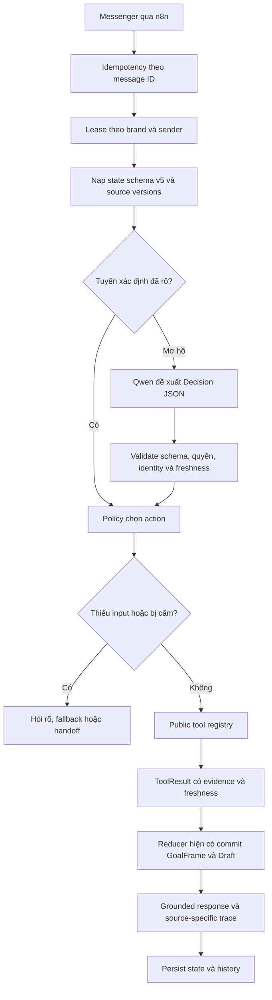

# Kế hoạch nâng cấp CFC thành AI Agent và tiếp nhận yêu cầu CRM

> Tài liệu kỹ thuật này được giải thích theo luồng đầy đủ trong [Master plan CFC AI Agent: hiện tại và tương lai](MASTER_PLAN_CFC_AI_AGENT_HIEN_TAI_VA_TUONG_LAI_2026-09-09.md).
> Khi triển khai, dùng số phase và exit gate trong [Phase roadmap nâng cấp không làm mất hệ thống cũ](PHASE_ROADMAP_CFC_AI_AGENT_NANG_CAP_KHONG_MAT_HE_THONG_CU_2026-09-09.md); bảng phase cũ phía dưới chỉ còn là tóm tắt kỹ thuật lịch sử.

Ngày lập: 08/09/2026. Rà soát lại toàn bộ `chatbot/server`: 09/09/2026. Phạm vi: CFC trước; ZeO giữ regression riêng.

Trạng thái: **kế hoạch đã chỉnh theo source hiện tại; chưa triển khai Agent public mới, chưa benchmark model và chưa thay đổi live.** Máy mục tiêu là Mac mini M4 16GB, model đang khai báo là `qwen2.5:7b-instruct`; chưa xác minh process, tag/digest, lượng tử hóa hoặc tải thực tế. Cloud chưa được cho phép nên plan mặc định local.

Kết quả rà soát chi tiết nằm tại [AUDIT_SERVER_CHO_CFC_AGENT_2026-09-09.md](AUDIT_SERVER_CHO_CFC_AGENT_2026-09-09.md). Tài liệu này tích hợp [backlog khách mới/cũ, tạo đơn CRM và dọn dẹp ngày 31/08](../PLAN_KHACH_HANG_MOI_CU_TAO_DON_CRM_VA_DON_DEP_2026-08-31.md). Lập plan không đồng nghĩa cho phép ghi CRM, chạy workflow, reset Redis hoặc dọn dữ liệu.

## 1. Kết luận kiến trúc sau khi đọc lại source

CFC **đã có nền của một Agent**, gồm router xác định, planner ngữ nghĩa, bộ nhớ nhiều mục tiêu, tool đọc dữ liệu, grounding và replay. Vấn đề chính không phải thiếu framework Agent mà là các phần này chưa dùng chung một hợp đồng:

- `chat_pipeline.py` đã có schema state v5, `GoalFrame`, pause/resume mục tiêu, slot, reference và tool result.
- `conversation_orchestrator.py` đã có decision allowlist và validation, nhưng context gửi model chưa chứa `goal_frames`, `active_goal_id` và danh sách `pending_requests`.
- CFC có thêm `cfc_semantic_planner.py`; ở chế độ assist/shadow pipeline vẫn chờ kết quả nhưng chỉ ghi `proposal_only`, nên có thể tốn độ trễ mà không đổi hành vi.
- `ai_agent_tools.py` và `/admin/assistant/chat` là Agent quản trị, có tool bật/tắt n8n, chạy shell và gọi webhook. Đây là miền tin cậy khác hoàn toàn với chatbot khách hàng.

Quyết định mới: **mở rộng pipeline hiện tại thành public business Agent, không dựng một Agent runtime thứ hai và không đưa registry quản trị cho Page chatbot.** FastAPI/Python tiếp tục điều phối, Redis lưu state, n8n làm I/O/sync. Model chỉ đề xuất decision có schema; backend sở hữu identity, quyền, dữ kiện, thực thi tool và commit state.

## 2. Thứ tự ưu tiên đã thay đổi

Plan cũ đi từ schema/reducer mới đến Agent. Sau audit, thứ tự đúng là:

1. Làm chắc cơ chế khóa, state, provenance và publish dữ liệu đang có.
2. Hợp nhất về một decision contract và một lượt planner ngữ nghĩa có ích.
3. Mở public Agent chỉ đọc cho một pilot hẹp.
4. Thêm customer resolution và `PurchaseDraft` theo từng goal.
5. Chỉ sau đó mới làm adapter ghi CRM với ledger, consent và reconciliation.

Nếu bỏ qua bước 1, đổi sang model mạnh hơn vẫn có thể đọc state thiếu, dùng snapshot/vector lệch phiên bản hoặc lặp thao tác sau timeout.

## 3. Vai trò của Qwen2.5 7B trên Mac M4 16GB

**Giữ Qwen2.5 7B làm baseline và ứng viên pilot.** Không giao model vai trò tự trị toàn hệ thống. Vai trò phù hợp là:

- hiểu câu tiếng Việt mơ hồ, follow-up, đổi ý và nhiều ý trong một tin;
- trích slot và reference từ context đã giới hạn;
- chọn một action trong allowlist nhỏ;
- viết câu trả lời từ `ToolResult` đã lọc khi policy cho phép.

Model không được tự tạo dữ kiện, chọn sender/brand/credential, chạy shell/HTTP tùy ý, quyết định consent hoặc retry thao tác ghi. Câu hỏi chưa được code vẫn trả lời được khi FAQ/RAG hoặc tool hiện có chứa dữ kiện. Nếu capability/data không tồn tại, hành vi đúng là hỏi rõ, báo giới hạn hoặc handoff; model lớn hơn không tự sinh ra dữ liệu CRM thật.

Qwen công bố Qwen2.5 hỗ trợ structured output/tool calling. Ollama cho phép truyền JSON Schema trong `format`; schema ràng buộc cấu trúc, không bảo đảm decision đúng. [Qwen2.5](https://qwenlm.github.io/blog/qwen2.5/), [Ollama structured outputs](https://docs.ollama.com/capabilities/structured-outputs), [Ollama tool calling](https://docs.ollama.com/capabilities/tool-calling).

Tag Ollama 7B Instruct hiện được công bố khoảng 4,7GB và 14B khoảng 9GB; đó là kích thước model, không phải tổng RAM runtime. M4 16GB còn phải chứa context, KV cache, embedding, Redis/n8n và hệ điều hành. Vì vậy chưa chọn 14B hoặc cloud trước khi benchmark đúng pipeline. [Ollama 7B](https://ollama.com/library/qwen2.5:7b-instruct), [Ollama 14B](https://ollama.com/library/qwen2.5:14b), [Ollama FAQ](https://docs.ollama.com/faq).

Thiết lập thử nghiệm: temperature 0; decision 256–512 output tokens; context 4K rồi so 8K; một generation đồng thời; tối đa một decision call cho phần lớn turn và tối đa hai tool đọc. Đặt deadline tổng cho turn và đo riêng cold/warm, queue, prompt evaluation, generation, tool và tổng Messenger.

## 4. Kiến trúc đích

Các tuyến xác định đang bảo vệ đơn hàng, loyalty, giá, đại lý và agronomy tiếp tục có ưu tiên. LLM xử lý phần mơ hồ; không thay mọi route bằng một vòng lặp tự do.

Hai registry phải tách hẳn:

- `public_agent_tools.py`: FAQ/agronomy, catalog công khai, điểm bán công khai, tra đơn có mã + SĐT, loyalty được bảo vệ, draft preview và handoff.
- `ai_agent_tools.py`: chỉ dành cho quản trị sau lớp xác thực riêng. Không import registry này từ pipeline khách hàng.

`execute_system_command`, toggle n8n và webhook tùy ý không bao giờ xuất hiện trong prompt/tool list của Page Agent.

## 5. Hợp đồng dùng chung

### Conversation state

Giữ schema v5 hiện có làm gốc. Không tạo reducer song song. Mở rộng có migration đọc tương thích:

- `GoalFrame`: `goal_id`, loại mục tiêu, status, slot riêng của goal, references, `last_answer_id`, result IDs và timestamps.
- `ConversationState`: active goal ID, tối đa số goal tạm dừng đã quy định, pending requests, recent turns giới hạn, state revision và source versions.
- `PurchaseDraft`: nằm trong goal mua hàng; có draft ID/version, line items, product candidate/selected ID, quy cách, số lượng/đơn vị, địa bàn giao, contact reference và trạng thái.

Phone nhận diện khách và địa chỉ giao của draft phải là hai khái niệm riêng. Sửa draft sau preview tăng version và làm hết hiệu lực consent cũ. Không tự quy đổi bao/kg hoặc tự chọn SKU khi chưa có nguồn xác minh.

### Decision

Một schema duy nhất gồm `action`, `arguments`, `slot_changes`, `reference`, `missing_slots`, `confidence` và `reason_code`. Backend tự gắn brand/sender và loại mọi field identity do model đề xuất. Action name giữa planner và router phải dùng cùng enum; sửa chênh lệch như `dealer_lookup` và `sales_location_search`.

### ToolResult và Evidence

`ToolResult` có status chuẩn: `success`, `not_found`, `ambiguous`, `missing_input`, `unavailable`, `stale`, `forbidden`. Kèm public payload, source family, source/version ID, observed time, expires time và redaction class.

Trace phải lấy snapshot của đúng nguồn. Kết quả AMIS không dùng hash FAQ; dữ liệu protected không mặc định gắn `allowed_audience=public`. Grounding hiện tại chỉ chứng minh có source marker, chưa chứng minh từng mệnh đề khớp dữ kiện, nên gate cần kiểm tra claim quan trọng bằng invariant cụ thể.

## 6. Khách mới/cũ và yêu cầu mua

Tái sử dụng chuẩn hóa SĐT, HMAC và bốn kết quả đã có trong loyalty projection: tìm thấy, profile có nhưng chưa có loyalty, nhiều match, không tìm thấy/unavailable. Cache đó đã loại account ID khỏi projection công khai, vì vậy cần một adapter privileged riêng để lấy candidate CRM khi đã qua xác minh; không thể dùng HMAC index như customer ID để ghi AMIS.

Số điện thoại khớp hồ sơ không chứng minh người nhắn sở hữu hồ sơ. Với dữ liệu riêng hoặc liên kết khách cũ, dùng cơ chế được chủ hệ thống chọn: nhân viên xác minh hoặc OTP/kênh phù hợp. Nếu chưa xác minh, vẫn có thể lưu intake độc lập và handoff nhưng không tự gắn hồ sơ AMIS.

Luồng đề xuất:

1. Thu thập nhu cầu và product candidate từ nguồn công khai.
2. Hỏi đúng slot còn thiếu, cho phép sửa/hủy và hỏi chen rồi resume.
3. Resolve customer theo outcome 0/1/nhiều/lỗi; stale/lỗi không được coi là khách mới.
4. Hiển thị preview có draft ID/version, sản phẩm, quy cách, số lượng, địa bàn và thông tin liên hệ.
5. Chỉ nhận consent khi đúng preview đang chờ và chưa hết hạn.
6. MVP tạo intake/handoff đã lưu thành công. AMIS write vẫn tắt.

## 7. Ghi CRM an toàn

Trước khi viết code phải xác minh trên đúng tenant: resource tạo Lead/Contact/Sale Order, field bắt buộc, owner, mã sản phẩm, đơn vị, giá, quyền credential và cách đọc lại record. Không bịa giá `0` để vượt field bắt buộc. Nếu AMIS không có draft phù hợp, lưu yêu cầu bán hàng nội bộ cho sales.

Message idempotency hiện có chỉ chống lặp response trong hội thoại. CRM cần operation ledger bền riêng, có unique key theo `draft_id + version + action`, ghi trạng thái trước khi gửi và giữ độc lập với TTL session. Timeout sau POST là `unknown`; phải tra cứu/reconcile trước retry. Contact thành công nhưng đơn thất bại phải giữ external ID để không tạo contact lại.

Notification đi qua outbox chống trùng sau kết quả nghiệp vụ. Lỗi Telegram không được chạy lại CRM operation. Chỉ trả “đã tạo” khi có external ID/kết quả được xác minh; ticket JSON local hiện có không được tính là bản ghi AMIS thành công.

## 8. Lộ trình triển khai đã sửa

| Bước | Công việc | Đầu ra/gate |
|---|---|---|
| P0 — nền đúng | Sửa semantics của sender lease; thống nhất update session/cache/revision; tách source-specific evidence; cô lập replay; kiểm kê mọi writer vào active snapshot | Unit/integration tĩnh đạt; replay không gửi notification/CRM; không reset dữ liệu thật |
| P1 — một planner | Dùng `conversation_orchestrator` làm decision contract; đưa GoalFrame/pending requests vào context; hợp nhất action enum; bỏ lượt CFC proposal-only khỏi request path hoặc chuyển shadow nền; JSON Schema + deadline | Mỗi turn tối đa một decision planner có tác dụng; tuyến rõ không gọi model; fallback giữ nguyên |
| P2 — public read Agent | Tạo public registry riêng; pilot mua hàng + đại lý + FAQ; tối đa hai tool đọc; state commit qua reducer hiện có | Golden replay + holdout đạt; 0 tool quản trị/public boundary violation trong suite |
| P3 — customer + draft | Privileged resolution adapter, identity state, PurchaseDraft goal-scoped, preview/consent/handoff | Demo 0/1/nhiều/lỗi, sửa/hủy/resume; chưa ghi AMIS |
| P4 — CRM dry-run | Xác minh contract tenant; mapping; ledger; reconciliation; outbox; payload dry-run | Review payload với quản trị AMIS; duplicate/timeout/partial failure tests đạt |
| P5 — canary | Agent read theo cohort ổn định; CRM write bằng flag riêng và allowlist cực hẹp sau phê duyệt nghiệp vụ | Trace end-to-end bằng sender test; diễn tập tắt Agent/write; theo dõi p95/error/handoff |
| P6 — cleanup | Audit caller và retire từng planner/writer/legacy cache đã có thay thế | Có migration, regression, rollback và duyệt riêng từng thao tác |

P0/P1 có thể làm bằng fixture trong lúc chờ bằng chứng Full Warm. Fixture không chứng minh live AMIS. Không chạy warm thủ công, push n8n, reset Redis hoặc xóa cache trong giai đoạn lập plan.

## 9. Thay đổi kỹ thuật dự kiến

| File/module | Hướng thay đổi |
|---|---|
| `chat_pipeline.py` | Giữ tuyến nhanh; một điểm gọi semantic decision; dùng message ID/revision thay text equality; commit state một lần |
| `conversation_store.py` | Caller phải kiểm tra lease có acquire; thiết kế renewal hoặc TTL theo deadline; lỗi persist chặn side effect CRM |
| `conversation_orchestrator.py` | Context schema v5 đầy đủ; action enum chung; JSON Schema và trace thời gian/model chính xác |
| `cfc_semantic_planner.py` | Hợp nhất vào contract chung hoặc chỉ shadow bất đồng bộ; không chờ proposal không được dùng |
| `dialogue_router.py` | Dùng action enum chung và giữ protected route priority |
| `public_agent_tools.py` mới | Registry public tối thiểu, typed arguments/result, policy và redaction; không phụ thuộc registry admin |
| `evidence_trace.py` | Evidence theo source family/version/audience; không gắn mọi kết quả với FAQ snapshot |
| `knowledge_sync.py`, `domains/knowledge/`, `domains/learning/`, Shopee writers | Một publish service có validate/stage/version/promote/rollback và refresh RAM; ngăn writer ghi thẳng active |
| `domains/customers/` | Update state qua cùng store/reducer, giữ TTL/revision và invalidate cache; notification qua outbox |
| `domains/amis/` | Reuse protected lookup; thêm privileged customer/write adapter, operation ledger và reconciliation sau P3 |
| replay/evaluation | Namespace riêng theo run, dependency adapters, suppress external side effects, latency từng stage, manifest đúng dataset/config/source |

Không tạo ngay `domains/agent/` lớn. Chỉ tách thêm module khi public registry/decision policy vượt quá kích thước hợp lý; trước đó tận dụng các primitive hiện có để giảm hai hệ thống cạnh tranh.

## 10. Bộ test và gate

Dùng ít nhất 30 hội thoại × 8–12 lượt, chia development/holdout theo kịch bản. Bao gồm khách mới/cũ/nhiều match; sửa số lượng/SĐT/địa bàn; hỏi chen/resume; ordinal reference; thiếu công thức; prompt injection; hai sender/hai brand; lease contention; JSON lỗi/timeout; stale CRM; consent cũ; webhook lặp; POST thành công nhưng client timeout.

Replay phải chạy bằng namespace riêng có run ID trong sender/key, dependency fake cho notification và CRM write, snapshot fixture cố định và manifest đúng file cases được truyền vào. Không dùng `run_test_md_scenarios.py --reload-data` làm baseline production vì đường này có thể ghi active Redis.

Gate đề xuất, chưa phải số đã đạt:

- 100% route rõ giữ đúng hành vi an toàn và không gọi model.
- ≥99% decision hợp schema trước fallback; ≥95% action + arguments đúng trên turn có đáp án rõ.
- ≥95% giữ đúng goal/slot/reference; không resume nhầm draft khi đổi chủ đề.
- 0 vi phạm quan sát được về rò dữ liệu, tool quản trị, fact protected, consent hoặc duplicate trong suite.
- 100% CRM timeout-unknown bị chặn retry cho đến khi reconcile.
- Mục tiêu p95: tuyến không gọi model ≤1 giây; Agent warm ≤8 giây. Đo thật trên M4 trước khi cam kết.
- Tải lần lượt 1 rồi 2–3 hội thoại; ghi swap, model residency, context, embedding contention và queue time.

So sánh pipeline hiện tại, Agent 7B và chỉ sau đó mới model khác trên cùng state/tool/source snapshot. Nếu lỗi do context, state hoặc dữ liệu, sửa đúng tầng. Nếu các tầng này đúng mà semantic vẫn không qua gate, benchmark local khác cùng cỡ, sau đó 14B hoặc cloud nếu chủ hệ thống chấp nhận RAM/dữ liệu/chi phí.

## 11. Việc nên bắt đầu ngay

Sprint đầu chỉ làm P0 và lát cắt đầu của P1:

1. Đóng băng corpus replay và tạo runner cô lập không side effect.
2. Viết test contention chứng minh caller xử lý `sender_lease=False` đúng.
3. Bổ sung test repeated same text với message ID khác và update profile qua admin trong lúc cache nóng.
4. Định nghĩa `Decision`/action enum duy nhất, map router hiện có vào enum.
5. Đưa active/suspended GoalFrame và pending requests vào context đã redact.
6. Đo một turn đang chạy bao nhiêu planner, thời gian từng planner và tool.
7. Chuyển CFC proposal-only ra khỏi synchronous request path, giữ feature flag rollback.

Sau sprint này mới benchmark Qwen 7B cho pilot mua hàng + đại lý. Đây là cách biết model có đủ hay không bằng số đo của chính hệ thống, thay vì đoán từ số tham số.

## 12. Quyết định nghiệp vụ còn mở trước CRM write

Trước P4/P5 cần chủ hệ thống chốt: tạo Lead hay Contact; intake nội bộ hay Sale Order Draft; owner mặc định; field bắt buộc và giá; cách xác minh khách cũ; nội dung/thời hạn consent; kho ledger; cách reconcile; cohort/allowlist đầu tiên. Không đưa secret vào tài liệu.

Cleanup giữ ràng buộc backlog cũ: chỉ archive/unpublish Public Sync sau Full Warm ổn định và có rollback; không xóa `live_crm`, cache hoặc planner khi còn caller; giữ manual regression; không sửa/xóa `TEST_DEMO.md` trong đợt cleanup.
