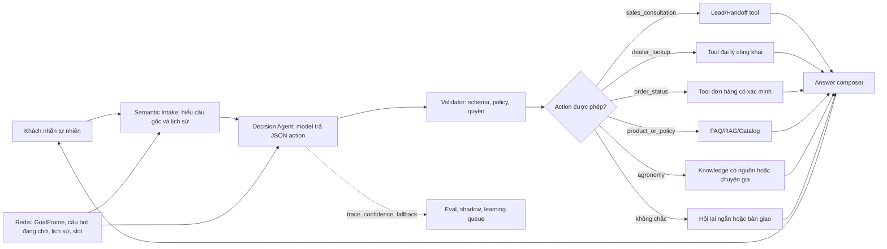

# Plan CFC Hybrid Agent: hiểu ngôn ngữ tự nhiên mà không bịa dữ liệu

Ngày lập: 17/09/2026  
Trạng thái: `PLANNED` — đây là thiết kế và lộ trình triển khai; chưa thay đổi runtime, n8n hay CRM production.

## 1. Điều cần sửa thật sự

Mục tiêu không phải là “bỏ toàn bộ route cứng và để AI trả lời mọi thứ”. Làm vậy chatbot có thể nói tự nhiên hơn nhưng sẽ dễ bịa giá, tồn kho, chính sách, tiến độ đơn hoặc hướng dẫn nông học.

Mục tiêu đúng là: **khách có thể nói theo bất kỳ cách tự nhiên nào; hệ thống hiểu khách muốn hoàn thành việc gì, tự chọn đúng công cụ an toàn, lấy dữ liệu thật, sau đó trả lời hoặc bàn giao đúng người.**

Khách không cần nói đúng “ngôn ngữ của hệ thống”. Model phải đọc câu gốc và lịch sử gần nhất, rồi biến nó thành một **ý nghĩa chuẩn nội bộ**. Ví dụ câu xàm, viết tắt hoặc không dấu vẫn phải được hiểu theo mục tiêu kinh doanh, không phải theo một từ khóa lẻ như “phân” hoặc “tư vấn”.

Ví dụ cần đạt:

> “Mình ở Hậu Giang, cần nhập phân, nhờ add tư vấn.”

Quyết định phải là `sales_consultation`, không phải `agronomy_consultation`.

Khi chưa có SĐT, câu trả lời là:

> Dạ Cò Bay đã ghi nhận bạn ở Hậu Giang cần nhập phân. Bên kinh doanh sẽ tư vấn đúng nhu cầu của bạn. Bạn gửi giúp mình số điện thoại, loại cây hoặc loại phân đang cần và số lượng dự kiến; bên mình sẽ liên hệ lại ạ.

Khi đã có SĐT, hệ thống tạo lead/handoff một lần, trả lời đã ghi nhận và không yêu cầu khách lặp lại thông tin.

## 2. Vì sao hiện tại trả lời “ngu” và lặp lại khi khách gửi SĐT

Đây là lỗi logic có thể chỉ ra từ source, không phải vì câu khách quá khó.

1. Câu “mình ở Hậu Giang, cần nhập phân, nhờ add tư vấn” có từ `nhập`, nhưng route mua hiện chỉ chắc chắn khi có thêm số lượng như `200kg`, `10 bao` hoặc `2 tấn`.
2. Câu cũng có “phân” và “tư vấn”, nên route cứng gắn nó vào `cfc_agronomy_review_request` với confidence cao.
3. Pipeline trả câu handoff khuyến nông, đồng thời lưu `active_goal = agronomy_consultation` vào Redis.
4. Lượt kế tiếp khách chỉ gửi `0783456199`. Code có fast-path hiểu đây là “khách trả lời câu bot vừa hỏi”, nhưng nó tiếp tục **active goal đang lưu**. Vì goal đang là nông học, số điện thoại bị map sang `cfc_dosage_usage_review` và gọi lại câu khuyến nông.

Nói ngắn: bot không hiểu số điện thoại là một mảnh dữ liệu để hoàn thành nhu cầu mua hàng. Nó đang tiếp tục một công việc nông học đã được chọn sai ở lượt trước.

## 3. Không phải “viết lại câu rồi chạy route cũ”

Ý của bạn về ChatGPT web là đúng ở phần quan trọng: model đọc câu tự nhiên, hiểu ý nghĩa và hiểu câu mới có phải là câu trả lời cho lượt trước không.

Tuy nhiên, không nên chỉ để model viết lại một câu đẹp hơn rồi đưa câu đó vào regex cũ. Nếu làm vậy, model có thể vô tình thay đổi ý, còn route cũ vẫn là người quyết định cuối cùng.

Thiết kế đúng là model trả một **Semantic Intake** có cấu trúc:

```json
{
  "canonical_request": "Khách ở Hậu Giang muốn nhập phân và yêu cầu nhân viên kinh doanh tư vấn.",
  "primary_action": "sales_consultation",
  "slot_updates": {"area": "Hậu Giang"},
  "is_answer_to_pending_question": false,
  "confidence": 0.93
}
```

Lượt sau:

```json
{
  "canonical_request": "Khách cung cấp số điện thoại để tiếp tục yêu cầu tư vấn mua phân.",
  "primary_action": "sales_consultation",
  "slot_updates": {"phone": "0783456199"},
  "is_answer_to_pending_question": true,
  "confidence": 0.99
}
```

Decision Agent và state machine dùng JSON này để chọn tool. Câu viết lại chỉ là phần debug để người quản trị hiểu model đã hiểu gì; không phải đầu vào duy nhất cho route.

## 4. Nguyên nhân kiến trúc ở hệ thống hiện tại

Hiện `query_understanding.py` quyết định `cfc_purchase_request` chắc chắn khi có từ mua/nhập **và** số lượng (`kg`, `tấn`, `bao`...). Nếu chưa có số lượng nhưng câu có “phân”, “tư vấn”, hoặc “kỹ thuật”, nó rơi sang `cfc_agronomy_review_request`.

Vì route này có confidence cao, `chat_pipeline.py` coi đây là protected fast path và không cho semantic planner đổi quyết định. Kết quả là câu khách nói tự nhiên bị chặn trước khi Qwen có cơ hội hiểu mục tiêu thương mại.

Điểm tốt cần giữ:

- `chat_pipeline.py` vẫn là cửa vào tương thích với n8n và Messenger.
- Redis/GoalFrame tiếp tục là nơi lưu hội thoại; model không tự có memory bền.
- Catalog, FAQ/RAG, AMIS, danh bạ đại lý và tool nội bộ tiếp tục là nguồn fact.
- Order, loyalty, giá, tồn kho, khiếu nại và dữ liệu khách vẫn có policy riêng.
- Replay, shadow, runtime manifest và evaluation isolation đã có để nâng cấp mà không ảnh hưởng khách thật.

## 5. Kiến trúc đích



Model chỉ có quyền **đề xuất quyết định và cập nhật slot có kiểm soát**. Nó không có quyền:

- tự viết số điện thoại, giá, tồn kho, chiết khấu hoặc chính sách;
- đọc CRM tùy ý;
- tạo lead/đơn hoặc gửi Telegram trực tiếp;
- tự khẳng định liều lượng nông học.

Validator chỉ nhận JSON theo contract, ví dụ:

```json
{
  "primary_action": "sales_consultation",
  "secondary_actions": ["agronomy_consultation"],
  "slots": {"area": "Hậu Giang"},
  "is_answer_to_pending_question": false,
  "ask_for": ["phone", "product_or_crop", "quantity"],
  "confidence": 0.91,
  "reason_code": "COMMERCIAL_PURCHASE_WITH_HUMAN_ADVICE"
}
```

`secondary_actions` chỉ được lưu làm việc chờ. Khách cần mua hàng trước thì không bị chuyển sang tư vấn kỹ thuật chỉ vì có chữ “phân”.

### Quy tắc SĐT và câu trả lời ngắn

SĐT, địa chỉ, ảnh, mã đơn và “ok/gửi đi” là **dữ liệu trả lời cho một công việc đang chờ**, không phải intent mới. Trước khi route, hệ thống phải kiểm tra câu bot vừa hỏi gì và GoalFrame nào đang active.

- Goal `sales_consultation` đang chờ SĐT → nhận SĐT, tạo/hoàn thiện LeadDraft.
- Goal `order_tracking` đang chờ SĐT → dùng SĐT để xác minh đơn.
- Goal `agronomy_consultation` đang chờ SĐT → chỉ bổ sung contact cho kỹ sư.
- Không có goal rõ → hỏi khách cần mua hàng, tìm đại lý, tư vấn kỹ thuật hay kiểm tra đơn.

Không được dùng một mapping cố định “có SĐT + active goal nông học = trả lại câu nông học” nếu active goal có dấu hiệu được chọn từ một decision sai hoặc còn confidence thấp.

## 6. Một Decision Agent, không phải nhiều planner tranh quyền

Tương lai chỉ có một model planner cho Page chatbot. Nó thay dần vai trò trùng lặp của:

- `QueryPlan` suy luận intent bằng regex;
- `cfc_semantic_planner.py`;
- phần semantic trong `conversation_orchestrator.py`.

`QueryPlan` vẫn còn giá trị, nhưng trở thành dữ liệu phụ trợ: chuẩn hóa tiếng Việt, trích SĐT/địa bàn/mã đơn, nhận dạng tham chiếu và các tín hiệu bảo mật. Nó không được tự kết luận toàn bộ ý định khách trong mọi câu.

Action contract ban đầu:

| Nhóm việc khách muốn | Action của Agent | Tool/nguồn fact | Có tự trả lời được? |
|---|---|---|---|
| Muốn mua, nhập, báo giá, cần sale tư vấn | `sales_consultation` / `purchase_intake` | Lead outbox, catalog | Có, chỉ xác nhận và hỏi thông tin thiếu |
| Tìm đại lý | `dealer_lookup` | Public dealer directory | Có nếu dữ liệu có nguồn |
| Hỏi sản phẩm/chính sách | `knowledge_lookup` | FAQ, RAG, catalog | Có khi có evidence |
| Hỏi cách dùng, bệnh cây, liều lượng | `agronomy_consultation` | Approved facts/RAG chuyên môn | Chỉ khi facts đủ; còn lại handoff |
| Tra đơn/điểm | `order_status` / `loyalty_lookup` | Protected AMIS adapter | Chỉ sau xác minh sở hữu |
| Khiếu nại | `complaint_intake` | SOP + handoff | Có, theo SOP |
| Không hiểu rõ | `clarification` | Không gọi tool rủi ro | Hỏi một câu ngắn nhất |
| Ngoài phạm vi | `out_of_scope` | Không có | Nói rõ phạm vi hoặc bàn giao |

## 7. Dùng Qwen, ChatGPT, Claude và Codex thế nào

### Qwen local: mặc định trong giai đoạn đầu

Qwen 7B trên Mac mini M4 16GB phù hợp để phân loại action, trích slot, nhận biết đổi chủ đề và viết JSON ngắn. Nó không nên là nơi tạo câu trả lời kỹ thuật tự do hoặc quyết định action ghi dữ liệu.

Ưu điểm: dữ liệu ở local, không phụ thuộc Internet, chi phí biên thấp. Hạn chế: câu tiếng Việt mơ hồ, đa ý hoặc cách nói rất lạ có thể sai; vì vậy cần schema, confidence, timeout và fallback.

### OpenAI hoặc Claude: cloud fallback tùy chọn

Không dùng website ChatGPT hay Codex làm runtime cho chatbot. Nếu chọn OpenAI thì dùng API model; nếu chọn Anthropic thì dùng Claude API. Cloud model chỉ được gọi khi:

1. Qwen không đạt confidence hoặc JSON không hợp lệ;
2. câu cần hiểu nhiều ý/phức tạp nhưng chưa chứa dữ liệu nhạy cảm cần giữ local;
3. policy và chi phí cho phép.

Payload cloud mặc định phải redact SĐT, token, mã đơn, dữ liệu CRM và lịch sử không cần thiết. Cloud model cũng chỉ được trả `Decision`, không được trả business fact hoặc gọi CRM trực tiếp.

### Codex

Codex phù hợp để phát triển, kiểm thử và cải tiến hệ thống, không phải “não” runtime cho khách nhắn Messenger. Không đưa Codex vào đường trả lời khách hàng.

### Model gateway cần có

Tạo một gateway riêng, không để từng file tự gọi provider:

```text
local Qwen → cloud fallback đã duyệt → deterministic clarification/handoff
```

Mỗi lần gọi phải ghi: provider/model, latency, token/cost nếu có, JSON-valid, confidence, action được chọn, action control và fallback reason. Không ghi raw PII vào event shadow.

## 8. Lộ trình triển khai

### Phase A — Contract và bộ đề hiểu ý khách

Mục tiêu: thống nhất ngôn ngữ giữa model, code và business trước khi đổi route.

Việc làm:

1. Tạo `SemanticIntake` + `AgentDecision` schema, action enum, slot schema, risk level và allowlist tool.
2. Tách `sales_consultation` khỏi `purchase_intake`: khách chỉ cần “nhập phân/nhờ tư vấn” không phải khai số lượng ngay.
3. Chuyển các route cứng hiện tại thành **hints** hoặc guard bắt buộc, không dùng regex để bao phủ từng cách nói mới.
4. Sửa state rule: SĐT-only phải điền vào GoalFrame đang chờ, không tạo intent nông học hoặc lặp lại một handoff cũ.
5. Tạo **bộ regression tối thiểu**, chỉ gồm khoảng 20–30 tình huống có hậu quả lớn như mua/nhập, đại lý, nông học, giá, tồn kho, đơn, khiếu nại, SĐT-only, đổi chủ đề và câu nhiều ý.
6. Bổ sung case bắt buộc cho lỗi hiện tại: “ở Hậu Giang cần nhập phân nhờ add tư vấn” phải ra `sales_consultation`; lượt tiếp `0783456199` phải điền SĐT vào cùng LeadDraft.

Xong khi: 100% action hợp schema; mọi action nhạy cảm bị validator từ chối nếu thiếu xác minh; eval có nhãn business duyệt.

### Phase B — Shadow Semantic Intake từ tin nhắn thật

Mục tiêu: để Qwen nhận mọi câu nhưng chưa thay câu trả lời khách.

Việc làm:

1. Gọi `Semantic Intake` cho mọi first-turn và follow-up, dùng state được redact/bounded.
2. Chạy song song route hiện tại; ghi chênh lệch action, slot, “có phải trả lời câu trước không” và reason code vào shadow event.
3. Không cố đoán trước toàn bộ câu khách có thể nói. Hệ thống đưa các câu low-confidence, fallback, repeated-question, human-handoff và câu có chênh lệch model/route cũ vào learning queue.
4. Theo tuần, gom các câu tương tự bằng embedding, chọn một đại diện mỗi cụm cho nhân viên business gắn nhãn: khách thật sự muốn gì, bot cần hỏi gì tiếp, có cần human hay không.
5. Case đã được duyệt trở thành regression case lâu dài. Case một lần, không ảnh hưởng business thì chỉ lưu analytics, không biến thành regex mới.
6. Đo latency, JSON-invalid, timeout, model/provider, action agreement và tỷ lệ fallback.

Xong khi: model đạt tỷ lệ action đúng theo bộ holdout đã duyệt; case SĐT-only tiếp tục đúng goal; không có PII thô trong event; không có Telegram/CRM write từ shadow.

### Phase C — Assist có giới hạn

Mục tiêu: model có quyền sửa các intent business ít rủi ro, nhưng các protected action vẫn do policy kiểm soát.

Thứ tự mở:

1. `sales_consultation`, `purchase_intake`, `dealer_lookup`, `clarification`.
2. `knowledge_lookup` khi answer có evidence.
3. `agronomy_consultation` chỉ chọn knowledge source/handoff, không cho model tạo công thức.
4. Sau cùng mới xem xét order, loyalty và thông tin CRM protected.

Mỗi action có feature flag riêng theo brand; failure, timeout hoặc decision ngoài schema quay về route cũ/hỏi lại ngắn.

Xong khi: ví dụ “nhập phân, nhờ tư vấn” và các paraphrase được model xử lý đúng mà không tăng tỷ lệ handoff sai hoặc gọi tool không được phép.

### Phase D — Tool loop có kiểm soát

Mục tiêu: từ một lần phân loại sang Agent biết làm nhiều bước nhỏ.

Ví dụ:

```text
Khách: "Tôi ở Hậu Giang muốn nhập phân cho sầu riêng"
Agent: sales_consultation → thấy thiếu SĐT và lượng dự kiến → hỏi đúng 2 thông tin
Khách gửi SĐT + 20 bao → tạo lead draft → gửi outbox kinh doanh → xác nhận đã tiếp nhận
Khách hỏi thêm "có đại lý gần không?" → dealer_lookup → trả danh sách có source
```

Quy tắc vòng lặp:

- tối đa 2–3 tool read cho một turn;
- tool write luôn tạo draft/outbox trước, không tự commit CRM;
- mỗi bước lấy tool result làm ground truth;
- không đủ nguồn thì dừng, hỏi lại hoặc handoff;
- giữ GoalFrame để quay lại việc dang dở sau khi khách đổi chủ đề.

### Phase E — Sales handoff và CRM từng phần

Mục tiêu: bán hàng thực sự hiệu quả hơn mà vẫn chưa cho Agent tự tạo đơn.

1. Sales consultation có `LeadDraft`: khu vực, nhu cầu, sản phẩm/cây, số lượng dự kiến, SĐT, nguồn Messenger, trạng thái.
2. Một outbox idempotent gửi đúng một thông báo cho kinh doanh; không gửi lặp nếu webhook Messenger retry.
3. Nhân viên duyệt/nhận lead; chatbot thấy trạng thái để không hứa sai.
4. CRM write chỉ bắt đầu bằng dry-run payload + người duyệt; sau đó mới canary tạo Lead, tuyệt đối chưa tự tạo Sale Order.

## 9. Vòng học từ các câu “xàm” của khách

Không có hệ thống nào liệt kê trước mọi câu khách có thể gửi. ChatGPT web hiểu được nhờ model mạnh đọc ngữ cảnh hội thoại trong một lớp policy và tool; không thể suy ra chính xác kiến trúc nội bộ chỉ từ giao diện web. CFC nên xây một phiên bản phù hợp với dữ liệu và rủi ro của chính mình, thay vì vá bằng hàng nghìn regex.

Với CFC, vòng học thực tế phải là:

```text
Tin nhắn thật
→ Semantic Intake hiểu mục tiêu
→ nếu chắc: xử lý
→ nếu không chắc/lệch: hỏi ngắn hoặc handoff
→ event ẩn danh vào learning queue
→ business duyệt mục tiêu đúng của một nhóm câu giống nhau
→ thêm example vào eval + prompt/tool description
→ shadow đo lại trước khi mở cho khách
```

Điều này khả thi hơn nhiều so với viết trước một “bộ eval đầy đủ”. Bộ eval là danh sách lỗi bot từng mắc và những ca quan trọng không được tái phạm; nó lớn dần cùng traffic thật.

Khi model vẫn không hiểu, câu hỏi fallback phải ngắn và có lựa chọn có nghĩa:

> Dạ bạn đang cần mua/nhập phân, tìm đại lý hay cần tư vấn kỹ thuật cho cây ạ? Bạn chọn một ý hoặc nhắn thêm vài chữ giúp mình.

Không được nhảy thẳng sang khuyến nông chỉ vì có chữ “phân”.

## 10. File và thay đổi dự kiến

Không viết lại `chat_pipeline.py` một lần. Thay đổi theo lớp mỏng, tương thích ngược:

| Thành phần | Việc cần làm |
|---|---|
| `agent_contracts.py` mới | `SemanticIntake`, `AgentDecision`, action/tool/slot enums, schema validator, risk policy |
| `decision_agent.py` mới | Prompt, provider gateway, redaction, JSON parse, timeout/cache |
| `conversation_orchestrator.py` | Trở thành nơi build context và validate decision thống nhất |
| `cfc_semantic_planner.py` | Chuyển thành adapter shadow hoặc retire sau khi parity đạt |
| `query_understanding.py` | Giữ normalize/entity/security hints; giảm vai trò quyết định intent toàn cục |
| `dialogue_router.py` | Chọn tool từ `AgentDecision` sau policy validation |
| `chat_pipeline.py` | Chỉ ghép pipeline, giữ response contract và fallback cũ |
| `nlu_shadow.py`, `evaluation_ops.py` | So decision mới/cũ, metric và sampling an toàn |
| `conversation_replay_eval.py` | Thêm scenario đa lượt, paraphrase và tool sequence |
| `workflows/local-n8n/...` | Chưa cần sửa ở Phase A–D; chỉ sửa khi LeadDraft cần outbox contract mới |

## 11. Tiêu chí không được thỏa hiệp

1. Model output không phải fact; fact phải từ tool/source có provenance.
2. Không gửi raw CRM, SĐT hoặc lịch sử đầy đủ lên cloud provider mặc định.
3. Không action write nào chạy chỉ vì model nói “hãy làm”.
4. Không dùng one-regex-per-paraphrase để vá mọi cách nói mới.
5. Không bỏ route cũ trước khi shadow và replay chứng minh route mới tốt hơn.
6. Không dùng test mock để tuyên bố đã chạy production.
7. Khi không hiểu, bot phải hỏi một câu ngắn đúng mục tiêu, không đẩy khách sang một chuyên môn khác.
8. SĐT-only, mã đơn-only, ảnh-only hoặc “ok” phải được hiểu trong mục tiêu đang chờ; không route lại chỉ từ nội dung ngắn của chính tin nhắn.

## 12. Thứ tự nên bắt đầu ngay

1. Xác nhận action catalogue với business: đặc biệt phân biệt `sales_consultation`, `purchase_intake` và `agronomy_consultation`.
2. Khóa hai regression multi-turn cho lỗi hiện tại: câu nhập phân → gửi SĐT; và câu mua/nhập → đổi chủ đề → quay lại gửi SĐT.
3. Implement Phase A cho CFC local, giữ flags `off`.
4. Chạy Qwen shadow trên các câu mới trước; dùng learning queue để lấy mẫu traffic thật theo tuần.
5. Dùng kết quả shadow để quyết định Qwen có đủ hay cần cloud fallback cho nhóm câu nào.

## 13. Tham chiếu kiến trúc

- OpenAI: [A practical guide to building AI agents](https://openai.com/business/guides-and-resources/a-practical-guide-to-building-ai-agents/) — LLM quản lý workflow, dùng tool trong guardrails, cần eval và human intervention.
- Anthropic: [Building effective agents](https://www.anthropic.com/engineering/building-effective-agents) — ưu tiên augmented LLM/workflow đơn giản trước khi tăng mức tự chủ của Agent.
- Microsoft: [Develop an agentic RAG solution](https://learn.microsoft.com/en-us/azure/architecture/ai-ml/guide/rag/rag-agentic) — retrieval nên là tool có input/output schema rõ; agent chỉ dùng loop nhiều bước khi bài toán thật sự cần.
